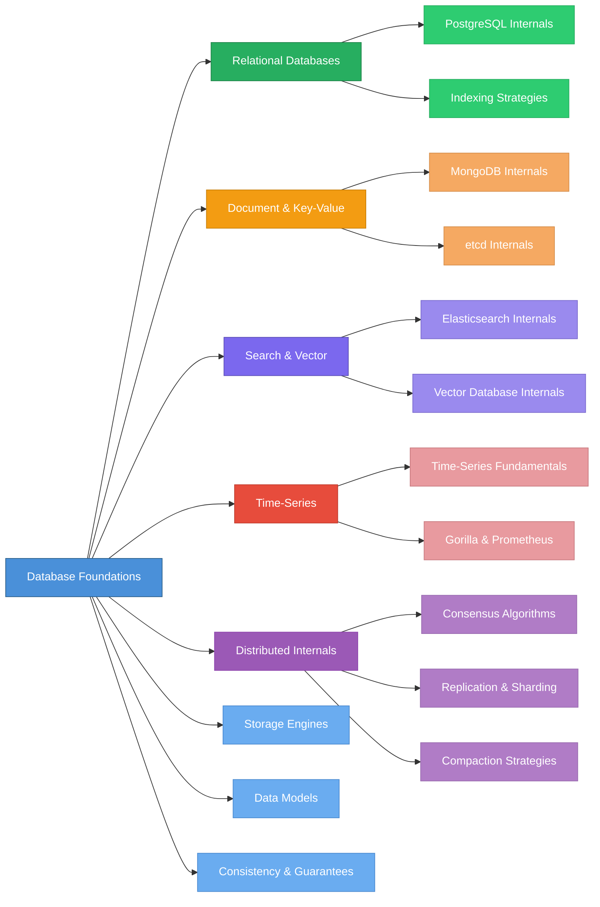

# Deep Dive into Databases

> A structured, tutorial-style knowledge base covering database internals — from storage engines and data models to distributed consensus, compaction strategies, and vector search.

## Learning Roadmap

## Table of Contents

### 1. Database Foundations
- [Section Overview](docs/01-database-foundations/README.md)
- [Storage Engines](docs/01-database-foundations/storage-engines.md) — B-trees vs LSM-trees, write/read/space amplification, and why storage engine choice is the most impactful architecture decision
- [Data Models](docs/01-database-foundations/data-models.md) — Relational, document, key-value, columnar, and graph models with a decision framework for choosing
- [Consistency & Guarantees](docs/01-database-foundations/consistency-and-guarantees.md) — ACID vs BASE, CAP theorem limitations, PACELC, isolation levels, and what consistency means in practice

### 2. Relational Databases
- [Section Overview](docs/02-relational-databases/README.md)
- [PostgreSQL Internals](docs/02-relational-databases/postgresql-internals.md) — MVCC, WAL, query planner, VACUUM, connection pooling, and partitioning
- [Indexing Strategies](docs/02-relational-databases/indexing-strategies.md) — B-tree, GIN, GiST, BRIN, hash, partial, and expression indexes with an index selection decision tree

### 3. Document & Key-Value Databases
- [Section Overview](docs/03-document-and-key-value-databases/README.md)
- [MongoDB Internals](docs/03-document-and-key-value-databases/mongodb-internals.md) — WiredTiger storage engine, replica sets, sharding, aggregation pipeline, schema design patterns, and transactions
- [etcd Internals](docs/03-document-and-key-value-databases/etcd-internals.md) — Raft consensus implementation, bbolt storage, watch mechanism, and why etcd powers Kubernetes

### 4. Search & Vector Databases
- [Section Overview](docs/04-search-and-vector-databases/README.md)
- [Elasticsearch Internals](docs/04-search-and-vector-databases/elasticsearch-internals.md) — Inverted indexes, BM25 scoring, distributed scatter-gather search, segment management, and shard sizing
- [Vector Database Internals](docs/04-search-and-vector-databases/vector-database-internals.md) — HNSW, IVF, product quantization algorithms in depth; Qdrant and Milvus architectures compared

### 5. Time-Series Databases
- [Section Overview](docs/05-time-series-databases/README.md)
- [Time-Series Fundamentals](docs/05-time-series-databases/time-series-fundamentals.md) — What makes time-series data different, compression techniques, indexing, retention strategies, and when to use a dedicated TSDB
- [Gorilla & Prometheus](docs/05-time-series-databases/gorilla-and-prometheus.md) — Facebook Gorilla's compression algorithms, Prometheus TSDB architecture, the Grafana ecosystem, and long-term storage options

### 6. Distributed Database Internals
- [Section Overview](docs/06-distributed-database-internals/README.md)
- [Consensus Algorithms](docs/06-distributed-database-internals/consensus-algorithms.md) — Raft, Paxos, and ZAB — leader election, log replication, safety properties, Multi-Raft scaling, and production implementations
- [Replication & Sharding](docs/06-distributed-database-internals/replication-and-sharding.md) — Single-leader, multi-leader, and leaderless replication; range vs hash sharding; consistent hashing; rebalancing strategies
- [Compaction Strategies](docs/06-distributed-database-internals/compaction-strategies.md) — STCS, LCS, TWCS, ICS, and Gorilla's block-based approach — the write-read-space amplification tradeoff

## Who Is This For?

- **Backend Engineers** who want to understand the databases they use daily — why queries are slow, how replication works, what compaction does
- **Infrastructure / Platform Engineers** operating database clusters who need to reason about sharding, consensus, and compaction tuning
- **Software Engineers** evaluating database choices who want to go deeper than feature comparison tables
- **Students & Researchers** looking for a structured, opinionated guide through database internals literature

## Quick-Start Reading Guide

| Your Goal | Start Here |
|---|---|
| Understand how databases store data | [Storage Engines](docs/01-database-foundations/storage-engines.md) |
| Choose between database types | [Data Models](docs/01-database-foundations/data-models.md) |
| Reason about consistency tradeoffs | [Consistency & Guarantees](docs/01-database-foundations/consistency-and-guarantees.md) |
| Debug slow PostgreSQL queries | [PostgreSQL Internals](docs/02-relational-databases/postgresql-internals.md) |
| Choose the right PostgreSQL index | [Indexing Strategies](docs/02-relational-databases/indexing-strategies.md) |
| Understand MongoDB architecture | [MongoDB Internals](docs/03-document-and-key-value-databases/mongodb-internals.md) |
| Learn how Kubernetes stores state | [etcd Internals](docs/03-document-and-key-value-databases/etcd-internals.md) |
| Build or improve full-text search | [Elasticsearch Internals](docs/04-search-and-vector-databases/elasticsearch-internals.md) |
| Choose a vector database for RAG | [Vector Database Internals](docs/04-search-and-vector-databases/vector-database-internals.md) |
| Design a monitoring stack | [Gorilla & Prometheus](docs/05-time-series-databases/gorilla-and-prometheus.md) |
| Understand distributed consensus | [Consensus Algorithms](docs/06-distributed-database-internals/consensus-algorithms.md) |
| Design a sharding strategy | [Replication & Sharding](docs/06-distributed-database-internals/replication-and-sharding.md) |
| Tune LSM-tree compaction | [Compaction Strategies](docs/06-distributed-database-internals/compaction-strategies.md) |
