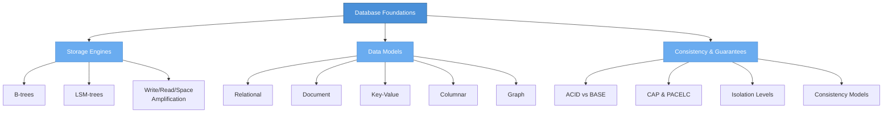

# Database Foundations

> Understanding how databases store, model, and protect data — the bedrock that every other section builds on.

## What This Section Covers

This section covers the three fundamental dimensions of any database system: how it physically stores data (**storage engines**), how it logically organizes data (**data models**), and what guarantees it provides (**consistency**). These foundations determine every performance characteristic and tradeoff you will encounter in the database-specific sections that follow. If you understand B-trees vs LSM-trees, relational vs document, and ACID vs BASE, you can reason about any database — even one you've never used.

## Concept Map

## Pages in This Section

| Page | What You'll Learn |
|---|---|
| [Storage Engines](storage-engines.md) | How B-trees and LSM-trees work, write vs read amplification, and why your storage engine choice is the single most impactful architecture decision |
| [Data Models](data-models.md) | Relational, document, key-value, columnar, and graph models with a decision framework for choosing |
| [Consistency & Guarantees](consistency-and-guarantees.md) | ACID vs BASE, CAP theorem limitations, PACELC, isolation levels, and what consistency means in practice |

## Suggested Reading Order

1. Start with **[Storage Engines](storage-engines.md)** — everything else assumes you understand B-trees vs LSM-trees
2. Then read **[Data Models](data-models.md)** — understand the logical layer above storage
3. Finally, **[Consistency & Guarantees](consistency-and-guarantees.md)** — the theoretical framework that governs distributed behavior

## How This Section Connects

- **To Relational Databases (Section 02)** — PostgreSQL's MVCC and indexing strategies build directly on B-tree and ACID concepts from this section
- **To Document & Key-Value Databases (Section 03)** — MongoDB's WiredTiger engine and etcd's bbolt are both covered in Storage Engines; the document vs relational tradeoff is the core of Data Models
- **To Distributed Internals (Section 06)** — Consensus, replication, and compaction all exist because of the tradeoffs introduced here, especially CAP and consistency models
