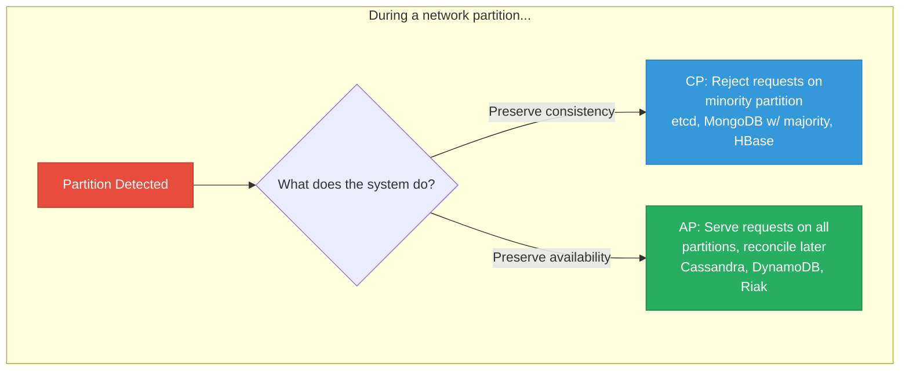
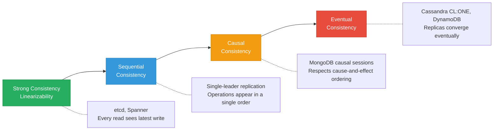

# Consistency & Guarantees

> **TL;DR:** "Consistency" means different things in different contexts, and conflating them causes real engineering mistakes. **ACID consistency** means transactions preserve invariants. **CAP consistency** means linearizability. **Eventual consistency** means replicas converge over time. Understanding these distinctions — and the practical tradeoffs between isolation levels — is essential for building correct distributed systems.

## Table of Contents

- [Why This Matters](#why-this-matters)
- [ACID Properties](#acid-properties)
- [BASE Properties](#base-properties)
- [The CAP Theorem](#the-cap-theorem)
- [PACELC: Beyond CAP](#pacelc-beyond-cap)
- [Isolation Levels](#isolation-levels)
- [Consistency Models in Distributed Systems](#consistency-models-in-distributed-systems)
- [Key Takeaways](#key-takeaways)
- [References](#references)

---

## Why This Matters

Engineers use the word "consistency" to mean at least three different things, often in the same conversation. A developer says "MongoDB is eventually consistent" and a DBA hears "data corruption." A solutions architect says "we need strong consistency" without specifying whether they mean serializable transactions or linearizable reads. This ambiguity leads to systems that are either over-engineered (paying for consistency they don't need) or under-engineered (losing data they assumed was safe).

This page defines each meaning precisely, maps them to real databases, and gives you the vocabulary to reason about consistency tradeoffs without confusion.

## ACID Properties

ACID is the set of guarantees provided by traditional relational databases. Each letter describes a different aspect of transaction behavior.

| Property | What It Means | What It Prevents |
|---|---|---|
| **Atomicity** | A transaction either fully commits or fully rolls back. No partial results. | Half-completed operations (e.g., money debited but not credited) |
| **Consistency** | Transactions transition the database from one valid state to another. All constraints (foreign keys, unique, check) are satisfied. | Invariant violations (e.g., negative balances where they're prohibited) |
| **Isolation** | Concurrent transactions don't interfere with each other. Each transaction sees a consistent snapshot. | Read anomalies: dirty reads, non-repeatable reads, phantoms |
| **Durability** | Once a transaction commits, the data survives crashes. Typically implemented via WAL + fsync. | Data loss after acknowledged writes |

### ACID Support by Database

| Database | Atomicity | Consistency | Isolation | Durability | Notes |
|---|---|---|---|---|---|
| **PostgreSQL** | Full | Full | Configurable (up to Serializable) | WAL + fsync | Gold standard for ACID |
| **MySQL InnoDB** | Full | Full | Configurable (default: Repeatable Read) | Redo log + doublewrite | Beware: Repeatable Read uses snapshot isolation, not true RR |
| **MongoDB** | Single-doc atomic; multi-doc transactions since 4.0 | Application-level | Snapshot isolation (within transactions) | Journal + WiredTiger | Multi-doc transactions add latency; design to minimize their use |
| **Cassandra** | Row-level (lightweight transactions for CAS) | Tunable | None (no multi-row transactions) | Commitlog + memtable flush | Lightweight transactions (LWT) use Paxos and are expensive |
| **etcd** | Full (within a single revision) | Linearizable | Serializable (via revision-based MVCC) | WAL + bbolt | Designed for coordination, not general-purpose workloads |

---

## BASE Properties

BASE is the counter-model to ACID, embraced by systems that prioritize availability and partition tolerance.

| Property | What It Means |
|---|---|
| **Basically Available** | The system guarantees availability — every request receives a response (success or failure), even during partial failures |
| **Soft state** | The state of the system may change over time, even without new input, as replicas converge |
| **Eventually consistent** | Given no new updates, all replicas will eventually reach the same state |

BASE is not an acronym you apply to a specific transaction. It describes the overall system behavior: the system prioritizes being responsive at all times, accepting that different nodes may temporarily disagree.

**Key insight:** ACID and BASE are not binary — they're ends of a spectrum. MongoDB with `readConcern: "majority"` and `writeConcern: "majority"` is closer to ACID than to BASE. Cassandra with `CONSISTENCY ONE` is firmly BASE. The same database can behave like either depending on configuration.

---

## The CAP Theorem

### The Original Claim

Eric Brewer's CAP theorem (2000, proved by Gilbert & Lynch in 2002) states that a distributed system can provide at most **two of three** guarantees:

- **Consistency (C)**: Every read receives the most recent write or an error (linearizability)
- **Availability (A)**: Every request receives a non-error response, without guarantee that it contains the most recent write
- **Partition tolerance (P)**: The system continues to operate despite network partitions between nodes

### Why CAP Is Misunderstood

The most common misconception: "You pick 2 out of 3." In reality:

1. **Partition tolerance is not optional.** Network partitions happen in any distributed system. You don't get to choose "CA" — if you're distributed, you must tolerate partitions.
2. **The choice is CP or AP** — what do you do *during* a partition?
   - **CP**: Refuse some requests to maintain consistency (return errors)
   - **AP**: Serve all requests but allow stale/divergent data
3. **CAP says nothing about behavior when there is no partition.** Most of the time, the network is fine. CAP doesn't help you reason about normal operation.

---

## PACELC: Beyond CAP

Daniel Abadi's **PACELC** extension (2012) addresses CAP's blind spot: what happens when there is *no* partition?

**PACELC** reads as: "If there is a **P**artition, choose between **A**vailability and **C**onsistency. **E**lse (normal operation), choose between **L**atency and **C**onsistency."

This is more useful than CAP because most of the time, your system is operating normally — and the latency vs. consistency tradeoff is the one you actually tune day-to-day.

| Database | If Partition (PA or PC) | Else (EL or EC) | Explanation |
|---|---|---|---|
| **PostgreSQL** (single-node) | N/A (not distributed) | EC | Strong consistency, no latency compromise |
| **PostgreSQL** (streaming replication) | PC | EC | Rejects writes if replica is unreachable (sync replication) |
| **MongoDB** (w: majority) | PC | EC | Majority write concern blocks until acknowledged |
| **MongoDB** (w: 1) | PA | EL | Single-node ack, async replication — low latency, possible data loss |
| **Cassandra** (CL: QUORUM) | PC | EC | Quorum reads/writes ensure consistency |
| **Cassandra** (CL: ONE) | PA | EL | Single-node read/write — fastest, least consistent |
| **etcd** | PC | EC | Always linearizable via Raft |
| **DynamoDB** | PA | EL | Eventual consistency by default; strong consistency optional |

---

## Isolation Levels

Isolation determines what a transaction sees when other transactions are running concurrently. The SQL standard defines four levels (from weakest to strongest):

| Isolation Level | Dirty Reads | Non-Repeatable Reads | Phantom Reads | Performance |
|---|---|---|---|---|
| **Read Uncommitted** | Possible | Possible | Possible | Highest |
| **Read Committed** | Prevented | Possible | Possible | High |
| **Repeatable Read** | Prevented | Prevented | Possible | Medium |
| **Serializable** | Prevented | Prevented | Prevented | Lowest |

### Anomalies Explained

- **Dirty read**: Transaction A reads data written by Transaction B before B commits. If B rolls back, A read data that never existed.
- **Non-repeatable read**: Transaction A reads a row, Transaction B updates it, A reads it again and sees a different value.
- **Phantom read**: Transaction A queries a set of rows, Transaction B inserts a new row that matches A's query, A re-queries and sees the new row.

### PostgreSQL's Implementation

PostgreSQL implements isolation using **MVCC** (Multi-Version Concurrency Control):

- **Read Committed** (default): Each statement sees a snapshot of data committed before the statement began. Different statements within the same transaction may see different data.
- **Repeatable Read**: The transaction sees a snapshot taken at the start of the first statement. All subsequent reads see this same snapshot. In PostgreSQL, this actually provides **snapshot isolation**, which prevents phantoms (stronger than SQL standard Repeatable Read).
- **Serializable**: Uses **Serializable Snapshot Isolation (SSI)** — detects serialization conflicts and aborts transactions that would violate serializability. No locks required.

### MongoDB's Read Concern Levels

MongoDB uses a different vocabulary but provides analogous guarantees:

| MongoDB Read Concern | SQL Equivalent | What You See |
|---|---|---|
| `"local"` | Read Committed (approx.) | Data from the local node, may not be replicated |
| `"majority"` | Read Committed + durability | Data acknowledged by a majority of replica set members |
| `"linearizable"` | Serializable (for single doc) | Most recent majority-committed data; blocks until confirmed |
| `"snapshot"` | Repeatable Read / Snapshot Isolation | Consistent snapshot across a multi-document transaction |

---

## Consistency Models in Distributed Systems

Beyond transaction isolation, distributed databases offer varying levels of consistency for replicated data:

| Model | Guarantee | Latency Cost | Example |
|---|---|---|---|
| **Linearizability** | Every read returns the value of the most recent write, as if there's a single copy | Highest (requires coordination) | etcd, Google Spanner |
| **Sequential consistency** | All operations appear to execute in some total order consistent with each process's program order | High | Single-leader replication |
| **Causal consistency** | Operations that are causally related are seen in the same order by all nodes | Medium | MongoDB causal sessions, COPS |
| **Eventual consistency** | If no new updates are made, all replicas converge to the same value | Lowest | Cassandra CL:ONE, DynamoDB (default), DNS |

**Practical implication:** Most applications can tolerate causal or even eventual consistency for most operations. Strong consistency (linearizability) is only required for coordination-sensitive operations like leader election, distributed locks, and financial transactions. Over-requiring strong consistency is the most common consistency mistake — it kills performance without improving correctness.

---

## Key Takeaways

- **ACID consistency** (transactions preserve invariants) and **CAP consistency** (linearizability) are completely different concepts. Don't conflate them.
- **CAP is about partitions**, not a three-way choice. Every distributed system must tolerate partitions, so the real question is: during a partition, do you sacrifice consistency or availability?
- **PACELC is more useful than CAP** for day-to-day engineering because it addresses the latency-consistency tradeoff during normal operation — which is where your system spends 99.9% of its time.
- **Isolation levels** are the practical knob for tuning consistency. PostgreSQL's default (Read Committed) is sufficient for most workloads. Use Serializable only when you need it — it's significantly more expensive.
- **Eventual consistency is fine for most reads.** Reserve strong consistency (linearizability) for operations where correctness depends on seeing the latest write — coordination, financial transactions, inventory management.
- **MongoDB's read/write concerns** are the tuning knobs that move it along the consistency spectrum. `w:1, readConcern:"local"` is BASE. `w:"majority", readConcern:"linearizable"` is ACID-like.
- **The same database can behave as CP or AP** depending on configuration. Labels like "MongoDB is AP" are oversimplifications.

---

## References

1. Brewer, E. (2012). [CAP Twelve Years Later: How the "Rules" Have Changed](https://www.infoq.com/articles/cap-twelve-years-later-how-the-rules-have-changed/). IEEE Computer.
2. Gilbert, S. & Lynch, N. (2002). [Brewer's Conjecture and the Feasibility of Consistent, Available, Partition-Tolerant Web Services](https://users.ece.cmu.edu/~adrian/731-sp04/readings/GL-cap.pdf). ACM SIGACT News.
3. Abadi, D. (2012). [Consistency Tradeoffs in Modern Distributed Database System Design](https://cs-people.bu.edu/liagos/638-2015-Fall/papers/hat-vldb2014.pdf). IEEE Computer.
4. Kleppmann, M. (2017). *Designing Data-Intensive Applications*, Chapters 7 (Transactions) and 9 (Consistency and Consensus). O'Reilly Media.
5. [PostgreSQL Transaction Isolation](https://www.postgresql.org/docs/current/transaction-iso.html)
6. [MongoDB Read Concern](https://www.mongodb.com/docs/manual/reference/read-concern/)
7. [MongoDB Write Concern](https://www.mongodb.com/docs/manual/reference/write-concern/)
