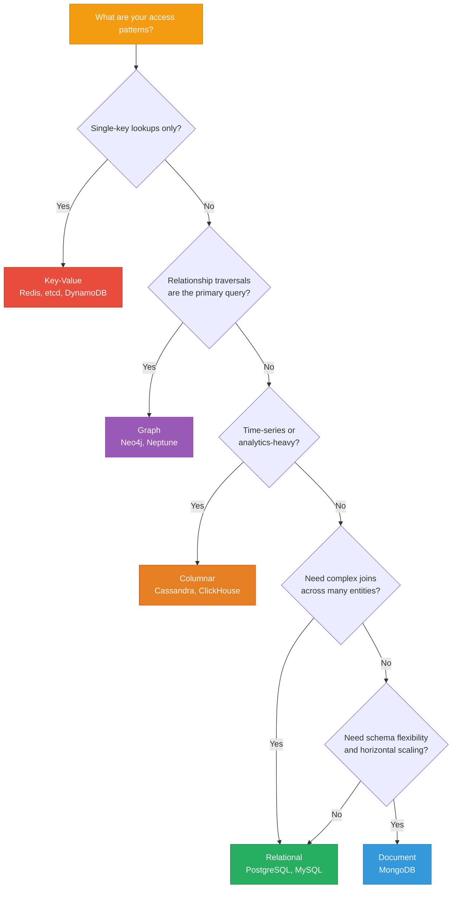

# Data Models

> **TL;DR:** Your data model choice shapes your query patterns, scaling strategy, and operational complexity. **Relational models** excel at complex queries and transactional integrity. **Document models** trade schema rigidity for developer velocity and horizontal scaling. **Key-value models** offer maximum throughput for simple lookups. The choice is not about which is "best" — it's about which tradeoffs your application can tolerate.

## Table of Contents

- [Why This Matters](#why-this-matters)
- [The Five Data Models](#the-five-data-models)
- [Comparison](#comparison)
- [Decision Framework](#decision-framework)
- [Relational vs Document: The Most Common Decision](#relational-vs-document-the-most-common-decision)
- [Multi-Model Databases](#multi-model-databases)
- [Key Takeaways](#key-takeaways)
- [References](#references)

---

## Why This Matters

The data model you choose determines what questions your application can answer efficiently. A relational model makes joins cheap but schema changes expensive. A document model makes schema evolution trivial but cross-document relationships awkward. A key-value model makes single-key lookups blazing fast but complex queries impossible.

This is not a reversible decision. Migrating from one data model to another after you have production data and a codebase built around it is one of the most expensive engineering projects a team can undertake. Getting this right up front — or at least understanding the tradeoffs you're accepting — saves months of pain later.

## The Five Data Models

### Relational (PostgreSQL, MySQL, SQL Server)

Data is organized into **tables** (relations) with fixed **columns** (attributes) and **rows** (tuples). Relationships between tables are expressed through **foreign keys** and resolved with **joins**.

**Core concepts:**
- **Schema-on-write**: The schema is enforced at write time. Every row in a table has the same columns.
- **Normalization**: Data is decomposed to eliminate redundancy (1NF, 2NF, 3NF, BCNF).
- **ACID transactions**: Atomicity, Consistency, Isolation, Durability across multi-row, multi-table operations.
- **SQL**: Declarative query language — you describe *what* you want, the query planner decides *how*.

**Strengths:**
- Complex queries with joins across many tables
- Strong consistency guarantees (ACID)
- Mature tooling, profiling, and optimization (50+ years of research)
- Schema enforces data integrity at the database level

**Limitations:**
- Schema migrations can be expensive (ALTER TABLE on large tables locks or rewrites)
- Horizontal scaling requires application-level sharding or specialized extensions (Citus)
- Object-relational impedance mismatch (translating between objects and tables)

### Document (MongoDB, CouchDB, DynamoDB)

Data is stored as self-contained **documents** — typically JSON/BSON — that can have nested structures and varying fields.

**Core concepts:**
- **Schema-on-read**: Documents in the same collection can have different structures. The application interprets the data at read time.
- **Denormalization**: Related data is embedded within a single document rather than split across tables.
- **Document-level atomicity**: Single-document operations are atomic by default. Multi-document transactions are supported (MongoDB 4.0+) but not the primary design.
- **Flexible schema**: Adding new fields requires no migration — just start writing documents with the new field.

**Strengths:**
- Developer velocity — schema matches application objects naturally
- Horizontal scaling via sharding is a first-class feature
- Flexible schema supports rapid iteration and heterogeneous data
- Embedding related data reduces join overhead

**Limitations:**
- Cross-document relationships require `$lookup` (MongoDB) or multiple queries
- Denormalization means data duplication — updates must touch multiple documents
- No multi-table schema enforcement at the database level (application must validate)
- Aggregation pipeline has a learning curve different from SQL

### Key-Value (etcd, Redis, DynamoDB, Riak)

The simplest data model: a hash map. Each entry is a **key** (string) mapped to a **value** (opaque blob or structured data).

**Core concepts:**
- **GET/PUT/DELETE**: The API is essentially three operations
- **No query language**: You can only retrieve data by key, not by value attributes
- **Partitioning by key**: Hash the key to determine which node stores it

**Strengths:**
- Extreme throughput and low latency for simple lookups
- Trivial to shard (hash key → partition)
- No query planning overhead
- Ideal for caches, sessions, configuration, and coordination

**Limitations:**
- No secondary indexes (cannot query by value attributes)
- No joins or aggregations
- Application must manage all access patterns
- Limited to simple access patterns by design

### Columnar (Cassandra, ScyllaDB, ClickHouse, HBase)

Data is organized into **column families** (groups of columns) rather than rows. Each row key maps to a set of columns, and columns can be added dynamically.

**Core concepts:**
- **Wide rows**: A single row can have millions of columns
- **Column family as unit of access**: Columns that are read together are stored together
- **Sorted by row key**: Data is distributed and sorted by the partition key
- **Write-optimized**: Typically backed by LSM-trees

**Strengths:**
- Excellent write throughput (append-only LSM storage)
- Natural fit for time-series data (row key = entity, columns = timestamps)
- Horizontal scaling with consistent hashing
- Analytics queries that scan entire columns are efficient (ClickHouse)

**Limitations:**
- Poor for ad-hoc queries or joins
- Data modeling is driven by query patterns, not entities
- Denormalization is required (often extreme)
- Operational complexity at scale

### Graph (Neo4j, Amazon Neptune, ArangoDB)

Data is modeled as **nodes** (entities) and **edges** (relationships) with properties on both. Traversal operations — following edges across the graph — are the primary query pattern.

**Core concepts:**
- **Index-free adjacency**: Each node stores direct pointers to its neighbors. Traversals are O(1) per hop, not O(log N).
- **Cypher / Gremlin**: Specialized query languages for pattern matching on graphs
- **Path queries**: "Find all friends of friends" or "shortest path between A and B"

**Strengths:**
- Relationship-heavy queries (social networks, fraud detection, recommendation engines)
- Traversal performance doesn't degrade with dataset size (index-free adjacency)
- Expressive pattern matching

**Limitations:**
- Not suitable for tabular data or simple CRUD
- Fewer operational tools and less community experience compared to relational
- Horizontal scaling is harder (graph partitioning is NP-hard)
- Niche use case — most applications don't need a graph database

---

## Comparison

| Property | Relational | Document | Key-Value | Columnar | Graph |
|---|---|---|---|---|---|
| **Query flexibility** | Very high (SQL) | Medium ($lookup, aggregation) | None (key only) | Low (partition key + clustering key) | High for traversals |
| **Schema** | Strict, enforced | Flexible, optional validation | None | Semi-structured | Flexible (nodes + edges) |
| **Scaling** | Vertical (mostly) | Horizontal (sharding) | Horizontal (trivial) | Horizontal (consistent hashing) | Vertical (mostly) |
| **Consistency** | Strong (ACID) | Tunable (read/write concern) | Varies (strong to eventual) | Tunable (per-query) | Strong (single-node) |
| **Joins** | Native, optimized | `$lookup` (limited) | Not supported | Not supported | Native (traversals) |
| **Best for** | Complex queries, transactions | Rapid development, flexible data | Caches, sessions, config | Time-series, analytics, write-heavy | Social networks, fraud, recommendations |
| **Example databases** | PostgreSQL, MySQL | MongoDB, CouchDB | Redis, etcd, DynamoDB | Cassandra, ClickHouse | Neo4j, Neptune |

---

## Decision Framework

---

## Relational vs Document: The Most Common Decision

For most applications, the real choice is between relational and document. Here's how to think about it.

### Choose Relational When:
- Your data has many **relationships** between entities (orders reference products, users, addresses)
- You need **multi-table transactions** (transfer money between accounts atomically)
- Your query patterns are **not fully known** at design time — SQL gives you flexibility to ask new questions
- You value **data integrity** enforced at the database level (constraints, foreign keys, triggers)

### Choose Document When:
- Your data is **naturally hierarchical** (a blog post with embedded comments, a product catalog with varying attributes)
- You need **horizontal scaling** as a first-class feature
- Your schema **evolves rapidly** (startup iterating on product-market fit)
- Your access patterns are **document-centric** — you almost always read/write an entire document

### Common Misconceptions

**"MongoDB doesn't do joins."** It does, via the `$lookup` aggregation stage. But `$lookup` is slower than relational joins because it's not optimized at the storage engine level. If you find yourself using `$lookup` in every query, you probably want a relational database.

**"PostgreSQL can't handle unstructured data."** PostgreSQL's `jsonb` type gives you document-like flexibility within a relational model. You can index JSON fields with GIN indexes and query them efficiently. For many workloads, PostgreSQL with `jsonb` gives you 80% of MongoDB's flexibility with 100% of relational's query power.

---

## Multi-Model Databases

The trend toward multi-model databases blurs the lines between data models:

- **PostgreSQL**: Relational + JSONB (document) + full-text search + PostGIS (geospatial) + pgvector (vector search). The "Swiss Army knife" of databases.
- **MongoDB**: Document + time-series collections (since 5.0) + Atlas Search (full-text) + Atlas Vector Search (ANN).
- **ArangoDB**: Document + Graph + Key-Value in a single engine.
- **DynamoDB**: Key-value + Document (nested JSON attributes).

**When to use a multi-model database vs. purpose-built systems:** A multi-model approach reduces operational complexity (one database to deploy, monitor, backup). Purpose-built systems offer better performance at scale for their specific workload. For most teams, starting with PostgreSQL and adding purpose-built systems as scale demands is the pragmatic path.

---

## Key Takeaways

- **Relational databases** (PostgreSQL, MySQL) are the default choice for structured data with relationships and complex queries. When in doubt, start here.
- **Document databases** (MongoDB) shine when your data is naturally hierarchical, your schema evolves rapidly, or you need built-in horizontal scaling.
- **Key-value stores** (Redis, etcd) are purpose-built for simple lookups at extreme throughput. Don't use them for anything else.
- **Columnar databases** (Cassandra, ClickHouse) excel at write-heavy, time-series, and analytics workloads. Data modeling is driven by queries, not entities.
- **Graph databases** (Neo4j) are the right choice only when relationship traversals are your primary query pattern. Most applications don't need one.
- **PostgreSQL with `jsonb`** gives you 80% of MongoDB's flexibility within a relational model — consider it before reaching for a document database.
- **Data model migration is expensive**. Understand the tradeoffs before committing, not after you have 10 million rows of production data.

---

## References

1. Kleppmann, M. (2017). *Designing Data-Intensive Applications*, Chapter 2: Data Models and Query Languages. O'Reilly Media.
2. Stonebraker, M. & Hellerstein, J. (2005). [What Goes Around Comes Around](https://people.cs.umass.edu/~yanlei/courses/CS691LL-f06/papers/SH05.pdf). Readings in Database Systems.
3. Codd, E. F. (1970). [A Relational Model of Data for Large Shared Data Banks](https://dl.acm.org/doi/10.1145/362384.362685). Communications of the ACM.
4. [MongoDB Data Modeling](https://www.mongodb.com/docs/manual/core/data-modeling-introduction/)
5. [PostgreSQL JSON Types Documentation](https://www.postgresql.org/docs/current/datatype-json.html)
