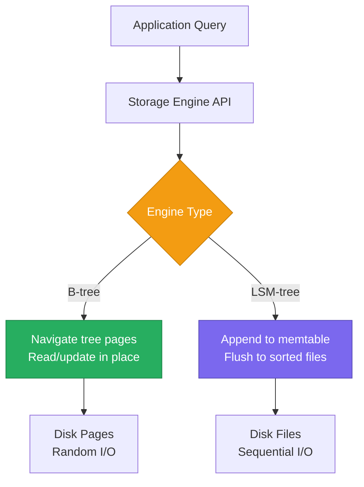
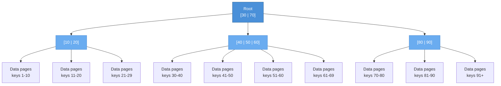
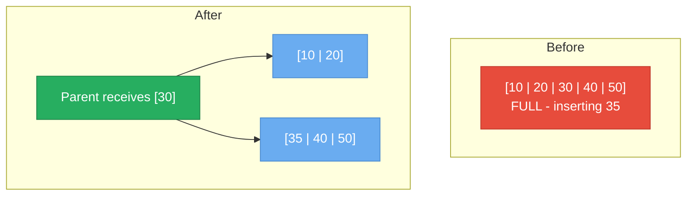
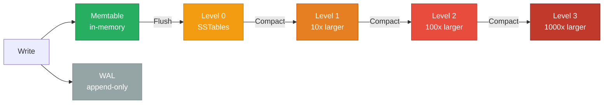
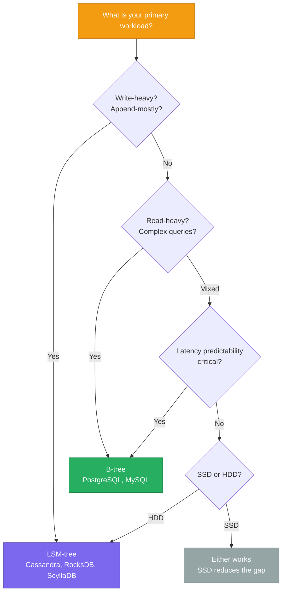

# Storage Engines

> **TL;DR:** The storage engine is the most consequential architectural choice in any database. **B-trees** optimize for reads with in-place updates and balanced tree structures. **LSM-trees** optimize for writes with append-only logs and sorted runs. Every database you use — PostgreSQL, MongoDB, etcd, Cassandra — makes this choice, and it cascades into every performance characteristic.

## Table of Contents

- [Why This Matters](#why-this-matters)
- [How Databases Store Data on Disk](#how-databases-store-data-on-disk)
- [B-trees](#b-trees)
- [LSM-trees](#lsm-trees-log-structured-merge-trees)
- [B-trees vs LSM-trees](#b-trees-vs-lsm-trees)
- [Write Amplification Deep Dive](#write-amplification-deep-dive)
- [Read Amplification Deep Dive](#read-amplification-deep-dive)
- [Hybrid and Embedded Engines](#hybrid-and-embedded-engines)
- [Key Takeaways](#key-takeaways)
- [References](#references)

---

## Why This Matters

Every query you run, every write you make, and every byte of disk you consume is shaped by the storage engine underneath. When a PostgreSQL query is slow, it's often because you're fighting the B-tree's update-in-place model. When a Cassandra cluster runs out of disk during compaction, it's because LSM-tree compaction temporarily doubles space usage. You cannot tune what you do not understand — and the storage engine is where performance lives.

The choice between B-tree and LSM-tree is not a matter of which is "better." It is a matter of which tradeoffs your workload can tolerate. This page gives you the mental model to reason about that tradeoff.

## How Databases Store Data on Disk

All storage engines solve the same fundamental problem: translate logical operations (INSERT, UPDATE, SELECT, DELETE) into physical operations on disk (read page, write page, fsync). Disk I/O — especially random I/O — is orders of magnitude slower than memory access, so the storage engine's primary job is to minimize unnecessary disk operations.

Two concepts dominate the design space:

- **Pages/Blocks**: Disk I/O operates in fixed-size units (typically 4 KB or 8 KB). Reading one byte costs the same as reading an entire page.
- **Sequential vs Random I/O**: Sequential reads/writes (contiguous pages) are 100-1000x faster than random I/O on HDDs and 10-100x faster on SSDs.

---

## B-trees

**B-trees** (and their variant **B+trees**) are the most widely used storage engine structure. They maintain data in a balanced tree of fixed-size pages, where every path from root to leaf has the same length.

### Structure

A B-tree of order *m* has these properties:
- Each node holds up to *m-1* keys and *m* child pointers
- Keys within a node are sorted
- All leaf nodes are at the same depth
- In a **B+tree** (used by most databases), only leaf nodes contain data; internal nodes contain only keys and child pointers

### Read Path

1. Start at the root page (always cached in memory)
2. Binary search within the page to find the correct child pointer
3. Follow the pointer to the next level
4. Repeat until reaching a leaf page
5. Binary search within the leaf to find the key

**Cost**: O(log_m N) page reads, where N is the number of keys and m is the branching factor. For a table with 1 billion rows and a branching factor of 500, this is ~4 page reads.

### Write Path

1. Find the target leaf page (same as read path)
2. If the page has space: insert the key in sorted position, write the page back to disk
3. If the page is full: **split** the page into two, push the median key up to the parent
4. If the parent is also full: split recursively up the tree
5. Write a **WAL record** before modifying the page (crash recovery)

**Key insight**: Writes are **update-in-place**. The page is read, modified, and written back to the same location. This means writes involve random I/O.

### Node Splitting

### Where B-trees Are Used

| Database | Storage Engine | Notes |
|---|---|---|
| **PostgreSQL** | Heap + B-tree indexes | Default index type; MVCC uses tuple versioning within heap pages |
| **MySQL InnoDB** | Clustered B+tree | Primary key IS the table (clustered index); secondary indexes point to primary key |
| **SQLite** | B-tree | Entire database is a single file of B-tree pages |
| **etcd** | bbolt (B+tree) | Fork of BoltDB; MVCC layer built on top |

---

## LSM-trees (Log-Structured Merge Trees)

**LSM-trees** take the opposite approach: never update data in place. Instead, they buffer writes in memory and periodically flush sorted batches to disk. This converts random writes into sequential writes, dramatically improving write throughput.

### Structure

An LSM-tree has these components:

1. **Memtable**: An in-memory sorted data structure (typically a red-black tree or skip list) that receives all writes
2. **Immutable memtable**: When the memtable reaches a size threshold, it becomes immutable and a new memtable is created
3. **SSTables** (Sorted String Tables): Immutable, sorted files on disk organized into levels
4. **WAL** (Write-Ahead Log): Append-only log for crash recovery of memtable data

### Write Path

1. Append the operation to the WAL (sequential write — fast)
2. Insert the key-value pair into the memtable (memory operation — fast)
3. When the memtable reaches its size limit (~64 MB), freeze it and create a new one
4. Flush the frozen memtable to disk as a new SSTable in Level 0
5. Background **compaction** merges SSTables across levels to keep the tree sorted and remove deleted/overwritten keys

**Key insight**: Every write is sequential (WAL append + memtable flush). No random I/O on the write path.

### Read Path

1. Check the memtable (most recent data)
2. Check the immutable memtable (if one exists)
3. Check Level 0 SSTables (may overlap — must check all)
4. Check each subsequent level (non-overlapping within a level — binary search)
5. Use **Bloom filters** to skip SSTables that definitely don't contain the key

**Cost**: Worst case requires checking every level. Bloom filters reduce this dramatically — a well-tuned Bloom filter has a false positive rate of ~1%, meaning 99% of unnecessary SSTable reads are avoided.

### Where LSM-trees Are Used

| Database | Storage Engine | Notes |
|---|---|---|
| **RocksDB** | LSM-tree | Facebook's fork of LevelDB; embedded engine used by many databases |
| **LevelDB** | LSM-tree | Google's original LSM implementation |
| **Cassandra** | LSM-tree | SSTables with configurable compaction (STCS, LCS, TWCS) |
| **ScyllaDB** | LSM-tree | C++ rewrite of Cassandra; adds ICS compaction |
| **MongoDB (WiredTiger)** | Hybrid B-tree + LSM concepts | B-tree structure with LSM-like journal and checkpoint mechanism |
| **InfluxDB (TSM)** | LSM-tree variant | Time-Structured Merge tree, optimized for time-series |

---

## B-trees vs LSM-trees

| Property | B-tree | LSM-tree |
|---|---|---|
| **Write pattern** | Random I/O (update in place) | Sequential I/O (append-only) |
| **Read pattern** | O(log N) — single path through tree | O(L) levels to check — mitigated by Bloom filters |
| **Write amplification** | ~2-10x (page rewrites + WAL) | ~10-30x (compaction rewrites across levels) |
| **Read amplification** | 1x (single lookup) | Up to L levels (mitigated by Bloom filters, caching) |
| **Space amplification** | ~1.5x (page fill factor + dead tuples) | ~1.1-2x (depends on compaction strategy) |
| **Concurrency** | Page-level or row-level locking | Lock-free reads (immutable SSTables) |
| **Range queries** | Excellent (leaf pages are linked) | Good (within levels), requires merging across levels |
| **Point queries** | Excellent (single tree traversal) | Good with Bloom filters, poor without |
| **Best for** | Read-heavy, mixed workloads | Write-heavy, append-heavy workloads |
| **Predictability** | Consistent latency | Variable (compaction spikes) |

### Decision Framework

---

## Write Amplification Deep Dive

**Write amplification** is the ratio of bytes written to disk vs. bytes written by the application. A write amplification of 10x means a 1 KB application write causes 10 KB of actual disk writes.

This matters for:
- **SSD lifetime**: SSDs have limited write endurance (P/E cycles). High write amplification wears out SSDs faster.
- **Write throughput**: More bytes written per operation means lower effective throughput.
- **I/O bandwidth**: Write amplification competes with reads for disk bandwidth.

### B-tree Write Amplification

A single key update requires:
1. Write the WAL record: **1x**
2. Read the target page: (read, not write)
3. Write the modified page back: **1x**
4. Possible page split: **~0.01x** amortized (splits are rare)

**Total: ~2-3x** for a single update. But full-page writes (to prevent torn pages) can push this to **~8-10x** in PostgreSQL's case (an 8 KB page written for a small change).

### LSM-tree Write Amplification

For leveled compaction with a size ratio of 10:
1. Write to WAL: **1x**
2. Flush memtable to L0: **1x**
3. Compact L0 → L1: data rewritten **~1x**
4. Compact L1 → L2: data rewritten **~10x** (each L1 SSTable overlaps with ~10 L2 SSTables)
5. Compact L2 → L3: data rewritten **~10x**

**Total: ~10-30x** depending on the number of levels. Facebook measured 10-30x write amplification in production RocksDB deployments.

---

## Read Amplification Deep Dive

**Read amplification** is the number of disk reads required to satisfy a single query.

### B-tree Read Amplification

- **Point query**: O(log_m N) page reads. For 1 billion keys with branching factor 500: ~4 reads. Top levels are typically cached, reducing this to **1-2 disk reads** in practice.
- **Range query**: After finding the start key, leaf pages are linked — sequential scan with no additional tree traversal.

### LSM-tree Read Amplification

- **Point query (worst case)**: Check memtable + 1 SSTable per level. With 7 levels: up to 7 disk reads.
- **Point query (with Bloom filters)**: Bloom filters eliminate ~99% of unnecessary checks. Effective read amplification: **~1-2 disk reads**.
- **Range query**: Must merge results from all levels (merge sort). More expensive than B-tree range scans.

---

## Hybrid and Embedded Engines

### WiredTiger (MongoDB)

WiredTiger is a hybrid engine that uses B-tree structures but incorporates LSM-inspired techniques:
- **B-tree** for data organization and indexing
- **Write-ahead journal** (like WAL) for durability
- **Checkpoint mechanism** that batches writes (reducing random I/O)
- **Document-level concurrency** via hazard pointers and skip lists
- **Compression** at the page level (snappy, zlib, zstd)

This hybrid approach gives MongoDB reasonable performance for both reads and writes, without the compaction overhead of a pure LSM-tree.

### RocksDB as an Embedded Engine

RocksDB (Facebook's LSM-tree implementation) is used as the storage backend for many databases:
- **CockroachDB**: SQL layer on top of RocksDB (now Pebble, a Go rewrite)
- **TiDB/TiKV**: Distributed SQL using RocksDB for local storage
- **Kafka Streams**: State stores backed by RocksDB
- **Flink**: Checkpoint state stored in RocksDB

This pattern — using a proven storage engine as a building block — avoids reimplementing the hardest part of a database.

---

## Key Takeaways

- **B-trees optimize for reads** with O(log N) lookups and linked leaf pages for range scans. They pay for this with random write I/O and page-level update overhead.
- **LSM-trees optimize for writes** by converting random writes to sequential I/O through memtables and SSTable flushes. They pay for this with read amplification and compaction overhead.
- **Write amplification** is the hidden cost of storage engines — 2-10x for B-trees, 10-30x for LSM-trees. It directly impacts SSD lifetime and write throughput.
- **Bloom filters** are what make LSM-tree reads practical — without them, every point query would scan every level.
- **The choice is workload-dependent**: read-heavy transactional workloads favor B-trees (PostgreSQL, MySQL). Write-heavy append workloads favor LSM-trees (Cassandra, RocksDB).
- **Hybrid engines exist**: WiredTiger (MongoDB) and RocksDB blur the line between pure B-tree and pure LSM approaches.
- **RocksDB is the SQLite of LSM-trees**: many databases embed it rather than building their own storage engine from scratch.

---

## References

1. O'Neil, P., Cheng, E., Gawlick, D., & O'Neil, E. (1996). [The Log-Structured Merge-Tree (LSM-Tree)](https://www.cs.umb.edu/~poneil/lsmtree.pdf). Acta Informatica, 33(4), 351-385.
2. Comer, D. (1979). The Ubiquitous B-Tree. ACM Computing Surveys, 11(2), 121-137.
3. Kleppmann, M. (2017). *Designing Data-Intensive Applications*, Chapter 3: Storage and Retrieval. O'Reilly Media.
4. Dong, S., Callaghan, M., Galanis, L., et al. (2017). [Optimizing Space Amplification in RocksDB](http://cidrdb.org/cidr2017/papers/p82-dong-cidr17.pdf). CIDR 2017.
5. [RocksDB Wiki — Leveled Compaction](https://github.com/facebook/rocksdb/wiki/Leveled-Compaction)
6. [WiredTiger Architecture Guide](https://source.wiredtiger.com/develop/arch-index.html)
