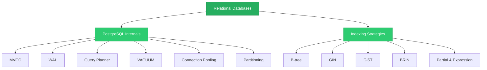

# Relational Databases

> The gold standard for structured data — PostgreSQL internals, query optimization, and indexing strategies that every backend engineer should understand.

## What This Section Covers

Relational databases have been the backbone of software engineering for over 50 years, and PostgreSQL is the most capable open-source implementation. This section goes deep into PostgreSQL's architecture — how MVCC provides concurrent access, how the WAL ensures durability, how the query planner decides execution strategies, and how to choose the right index type for your query pattern. Whether you're debugging a slow query or designing a schema, this is the foundational knowledge.

## Concept Map

## Pages in This Section

| Page | What You'll Learn |
|---|---|
| [PostgreSQL Internals](postgresql-internals.md) | MVCC, WAL, query planner, VACUUM, connection pooling, and partitioning — the systems that determine PostgreSQL's behavior |
| [Indexing Strategies](indexing-strategies.md) | B-tree, GIN, GiST, BRIN, hash, partial, and expression indexes — when to use each and common anti-patterns |

## Suggested Reading Order

1. Start with **[PostgreSQL Internals](postgresql-internals.md)** — understand the architecture before optimizing it
2. Then read **[Indexing Strategies](indexing-strategies.md)** — indexing decisions make more sense once you understand the query planner and MVCC
