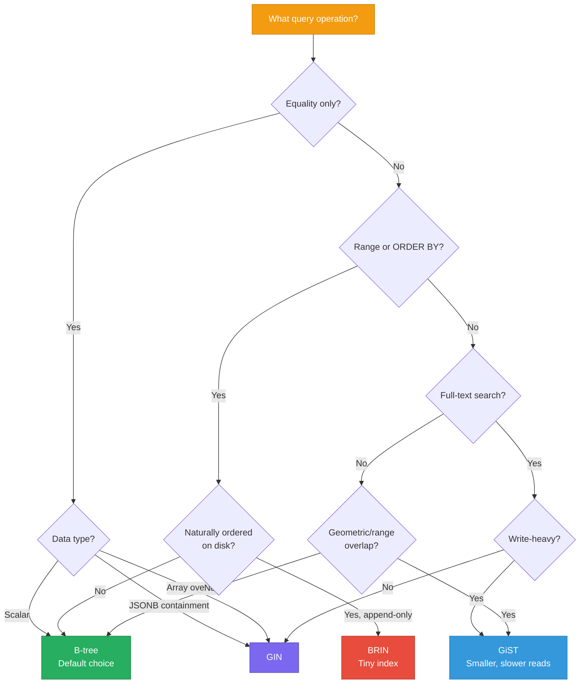

# Indexing Strategies

> **TL;DR:** PostgreSQL offers six index types, each optimized for different query patterns. **B-tree** is the default and handles 90% of cases. **GIN** excels at full-text search and JSONB. **GiST** handles geometric and range queries. **BRIN** is a space-efficient option for naturally ordered data. Choosing the wrong index type is worse than having no index at all — it consumes disk and slows writes without improving reads.

## Table of Contents

- [Why This Matters](#why-this-matters)
- [B-tree Indexes](#b-tree-indexes)
- [GIN (Generalized Inverted Index)](#gin-generalized-inverted-index)
- [GiST (Generalized Search Tree)](#gist-generalized-search-tree)
- [BRIN (Block Range Index)](#brin-block-range-index)
- [Hash Indexes](#hash-indexes)
- [Partial and Expression Indexes](#partial-and-expression-indexes)
- [Index Selection Decision Tree](#index-selection-decision-tree)
- [Comparison](#comparison)
- [Anti-Patterns](#anti-patterns)
- [Key Takeaways](#key-takeaways)
- [References](#references)

---

## Why This Matters

Indexes are the single most impactful performance lever in PostgreSQL. A missing index turns a 2 ms query into a 20-second sequential scan. A wrong index type means you're paying write overhead for an index that can't serve your query. Over-indexing bloats disk, slows writes, and makes VACUUM work harder. The goal is not "more indexes" — it's "the right indexes."

---

## B-tree Indexes

The default index type. Created automatically for primary keys and unique constraints. B-trees support equality (`=`), range (`<`, `>`, `BETWEEN`), sorting (`ORDER BY`), and prefix matching (`LIKE 'foo%'`).

### Multi-Column Indexes and Column Ordering

A multi-column B-tree index on `(a, b, c)` can serve queries that filter on:
- `a` alone
- `a` and `b`
- `a`, `b`, and `c`
- `a` and range on `b`

It **cannot** efficiently serve queries that filter only on `b` or `c` without `a` (the leftmost prefix rule).

**Column ordering matters:** Put the most selective (highest cardinality) equality column first, followed by range columns.

```sql
-- Good: equality on status, range on created_at
CREATE INDEX idx_orders ON orders (status, created_at);
SELECT * FROM orders WHERE status = 'active' AND created_at > '2024-01-01';

-- Bad: reversed order forces scanning all statuses for the date range
CREATE INDEX idx_orders_bad ON orders (created_at, status);
```

### Covering Indexes (INCLUDE)

A **covering index** includes additional columns that are not part of the search key but are needed by the query. This enables **index-only scans** — the query is answered entirely from the index without touching the heap.

```sql
-- The query needs id, name, and email. Only email is in the WHERE clause.
CREATE INDEX idx_users_email ON users (email) INCLUDE (id, name);
SELECT id, name FROM users WHERE email = 'user@example.com';
-- Index-only scan: no heap access needed
```

---

## GIN (Generalized Inverted Index)

GIN indexes map each **element** (token, key, array element) to a list of rows that contain it. This is the same concept as Elasticsearch's inverted index, but built into PostgreSQL.

### Full-Text Search

```sql
-- Create a tsvector column and GIN index
ALTER TABLE articles ADD COLUMN search_vector tsvector;
UPDATE articles SET search_vector = to_tsvector('english', title || ' ' || body);
CREATE INDEX idx_articles_search ON articles USING gin(search_vector);

-- Query with tsquery
SELECT * FROM articles WHERE search_vector @@ to_tsquery('english', 'database & performance');
```

### JSONB Indexing

```sql
-- Index all keys and values in a JSONB column
CREATE INDEX idx_metadata ON events USING gin(metadata);

-- Supports containment queries
SELECT * FROM events WHERE metadata @> '{"type": "click", "source": "mobile"}';

-- Supports existence checks
SELECT * FROM events WHERE metadata ? 'user_id';

-- For path-based queries, use jsonb_path_ops (smaller, faster, but only supports @>)
CREATE INDEX idx_metadata_path ON events USING gin(metadata jsonb_path_ops);
```

### Array Indexing

```sql
CREATE INDEX idx_tags ON posts USING gin(tags);
SELECT * FROM posts WHERE tags @> ARRAY['postgres', 'performance'];
```

### GIN vs B-tree on JSONB

| Operation | B-tree on `metadata->>'key'` | GIN on `metadata` |
|---|---|---|
| Equality on one key | Fast (direct lookup) | Fast |
| Containment (`@>`) | Not supported | Fast |
| Key existence (`?`) | Not supported | Fast |
| Range on one key | Supported | Not supported |
| Index size | Smaller | Larger |
| Write overhead | Lower | Higher (multiple entries per row) |

**Rule of thumb:** Use B-tree on extracted keys when you always query the same field. Use GIN when queries target different fields or use containment/existence operators.

---

## GiST (Generalized Search Tree)

GiST is a framework for building balanced tree indexes on non-traditional data types. It supports "nearest-neighbor" and overlap queries that B-trees cannot handle.

### Use Cases

- **Range types**: `int4range`, `tsrange`, `daterange` — overlap (`&&`), contains (`@>`), contained by (`<@`)
- **Geometric data**: Points, polygons, circles — PostGIS spatial queries
- **Full-text search**: Alternative to GIN (smaller index, slower queries)
- **Exclusion constraints**: Prevent overlapping time ranges (e.g., room bookings)

```sql
-- Prevent double-booking a room
ALTER TABLE bookings ADD CONSTRAINT no_overlap
    EXCLUDE USING gist (room_id WITH =, time_range WITH &&);
```

### GiST vs GIN for Full-Text Search

| Property | GiST | GIN |
|---|---|---|
| Index size | Smaller (lossy) | Larger (exact) |
| Build time | Faster | Slower |
| Query speed | Slower (must recheck) | Faster |
| Update cost | Lower | Higher |
| **Best for** | Columns that change frequently | Columns that are mostly read |

---

## BRIN (Block Range Index)

BRIN (Block Range Index) is a lightweight index that stores **summary information** (min/max values) for ranges of physical table blocks. It's extremely small but only works well when data is physically ordered on disk.

### How BRIN Works

Instead of indexing every row, BRIN divides the table into block ranges (default: 128 pages = 1 MB) and stores the min and max value for each range. A query checks which block ranges *could* contain matching rows and scans only those.

### When BRIN Excels

BRIN is ideal for columns where the physical order on disk correlates with the logical order of values:
- **Timestamps** on append-only tables (logs, events, sensor data)
- **Sequential IDs** on tables where rows are inserted in order
- **Partitioned tables** where each partition covers a time range

### Space Comparison

For a table with 100 million rows and a `timestamp` column:

| Index Type | Size | Scan Overhead |
|---|---|---|
| B-tree | ~2 GB | Precise row lookup |
| BRIN | ~100 KB | Scans matching block ranges (may include false positives) |

BRIN uses **20,000x less space** than B-tree for this use case, at the cost of slightly less precise lookups.

```sql
-- Perfect for an append-only events table
CREATE INDEX idx_events_ts ON events USING brin(created_at);
```

---

## Hash Indexes

Hash indexes support **only equality** queries (`=`). They use a hash function to map keys to buckets.

Since PostgreSQL 10, hash indexes are crash-safe (WAL-logged). Before that, they were considered unreliable.

**When hash beats B-tree:** Almost never in practice. The space savings are minimal, and B-tree supports equality *plus* range queries. Consider hash indexes only for very high-cardinality equality-only lookups (e.g., UUIDs) where you've benchmarked and confirmed a measurable improvement.

---

## Partial and Expression Indexes

### Partial Indexes

A partial index only indexes rows that match a condition. This reduces index size and maintenance overhead.

```sql
-- Only index active users (95% of queries filter on active=true)
CREATE INDEX idx_active_users ON users (email) WHERE active = true;

-- Only index unprocessed jobs
CREATE INDEX idx_pending_jobs ON jobs (priority, created_at) WHERE status = 'pending';
```

### Expression Indexes

An expression index indexes the result of a function or expression, not the raw column value.

```sql
-- Case-insensitive email lookup
CREATE INDEX idx_users_email_lower ON users (lower(email));
SELECT * FROM users WHERE lower(email) = 'user@example.com';

-- Index a computed value
CREATE INDEX idx_orders_year ON orders (extract(year FROM created_at));
```

---

## Index Selection Decision Tree



---

## Comparison

| Index Type | Query Types | Data Types | Relative Size | Write Overhead | Best For |
|---|---|---|---|---|---|
| **B-tree** | `=`, `<`, `>`, `BETWEEN`, `ORDER BY`, `LIKE 'prefix%'` | Scalar types | Medium | Low | 90% of use cases |
| **GIN** | `@>`, `?`, `@@`, `&&` | JSONB, tsvector, arrays | Large | High | Full-text search, JSONB queries |
| **GiST** | `&&` (overlap), `@>`, `<@`, `<<->>`(nearest) | Ranges, geometry, tsvector | Medium | Medium | Geometric queries, exclusion constraints |
| **BRIN** | `=`, `<`, `>`, `BETWEEN` | Any orderable type | Tiny | Very low | Append-only, time-ordered tables |
| **Hash** | `=` only | Any hashable type | Small | Low | Rarely better than B-tree |

---

## Anti-Patterns

### Over-Indexing
Every index slows writes (INSERT, UPDATE, DELETE must update all indexes). A table with 10 indexes means every write does 10 index operations. Audit unused indexes with:
```sql
SELECT schemaname, relname, indexrelname, idx_scan
FROM pg_stat_user_indexes
WHERE idx_scan = 0
ORDER BY pg_relation_size(indexrelid) DESC;
```

### Wrong Column Order in Composite Indexes
An index on `(a, b)` is useless for queries that filter only on `b`. Put the most restrictive equality column first.

### Indexing Low-Cardinality Columns with B-tree
A B-tree index on a boolean column (`active = true/false`) is almost never helpful — the planner will choose a sequential scan because the index doesn't narrow the result enough. Use a **partial index** instead (`WHERE active = true`).

### Not Running ANALYZE After Bulk Loads
After inserting millions of rows, the planner's statistics are stale. Run `ANALYZE table_name;` to update them, or the planner will make bad decisions about which indexes to use.

---

## Key Takeaways

- **B-tree is the default** and handles equality, range, sorting, and prefix matching. Start here.
- **GIN is essential** for JSONB containment queries and full-text search. Expect higher write overhead.
- **BRIN is spectacularly space-efficient** for naturally ordered data (timestamps on append-only tables). 20,000x smaller than B-tree for the same column.
- **GiST enables exclusion constraints** (no overlapping bookings) and geometric queries (PostGIS) that no other index type can handle.
- **Partial indexes** are underused — if 95% of queries filter on `status = 'active'`, index only active rows.
- **Covering indexes** (`INCLUDE`) enable index-only scans, eliminating heap lookups entirely.
- **Audit unused indexes** regularly with `pg_stat_user_indexes`. Every unused index is wasted disk and write overhead.

---

## References

1. [PostgreSQL Documentation — Index Types](https://www.postgresql.org/docs/current/indexes-types.html)
2. Winand, M. [Use the Index, Luke](https://use-the-index-luke.com/) — The best resource on SQL indexing
3. [PostgreSQL Wiki — Performance Optimization](https://wiki.postgresql.org/wiki/Performance_Optimization)
4. [PostgreSQL GIN Index Documentation](https://www.postgresql.org/docs/current/gin.html)
5. [PostgreSQL BRIN Index Documentation](https://www.postgresql.org/docs/current/brin.html)
