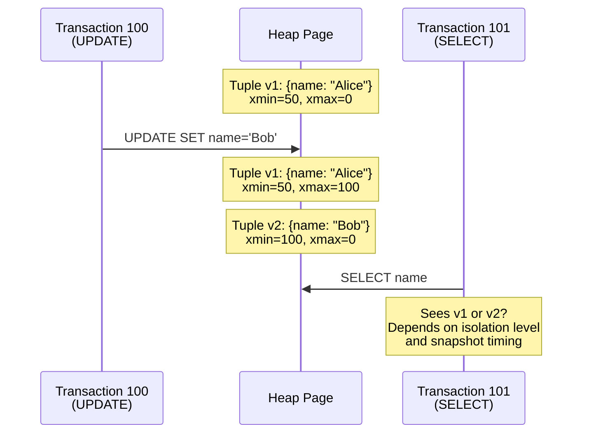
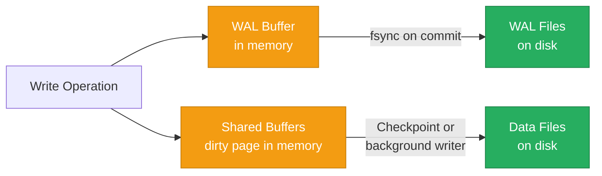

# PostgreSQL Internals

> **TL;DR:** PostgreSQL uses **Multi-Version Concurrency Control (MVCC)** to let readers never block writers and writers never block readers. Its **Write-Ahead Log (WAL)** ensures durability. Its **cost-based query planner** decides execution strategies. Understanding these three systems — MVCC, WAL, and the planner — explains why PostgreSQL performs the way it does and how to tune it.

## Table of Contents

- [Why This Matters](#why-this-matters)
- [Architecture Overview](#architecture-overview)
- [MVCC (Multi-Version Concurrency Control)](#mvcc-multi-version-concurrency-control)
- [VACUUM: Cleaning Up Dead Tuples](#vacuum-cleaning-up-dead-tuples)
- [Write-Ahead Log (WAL)](#write-ahead-log-wal)
- [Query Planner](#query-planner)
- [Connection Pooling](#connection-pooling)
- [Partitioning](#partitioning)
- [Key Takeaways](#key-takeaways)
- [References](#references)

---

## Why This Matters

PostgreSQL is the default database for most applications, and for good reason — it's reliable, feature-rich, and has decades of optimization behind it. But "default" doesn't mean "simple." PostgreSQL's internals are sophisticated, and understanding them is the difference between a database that hums along and one that grinds to a halt under load. MVCC bloat, autovacuum lag, query planner misestimates, and connection exhaustion are all problems that stem from not understanding what's happening underneath.

## Architecture Overview

PostgreSQL uses a **process-per-connection** architecture. Each client connection spawns a dedicated backend process. All backend processes communicate through **shared memory** (shared buffers, WAL buffers, lock tables).

```mermaid
graph TD
    C1[Client 1] --> PG[Postmaster<br/>Listener Process]
    C2[Client 2] --> PG
    C3[Client N] --> PG
    PG --> B1[Backend Process 1]
    PG --> B2[Backend Process 2]
    PG --> B3[Backend Process N]
    B1 --> SM[Shared Memory<br/>Shared Buffers | WAL Buffers | Lock Table]
    B2 --> SM
    B3 --> SM
    SM --> WAL[WAL Files<br/>Sequential writes]
    SM --> HEAP[Heap Files<br/>Table data pages]
    SM --> IDX[Index Files<br/>B-tree pages]

    BG1[Background Writer] --> SM
    BG2[WAL Writer] --> SM
    BG3[Autovacuum] --> SM
    BG4[Checkpointer] --> SM

    style PG fill:#4a90d9,stroke:#2c5f8a,color:#fff
    style SM fill:#f39c12,stroke:#c87f0a,color:#fff
    style WAL fill:#27ae60,stroke:#1e8449,color:#fff
```

**Key components:**
- **Postmaster**: Listens for connections, forks backend processes
- **Backend processes**: Execute queries, manage transactions (one per connection)
- **Shared buffers**: In-memory cache of disk pages (typically 25% of RAM)
- **WAL buffers**: In-memory buffer for WAL records before they're flushed to disk
- **Background writer**: Writes dirty pages from shared buffers to disk
- **Checkpointer**: Periodically ensures all dirty pages are written and creates a recovery point
- **Autovacuum**: Cleans up dead tuples created by MVCC

### Process-per-Connection vs Thread-per-Connection

PostgreSQL's process model means each connection consumes ~5-10 MB of memory. With 1,000 connections, that's 5-10 GB of memory just for connection overhead — before any query execution. This is why **connection pooling** (PgBouncer) is essential for any non-trivial deployment.

By contrast, MySQL uses threads (lighter-weight), and some newer databases like ScyllaDB use a thread-per-core model (even lighter).

---

## MVCC (Multi-Version Concurrency Control)

MVCC is PostgreSQL's concurrency strategy. Instead of locking rows for reads, PostgreSQL keeps **multiple versions** of each row and uses **visibility rules** to determine which version each transaction can see.

### How It Works

Every row (tuple) in PostgreSQL has two hidden system columns:
- **`xmin`**: The transaction ID that created this tuple version
- **`xmax`**: The transaction ID that deleted or updated this tuple (0 if still valid)

When a row is **updated**, PostgreSQL doesn't modify it in place. Instead, it:
1. Marks the old tuple's `xmax` with the current transaction ID
2. Creates a **new tuple** with the updated data and the current transaction ID as `xmin`
3. Both versions coexist on the same heap page (or overflow to another page)



### Visibility Rules

A tuple is visible to transaction T if:
- `xmin` is committed AND `xmin` < T's snapshot (the row was created before T started looking)
- `xmax` is either 0 (not deleted) OR `xmax` is not committed OR `xmax` >= T's snapshot

This means:
- **Readers never block writers**: Readers see the old version while a writer creates a new version
- **Writers never block readers**: The old version remains visible until the writer commits
- **Writers block writers**: Two transactions trying to update the same row will block (row-level lock)

### The Dead Tuple Problem

Every UPDATE creates a dead tuple (the old version). Every DELETE creates a dead tuple. These dead tuples consume disk space and slow down sequential scans (the scanner must skip over them). Over time, a heavily updated table accumulates significant bloat.

This is the fundamental cost of MVCC: **write amplification and space amplification** in exchange for lock-free reads.

---

## VACUUM: Cleaning Up Dead Tuples

VACUUM is PostgreSQL's garbage collector. It reclaims space occupied by dead tuples and updates the **visibility map** (which pages are "all-visible" and can be skipped by index-only scans).

### Regular VACUUM vs VACUUM FULL

| Operation | What It Does | Locking | Space Reclamation |
|---|---|---|---|
| **VACUUM** | Marks dead tuple space as reusable within the same table file | No exclusive lock (runs concurrently) | Space is reusable but file doesn't shrink |
| **VACUUM FULL** | Rewrites the entire table, compacting it | **Exclusive lock** (table offline) | File shrinks to actual data size |

**Rule of thumb:** Use regular VACUUM (via autovacuum) for ongoing maintenance. Use VACUUM FULL only as a last resort for severely bloated tables during a maintenance window.

### Autovacuum

Autovacuum is a background process that automatically runs VACUUM on tables that need it. It triggers based on:
- **`autovacuum_vacuum_threshold`**: Minimum number of dead tuples (default: 50)
- **`autovacuum_vacuum_scale_factor`**: Fraction of the table that must be dead tuples (default: 0.2 = 20%)

**Trigger formula**: VACUUM runs when dead_tuples > threshold + scale_factor * total_tuples

**Common tuning for high-throughput tables:**
```
-- For a table with 10M rows, default triggers at 2M dead tuples (20%)
-- That's too late. Tune it:
ALTER TABLE hot_table SET (
    autovacuum_vacuum_scale_factor = 0.02,  -- 2% instead of 20%
    autovacuum_vacuum_threshold = 1000
);
```

### Transaction ID Wraparound

PostgreSQL transaction IDs are 32-bit integers (~4 billion). When the counter wraps around, old transactions would appear to be in the "future," making their data invisible. To prevent this, PostgreSQL requires a **VACUUM FREEZE** to mark old tuples with a special "frozen" transaction ID.

If autovacuum falls behind and the transaction ID counter approaches wraparound, PostgreSQL enters a **safety shutdown** mode — refusing new transactions until a manual VACUUM FREEZE completes. This is one of the most dangerous operational failure modes in PostgreSQL.

**Prevention:** Monitor `age(datfrozenxid)` in `pg_database`. If it exceeds 500 million, investigate immediately.

---

## Write-Ahead Log (WAL)

The WAL is PostgreSQL's durability mechanism. Every change is written to the WAL **before** it's applied to the actual data pages. If the system crashes, PostgreSQL replays the WAL from the last checkpoint to recover.

### Write Path



1. Application issues INSERT/UPDATE/DELETE
2. Backend process writes a WAL record to the WAL buffer (memory)
3. Backend modifies the page in shared buffers (memory — "dirty page")
4. On COMMIT: WAL buffer is flushed to WAL files on disk (`fsync`)
5. Later: Checkpointer or background writer flushes dirty pages from shared buffers to data files

**Key insight:** The data files on disk are often behind the WAL. This is fine — if the system crashes, WAL replay brings the data files up to date. The WAL is the source of truth until the next checkpoint.

### WAL and Replication

Streaming replication sends WAL records from the primary to replicas in near-real-time. Replicas replay the WAL to stay current. This means:
- **Synchronous replication**: Primary waits for the replica to acknowledge the WAL write before confirming the commit. Zero data loss, higher latency.
- **Asynchronous replication**: Primary doesn't wait. Lower latency, but up to a few seconds of data loss on failover.

### Key WAL Parameters

| Parameter | What It Does | Default | Tuning Guidance |
|---|---|---|---|
| `wal_level` | How much information is written to WAL | `replica` | Set to `logical` if you need logical replication or CDC |
| `max_wal_size` | Maximum WAL size before a checkpoint is forced | 1 GB | Increase for write-heavy workloads (e.g., 4-16 GB) |
| `checkpoint_timeout` | Maximum time between checkpoints | 5 min | Increase to 15-30 min for write-heavy workloads |
| `synchronous_commit` | Whether to wait for WAL flush before confirming commit | `on` | Set `off` for non-critical writes (2-3x throughput gain, risk of losing last few ms of data) |

---

## Query Planner

PostgreSQL uses a **cost-based optimizer** to decide how to execute queries. It estimates the cost of different execution strategies and picks the cheapest one.

### EXPLAIN and EXPLAIN ANALYZE

- **`EXPLAIN`**: Shows the planner's chosen plan and estimated costs (does not execute the query)
- **`EXPLAIN ANALYZE`**: Executes the query and shows actual vs estimated row counts, timing per node

The most important thing to check: **estimated rows vs actual rows**. When these differ significantly, the planner chose a bad plan because its statistics are wrong. Fix this with `ANALYZE` (update table statistics).

### Scan Types

| Scan Type | When Chosen | How It Works |
|---|---|---|
| **Sequential Scan** | Small table, or query returns >5-10% of rows | Reads every page in the table in order |
| **Index Scan** | Selective query on an indexed column | Traverses B-tree index, then fetches heap tuple |
| **Index-Only Scan** | Query columns are all in the index (covering index) | Reads only the index, skips heap entirely |
| **Bitmap Index Scan** | Medium selectivity, or combining multiple indexes | Builds a bitmap of matching pages, then fetches pages in physical order |

### Join Strategies

| Strategy | Best When | How It Works | Cost |
|---|---|---|---|
| **Nested Loop** | One side is small, inner side has an index | For each row in outer table, look up matching row in inner table | O(N * M) worst case, O(N * log M) with index |
| **Hash Join** | Both sides are large, no useful index, equality join | Build hash table from smaller side, probe with larger side | O(N + M) time, O(min(N,M)) memory |
| **Merge Join** | Both sides are large, both are sorted (or have index) | Merge two sorted streams | O(N + M) if pre-sorted |

### Statistics and ANALYZE

The planner relies on statistics stored in `pg_statistic`:
- Number of distinct values per column
- Most common values and their frequencies
- Histogram of value distribution

`ANALYZE` (run automatically by autovacuum) updates these statistics. Stale statistics → bad plans → slow queries.

---

## Connection Pooling

PostgreSQL's process-per-connection model means you **must** use a connection pooler in production. Direct connections from application instances (especially in microservices or serverless environments) will exhaust PostgreSQL's memory and process limits.

### PgBouncer

PgBouncer is the most widely used connection pooler for PostgreSQL.

| Pool Mode | How It Works | Best For |
|---|---|---|
| **Transaction** | Connection is returned to the pool after each transaction | Most applications (default recommendation) |
| **Session** | Connection is held for the entire client session | Applications using prepared statements, session-level settings |
| **Statement** | Connection is returned after each statement | Simple queries, autocommit workloads |

**Typical setup:** Application opens 100 connections to PgBouncer. PgBouncer maintains 20 connections to PostgreSQL. PgBouncer multiplexes application requests across the smaller pool.

### pgpool-II

pgpool-II adds load balancing and automatic failover on top of connection pooling:
- Routes read queries to replicas
- Detects primary failure and promotes a replica
- More complex to configure than PgBouncer

**When to choose which:**
- **PgBouncer**: You just need connection pooling (most cases)
- **pgpool-II**: You need pooling + read replica load balancing + automatic failover in one tool

---

## Partitioning

PostgreSQL supports **declarative partitioning** (since v10) to split large tables into smaller physical pieces while presenting a single logical table to queries.

### Partition Strategies

| Strategy | How It Works | Best For |
|---|---|---|
| **Range** | Rows assigned to partitions based on a range of values | Time-series data (partition by month), sequential IDs |
| **List** | Rows assigned based on a list of discrete values | Geographical regions, categories, status codes |
| **Hash** | Rows assigned based on a hash of the partition key | Even distribution when there's no natural range |

### When to Partition

Partition when:
- Table exceeds **~100 GB** and you can't index your way out of performance problems
- You need **time-based data lifecycle** (drop old partitions instead of DELETE + VACUUM)
- Query patterns **always include the partition key** (enabling partition pruning)

Don't partition when:
- The table is small enough for normal indexing to handle
- Queries frequently span all partitions (no pruning benefit)
- You're doing it "just in case" — partitioning adds management overhead

### Partition Pruning

The query planner's ability to skip irrelevant partitions at planning time:

```sql
-- With monthly range partitions on created_at:
SELECT * FROM events WHERE created_at >= '2024-01-01' AND created_at < '2024-02-01';
-- Planner scans ONLY the January 2024 partition
```

---

## Key Takeaways

- **MVCC lets readers and writers coexist** without blocking each other, but it creates dead tuples that must be cleaned up by VACUUM. Monitor autovacuum performance — if it falls behind, bloat and transaction ID wraparound will eventually bite you.
- **WAL is the durability foundation.** Every committed transaction hits the WAL before it's confirmed. Tune `max_wal_size` and `checkpoint_timeout` for write-heavy workloads.
- **The query planner is only as good as its statistics.** When queries are slow, check `EXPLAIN ANALYZE` and compare estimated vs actual row counts. Stale statistics are the #1 cause of bad plans.
- **Connection pooling is mandatory**, not optional. PgBouncer in transaction mode is the standard recommendation. Without it, a spike in connections will exhaust PostgreSQL's process limits.
- **Partition large tables by time** if you have time-series-like access patterns. The ability to drop entire partitions (instead of DELETE + VACUUM) is the primary operational benefit.
- **PostgreSQL is a multi-model database** — relational + JSONB + full-text search + geospatial (PostGIS) + vector search (pgvector). Understand its limits before reaching for a purpose-built alternative.

---

## References

1. [PostgreSQL Official Documentation — Internals](https://www.postgresql.org/docs/current/internals.html)
2. Momjian, B. [PostgreSQL Internals Through Pictures](https://momjian.us/main/writings/pgsql/internalpics.pdf)
3. Rogov, E. (2023). *PostgreSQL 14 Internals*. Postgres Professional.
4. [PostgreSQL Wiki — Performance Optimization](https://wiki.postgresql.org/wiki/Performance_Optimization)
5. [PgBouncer Documentation](https://www.pgbouncer.org/)
6. Kleppmann, M. (2017). *Designing Data-Intensive Applications*, Chapter 7: Transactions. O'Reilly Media.
