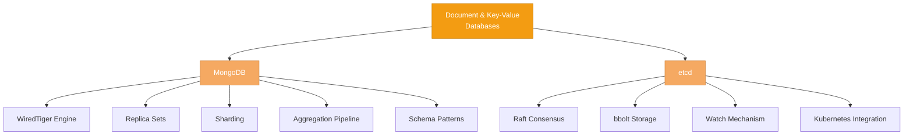

# Document & Key-Value Databases

> Schema flexibility and distributed coordination — how MongoDB and etcd solve fundamentally different problems with different architectures.

## What This Section Covers

MongoDB and etcd represent two ends of the NoSQL spectrum. MongoDB is a general-purpose document database designed for developer productivity and horizontal scaling. etcd is a coordination service designed for consistency and reliability at small scale. What they share is a departure from the relational model — and understanding *why* they departed (and what they gained and lost) is the core of this section.

## Concept Map

## Pages in This Section

| Page | What You'll Learn |
|---|---|
| [MongoDB Internals](mongodb-internals.md) | WiredTiger storage engine, replica sets, sharding, aggregation pipeline, schema design patterns, and transactions |
| [etcd Internals](etcd-internals.md) | Raft consensus implementation, bbolt storage, watch mechanism, and why etcd powers Kubernetes |

## Suggested Reading Order

1. Start with **[MongoDB Internals](mongodb-internals.md)** — it's the more broadly applicable database and introduces concepts (replication, sharding) that appear across all distributed databases
2. Then read **[etcd Internals](etcd-internals.md)** — a specialized coordination service that provides a clean case study of Raft consensus in production

## How This Section Connects

- **To Database Foundations (Section 01)** — MongoDB's WiredTiger is a B-tree engine (covered in Storage Engines). etcd's bbolt is also a B+tree. The document vs relational tradeoff is the core of Data Models.
- **To Distributed Internals (Section 06)** — etcd is one of the primary Raft implementations discussed in Consensus Algorithms. MongoDB's replica sets and sharding are concrete examples of the strategies in Replication & Sharding.
