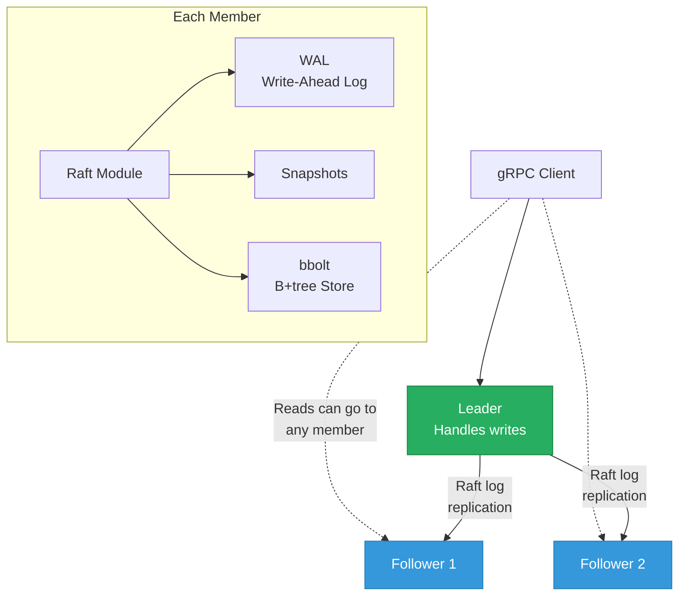
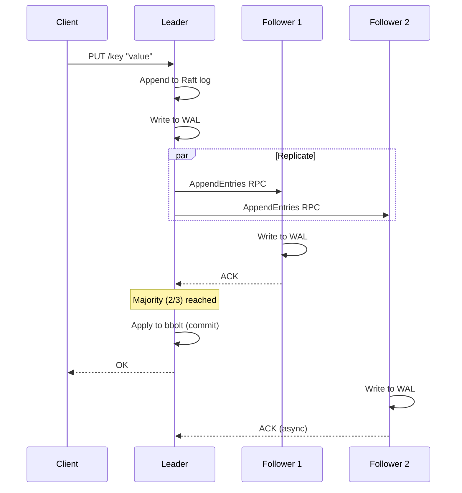
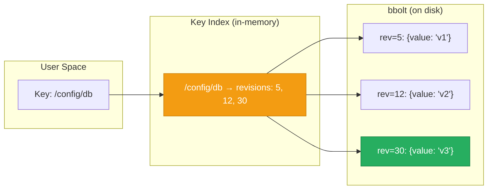

# etcd Internals

> **TL;DR:** etcd is a distributed key-value store that uses **Raft consensus** to guarantee linearizable reads and writes. It powers Kubernetes' control plane, storing all cluster state. Built on **bbolt** (a B+tree), etcd prioritizes consistency and reliability over throughput. Understanding etcd means understanding why coordination services exist and how Raft makes them correct.

## Table of Contents

- [Why This Matters](#why-this-matters)
- [Architecture Overview](#architecture-overview)
- [Raft Consensus in etcd](#raft-consensus-in-etcd)
- [bbolt Storage Engine](#bbolt-storage-engine)
- [Watch Mechanism](#watch-mechanism)
- [Persistent Storage Files](#persistent-storage-files)
- [Performance Characteristics](#performance-characteristics)
- [Key Takeaways](#key-takeaways)
- [References](#references)

---

## Why This Matters

Every Kubernetes cluster depends on etcd. When etcd is unhealthy, Kubernetes cannot schedule pods, update configurations, or detect node failures. Beyond Kubernetes, etcd's architecture is a case study in distributed consensus — it's one of the clearest real-world implementations of Raft. Understanding etcd teaches you how distributed systems achieve correctness, not just availability.

## Architecture Overview

An etcd cluster consists of an odd number of members (typically 3 or 5) that elect a leader using Raft. All writes go through the leader, which replicates them to followers before acknowledging.

**Key components per member:**
- **gRPC API**: Client-facing interface for KV operations, watches, leases
- **Raft module**: Consensus algorithm implementation (`etcd/raft` library)
- **WAL**: Persistent log of Raft entries (crash recovery)
- **Snapshots**: Periodic compaction of the WAL into a full state snapshot
- **bbolt**: The underlying key-value store (B+tree on disk)

---

## Raft Consensus in etcd

etcd's Raft implementation is one of the most battle-tested in the industry. For a full treatment of Raft, see [Consensus Algorithms](../06-distributed-database-internals/consensus-algorithms.md).

### Write Path Through Raft

**Key properties:**
- Every write is committed only after a **majority** of members acknowledge
- The leader always has the most up-to-date log
- If the leader fails, a follower with the most complete log wins the election

### Linearizable Reads

By default, etcd provides linearizable reads — every read returns the most recent committed value. Two mechanisms:

1. **ReadIndex (default)**: The leader confirms it's still the leader by exchanging heartbeats with a majority, then serves the read. Adds ~1 RTT latency.
2. **Lease-based reads**: The leader assumes it's still the leader during its lease period. Lower latency but can return stale data if a network partition causes a new leader election.

---

## bbolt Storage Engine

etcd uses **bbolt** (a fork of BoltDB) as its persistent storage backend. bbolt is a **B+tree** embedded key-value store.

### How etcd Uses bbolt

etcd implements **MVCC** on top of bbolt:
- Each key has a **revision** (monotonically increasing integer)
- Every write creates a new revision
- bbolt stores key-revision pairs: the key is `(revision, sub_revision)`, the value is the actual key-value data
- A separate **key index** (in-memory B-tree) maps user keys to their revisions

### Compaction

Over time, the revision history grows and bbolt's database file grows. etcd supports **compaction** to remove revisions older than a specified revision number:
- **Automatic**: Configure with `--auto-compaction-retention` (e.g., `"5m"` for 5 minutes)
- **Manual**: `etcdctl compaction <revision>`

Compaction removes old revisions from bbolt but doesn't shrink the file (bbolt reuses freed pages internally). To reclaim disk space, run `etcdctl defrag`.

---

## Watch Mechanism

etcd's watch API is **event-driven, not polling**. Clients subscribe to key changes and receive notifications as they happen. This is the foundation of Kubernetes' controller pattern — controllers watch for resource changes and reconcile state.

### How Watches Work

1. Client sends a `Watch` request with a key (or key prefix) and an optional start revision
2. etcd creates a **watcher** attached to the key index
3. When a key matching the watcher's filter is modified, etcd sends a `WatchResponse` with the new and old value
4. Multiple watchers are **multiplexed** over a single gRPC stream

**Key properties:**
- **Ordered**: Events are delivered in revision order
- **Reliable**: If a client disconnects and reconnects with a revision number, it receives all events since that revision (up to the compaction boundary)
- **Efficient**: Server-side multiplexing means thousands of watches on a single connection are cheap

---

## Persistent Storage Files

etcd stores its data in a directory structure on disk. Understanding these files is essential for backup, recovery, and debugging.

| File/Directory | Purpose | Format |
|---|---|---|
| `member/wal/` | Write-Ahead Log — Raft log entries | Binary, append-only, 64 MB segments |
| `member/snap/` | Raft snapshots — compacted state | Binary, protobuf |
| `member/snap/db` | bbolt database file — current state | B+tree pages, mmap'd |

**Backup strategy:**
- Use `etcdctl snapshot save` (not filesystem copy — bbolt needs a consistent snapshot)
- Restore with `etcdctl snapshot restore`
- Never copy the data directory while etcd is running

For more details, see the [etcd Persistent Storage Files](https://etcd.io/docs/v3.5/learning/persistent-storage-files/) documentation.

---

## Performance Characteristics

etcd is designed for **consistency and reliability**, not raw throughput. It is explicitly **not** a general-purpose database.

### Typical Performance

| Metric | Typical Value | Notes |
|---|---|---|
| Write throughput | 10,000-30,000 ops/sec | Raft consensus is the bottleneck |
| Read throughput | 50,000-100,000 ops/sec | Higher because reads can be served locally |
| P99 write latency | 5-20 ms | Depends on disk fsync speed and network RTT |
| Max database size | ~8 GB recommended | Beyond this, compaction and defrag become expensive |
| Max key size | 1.5 MB | But large values are discouraged |
| Max recommended keys | ~1 million | etcd is for metadata, not bulk data |

### etcd vs Other Coordination Services

| Feature | etcd | Redis | Consul | ZooKeeper |
|---|---|---|---|---|
| **Consensus** | Raft | None (single-leader replication) | Raft | ZAB |
| **Consistency** | Linearizable | Eventual (replication) | Linearizable | Linearizable |
| **Watch/Notify** | Yes (revision-based) | Pub/Sub (fire-and-forget) | Yes (blocking queries) | Yes (znodes + watches) |
| **Storage** | bbolt (B+tree, disk) | In-memory | bbolt | ZK data tree (memory + snapshot) |
| **Scale** | Metadata (~GB) | Data (~100 GB+) | Metadata (~GB) | Metadata (~GB) |
| **Primary use** | Kubernetes control plane | Cache, sessions, queues | Service discovery, service mesh | Distributed coordination (legacy) |

**Key insight:** etcd, Consul, and ZooKeeper solve the same problem (distributed coordination) with similar architectures. Redis solves a different problem (fast data access) with a different architecture. Don't use etcd as a cache; don't use Redis as a consensus store.

---

## Key Takeaways

- **etcd is a coordination service**, not a general-purpose database. It stores metadata (Kubernetes cluster state, configuration, service discovery) with strong consistency guarantees.
- **Raft consensus ensures linearizability** — every read returns the most recently committed value, and writes are durable once a majority acknowledges them.
- **bbolt (B+tree)** provides the persistent storage layer. etcd builds MVCC on top of it, enabling watches and historical reads.
- **The watch mechanism** is etcd's killer feature — it enables Kubernetes' reconciliation loop pattern. Watches are event-driven, ordered, and reliable.
- **etcd's performance ceiling is low by design** — 10K-30K writes/sec, ~8 GB data. These are not limitations to work around; they're design constraints that enable consistency.
- **Compaction and defragmentation** are operational necessities — without them, the bbolt database file grows indefinitely.

---

## References

1. [etcd Official Documentation](https://etcd.io/docs/)
2. [etcd Persistent Storage Files](https://etcd.io/docs/v3.5/learning/persistent-storage-files/)
3. Ongaro, D. & Ousterhout, J. (2014). [In Search of an Understandable Consensus Algorithm](https://raft.github.io/raft.pdf). USENIX ATC.
4. [etcd/raft — Raft library used by etcd](https://github.com/etcd-io/raft)
5. [bbolt — etcd's embedded key-value database](https://github.com/etcd-io/bbolt)
