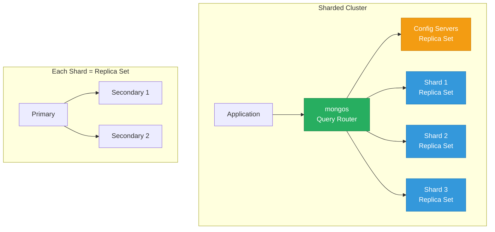
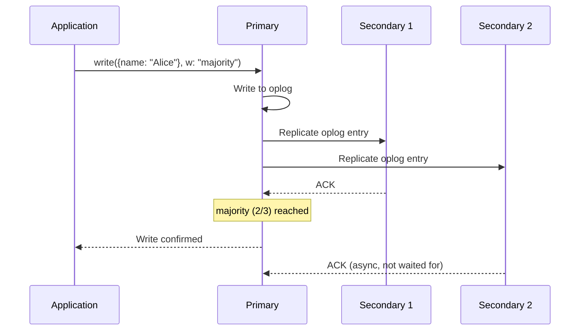
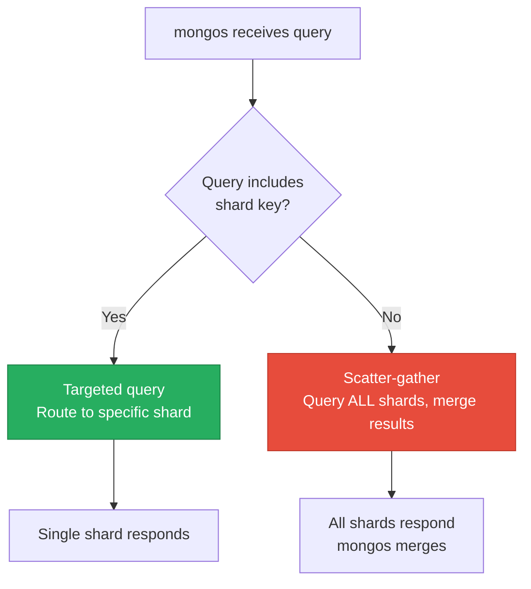

# MongoDB Internals

> **TL;DR:** MongoDB stores data as BSON documents in **WiredTiger**, a hybrid B-tree storage engine with document-level locking and compression. **Replica sets** provide automatic failover with configurable read/write concerns. **Sharding** distributes data across machines using either range-based or hashed shard keys. Understanding WiredTiger's cache, the oplog, and shard key selection is the difference between a MongoDB deployment that works and one that falls over.

## Table of Contents

- [Why This Matters](#why-this-matters)
- [Architecture Overview](#architecture-overview)
- [WiredTiger Storage Engine](#wiredtiger-storage-engine)
- [Replica Sets](#replica-sets)
- [Sharding](#sharding)
- [Aggregation Pipeline](#aggregation-pipeline)
- [Schema Design Patterns](#schema-design-patterns)
- [Transactions](#transactions)
- [Key Takeaways](#key-takeaways)
- [References](#references)

---

## Why This Matters

MongoDB is the most widely deployed document database, and its architecture is fundamentally different from relational databases. It makes different tradeoffs — schema flexibility over enforcement, horizontal scaling over join optimization, document-level atomicity over multi-table transactions. Understanding these tradeoffs at the engine level explains why MongoDB excels at some workloads and struggles at others. If you're operating MongoDB in production, understanding WiredTiger's cache, the oplog, and shard key selection prevents the most common failure modes.

## Architecture Overview

MongoDB supports three deployment topologies, each adding a layer of complexity:

| Topology | When to Use | Complexity |
|---|---|---|
| **Standalone** | Development, testing | Minimal |
| **Replica Set** | Production (most cases) — HA, read scaling | Moderate |
| **Sharded Cluster** | Data exceeds single server capacity, or write throughput exceeds single primary | High |

---

## WiredTiger Storage Engine

WiredTiger has been MongoDB's default storage engine since 3.2. It replaced MMAPv1, which had collection-level locking and no compression.

### Key Characteristics

- **B-tree** structure for data and indexes (not LSM-tree)
- **Document-level concurrency** via optimistic concurrency control (hazard pointers + skip lists)
- **Write-ahead journal** for durability (similar to PostgreSQL's WAL)
- **Checkpoint mechanism**: WiredTiger writes snapshots of data to disk every 60 seconds, with the journal providing durability between checkpoints
- **Compression** at the page level:

| Compression | Ratio | CPU Cost | Default For |
|---|---|---|---|
| **Snappy** | ~2-4x | Low | Collection data |
| **zlib** | ~4-6x | Medium | — |
| **zstd** | ~4-7x | Medium-Low | Recommended for most workloads (since 4.2) |
| **None** | 1x | None | — |

### WiredTiger Cache vs Filesystem Cache

WiredTiger maintains its own internal cache (default: 50% of RAM minus 1 GB). Data in this cache is in an **uncompressed, B-tree format** optimized for random access. The operating system's filesystem cache holds **compressed** pages as they exist on disk.

| Cache Layer | Contents | Managed By | Default Size |
|---|---|---|---|
| **WiredTiger cache** | Uncompressed B-tree pages, dirty pages | WiredTiger | 50% of (RAM - 1 GB) |
| **Filesystem cache** | Compressed disk pages | OS kernel | Remaining RAM |

**Tuning rule:** Don't set `wiredTigerCacheSizeGB` too high — you need filesystem cache for compressed pages and OS overhead. The default formula works well for dedicated database servers.

### WiredTiger vs PostgreSQL's Heap Storage

| Property | WiredTiger (MongoDB) | Heap + B-tree (PostgreSQL) |
|---|---|---|
| Data organization | B-tree clustered by `_id` | Heap (unordered) + separate B-tree indexes |
| Concurrency | Document-level optimistic | Row-level MVCC (multi-version) |
| Compression | Built-in (snappy/zstd/zlib) | Optional (TOAST for large values) |
| Dead tuple cleanup | Implicit (old versions discarded at checkpoint) | Explicit (VACUUM required) |
| Update strategy | Rewrite entire document | Create new tuple version |

---

## Replica Sets

A replica set is a group of MongoDB instances (typically 3) that maintain the same data, providing high availability and read scaling.

### How Replication Works

1. **Primary** receives all writes
2. Primary records operations in the **oplog** (operations log) — a capped collection in the `local` database
3. **Secondaries** tail the oplog and replay operations
4. If the primary fails, an **election** promotes a secondary

### Elections

Elections use a modified Raft-like protocol:
- Nodes exchange heartbeats every 2 seconds
- If a secondary doesn't hear from the primary for `electionTimeoutMillis` (default: 10s), it initiates an election
- A candidate needs votes from a **majority** (2 out of 3, 3 out of 5)
- Elections typically complete in ~12 seconds

### Write Concern

Write concern controls how many replica set members must acknowledge a write before the driver confirms success.

| Write Concern | Durability | Latency | Data Loss Risk |
|---|---|---|---|
| `w: 1` | Primary acknowledged | Lowest | Possible (primary fails before replication) |
| `w: "majority"` | Majority acknowledged | Medium | Minimal (data on multiple nodes) |
| `w: <number>` | N members acknowledged | Higher | Controlled |
| `j: true` | Journaled on acknowledging members | Highest | None (if combined with w: majority) |

### Read Preference

| Mode | Where Reads Go | Use Case |
|---|---|---|
| `primary` | Primary only (default) | Consistency-critical reads |
| `primaryPreferred` | Primary, fallback to secondary | HA for reads |
| `secondary` | Secondaries only | Offload read traffic from primary |
| `secondaryPreferred` | Secondaries, fallback to primary | Analytics queries |
| `nearest` | Lowest latency member | Geographically distributed clusters |

---

## Sharding

Sharding distributes data across multiple replica sets (shards) to handle datasets and write throughput that exceed a single server's capacity.

### Shard Key Selection

The shard key is the **most important decision** in a sharded MongoDB deployment. It determines how data is distributed and which queries can be routed to a single shard.

| Shard Key Strategy | Distribution | Range Queries | Write Scaling | Danger |
|---|---|---|---|---|
| **Hashed `_id`** | Even | Not on `_id` | Good | No range queries on `_id` |
| **Range on timestamp** | Uneven (hot shard) | Excellent on time | Poor (all writes hit one shard) | Hotspot on latest shard |
| **Compound (tenant + timestamp)** | Even per tenant | Per-tenant time queries | Good | Jumbo chunks if tenant is skewed |
| **Hashed compound** | Even | Limited | Good | Scatter-gather for range queries |

### Anti-Patterns

- **Monotonically increasing shard key** (e.g., `_id: ObjectId()`): All inserts go to the shard owning the highest range. One shard gets all the writes. Use hashed sharding on `_id` instead.
- **Low-cardinality shard key** (e.g., `status`): If you have 3 statuses, you get 3 chunks. You can never have more shards than chunks.
- **Changing the shard key**: You can't change it after collection creation (as of MongoDB 5.0, you can reshard, but it's a heavy operation).

### Query Routing

**Key insight**: Queries that include the shard key are routed to a single shard (fast). Queries without the shard key hit every shard (slow). Design your shard key around your most common query pattern.

---

## Aggregation Pipeline

MongoDB's aggregation pipeline is a sequence of stages that transform documents. Each stage takes the output of the previous stage as input.

### Key Stages

| Stage | SQL Equivalent | What It Does |
|---|---|---|
| `$match` | `WHERE` | Filter documents |
| `$group` | `GROUP BY` | Group and aggregate |
| `$project` | `SELECT` | Reshape documents, add/remove fields |
| `$sort` | `ORDER BY` | Sort documents |
| `$limit` | `LIMIT` | Cap the number of results |
| `$lookup` | `JOIN` | Left outer join to another collection |
| `$unwind` | Lateral join | Deconstruct an array field into one document per element |
| `$addFields` | Computed column | Add new fields based on expressions |
| `$facet` | Multiple aggregations | Run multiple pipelines in parallel on the same input |

### Optimization Rules

1. **`$match` first**: Place filters as early as possible to reduce the document count flowing through subsequent stages
2. **`$project` early**: Remove unneeded fields to reduce memory usage
3. **Avoid `$lookup` in hot paths**: `$lookup` is not optimized like relational joins. If you're using it heavily, consider embedding or denormalization
4. **Use indexes**: The first `$match` and `$sort` stages can use indexes. Subsequent stages operate on in-memory results

---

## Schema Design Patterns

Unlike relational databases where normalization is the default, MongoDB schema design is driven by **access patterns** — how your application reads and writes data.

### Embedding vs Referencing

| Approach | When to Use | Tradeoff |
|---|---|---|
| **Embed** | Data is always accessed together, 1:1 or 1:few relationship | Document can grow large; updating embedded data requires rewriting the parent |
| **Reference** | Data is accessed independently, many:many relationship, or embedded data would grow unbounded | Requires `$lookup` or multiple queries; no atomic updates across documents |

### Common Patterns

| Pattern | Problem It Solves | Example |
|---|---|---|
| **Extended Reference** | You need fields from a referenced document without a `$lookup` | Store `{user_id, user_name}` in order documents (denormalized subset) |
| **Bucket** | Many small documents per entity over time (time-series-like) | Group sensor readings into hourly buckets: `{sensor_id, hour, readings: [...]}` |
| **Outlier** | Most documents are small, but a few are very large | Flag documents that exceed a threshold and handle them differently |
| **Computed** | Frequently queried aggregations are expensive | Pre-compute rollup fields on write (e.g., `total_orders: 42`) |

---

## Transactions

MongoDB supports multi-document transactions since version 4.0 (replica sets) and 4.2 (sharded clusters).

### What Transactions Provide

- **Atomicity**: All operations in the transaction succeed or all are rolled back
- **Snapshot isolation**: The transaction sees a consistent snapshot of data
- **Cross-collection**: Operations can span multiple collections

### Performance Implications

- Transactions add **latency** (coordination overhead, write conflict detection)
- Transactions hold **WiredTiger resources** for their duration — long-running transactions can cause cache pressure
- MongoDB's default transaction timeout is **60 seconds**

### When to Use Transactions vs Schema Redesign

| Situation | Recommendation |
|---|---|
| Transfer between two accounts | Transaction (classic ACID use case) |
| Create order + update inventory | Transaction, or denormalize into a single document |
| Insert related data across 3+ collections on every request | Redesign your schema — you're using MongoDB like a relational database |

**Rule of thumb:** If you find yourself using multi-document transactions in every write operation, you either need a relational database or need to rethink your document schema.

---

## Key Takeaways

- **WiredTiger is a B-tree engine** with document-level concurrency and built-in compression. It doesn't suffer from VACUUM-like bloat (old versions are discarded at checkpoints), but it does require careful cache sizing.
- **Replica sets** provide HA via automatic failover. Write concern (`w: "majority"`) and read concern (`readConcern: "majority"`) are the knobs that control your consistency-latency tradeoff.
- **Shard key selection is irreversible and determines everything** — data distribution, query routing, write scaling. Get this wrong and you'll have hotspots, scatter-gather queries, or jumbo chunks. Design it around your most common query.
- **The aggregation pipeline is MongoDB's query engine** for anything beyond simple CRUD. Place `$match` and `$project` early, avoid `$lookup` in hot paths.
- **Schema design is driven by access patterns**, not normalization. Embed related data when it's always accessed together. Reference when data is independent or grows unbounded.
- **Multi-document transactions exist but have costs.** If you need them on every write, consider whether MongoDB is the right choice — or whether your schema needs redesigning.

---

## References

1. [MongoDB Official Documentation](https://www.mongodb.com/docs/manual/)
2. [WiredTiger Architecture Guide](https://source.wiredtiger.com/develop/arch-index.html)
3. [MongoDB University — Free Courses](https://university.mongodb.com/)
4. [MongoDB Schema Design Patterns](https://www.mongodb.com/blog/post/building-with-patterns-a-summary)
5. [MongoDB Sharding Documentation](https://www.mongodb.com/docs/manual/sharding/)
