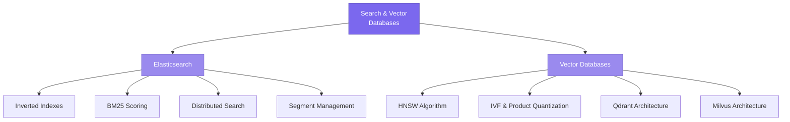

# Search & Vector Databases

> Purpose-built for finding things — inverted indexes for text, HNSW graphs for vectors, and the architectures that make them fast at scale.

## What This Section Covers

Search and vector databases are built around a different question than traditional databases: instead of "retrieve the row with this key," they answer "which documents are most relevant to this query?" For text, this means inverted indexes and BM25 scoring. For vectors (embeddings), this means approximate nearest neighbor algorithms like HNSW and IVF. This section covers both Elasticsearch (text search) and Qdrant/Milvus (vector search) at the architectural level.

**Relationship to the LLMs repo:** The file `deep-dive-llms/docs/02-retrieval-augmented-generation/vector-databases.md` covers Elasticsearch, Qdrant, and Milvus from the perspective of RAG pipeline selection — when to use which. This section goes deeper into *how they work internally* — the algorithms, data structures, and architectural decisions.

## Concept Map

## Pages in This Section

| Page | What You'll Learn |
|---|---|
| [Elasticsearch Internals](elasticsearch-internals.md) | Inverted indexes, BM25 scoring, distributed scatter-gather search, segment management, and shard sizing |
| [Vector Database Internals](vector-database-internals.md) | HNSW, IVF, product quantization algorithms in depth; Qdrant and Milvus architectures compared; filtering strategies |

## Suggested Reading Order

1. Start with **[Elasticsearch Internals](elasticsearch-internals.md)** — inverted indexes are the foundational concept, and Elasticsearch's segment-based architecture influences vector database design
2. Then read **[Vector Database Internals](vector-database-internals.md)** — builds on search concepts but focuses on high-dimensional vector space algorithms
