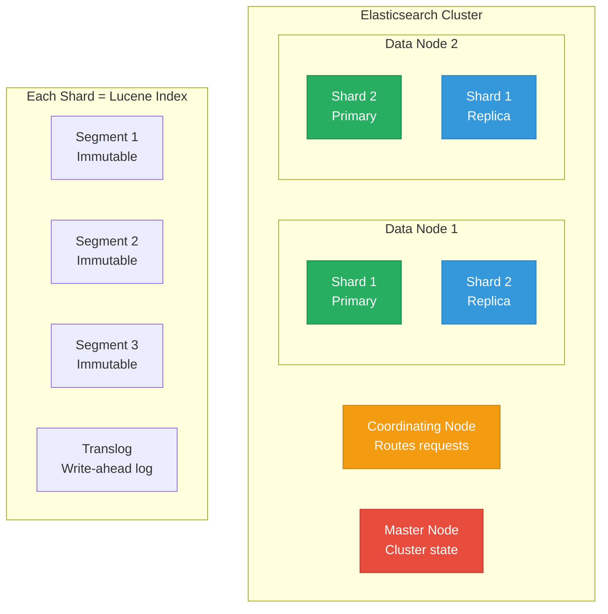
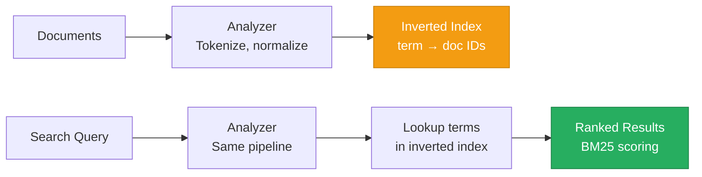
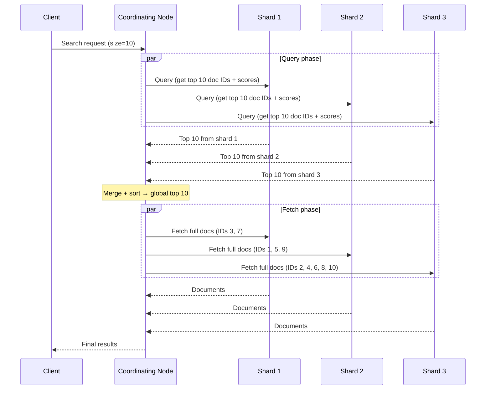

# Elasticsearch Internals

> **TL;DR:** Elasticsearch is built on **Apache Lucene** and uses **inverted indexes** to make full-text search fast. **BM25 scoring** ranks documents by relevance. Distributed search coordinates across shards with a **scatter-gather** pattern. Understanding inverted indexes, the analyzer pipeline, and shard allocation explains both why Elasticsearch is fast and where it struggles.

## Table of Contents

- [Why This Matters](#why-this-matters)
- [Architecture Overview](#architecture-overview)
- [Inverted Indexes](#inverted-indexes)
- [The Analyzer Pipeline](#the-analyzer-pipeline)
- [BM25 Scoring](#bm25-scoring)
- [Distributed Search Architecture](#distributed-search-architecture)
- [Indexing and Segments](#indexing-and-segments)
- [Shard Management](#shard-management)
- [Vector Search in Elasticsearch](#vector-search-in-elasticsearch)
- [Key Takeaways](#key-takeaways)
- [References](#references)

---

## Why This Matters

Elasticsearch powers search, logging (ELK stack), and increasingly, hybrid search (text + vector) across thousands of organizations. Its architecture is fundamentally different from traditional databases — instead of B-trees or LSM-trees, it uses **inverted indexes** optimized for finding documents that contain specific terms. Understanding this architecture explains why Elasticsearch can search billions of documents in milliseconds, why it struggles with updates, and how to avoid the operational pitfalls (over-sharding, mapping explosions, deep pagination) that take clusters down.

## Architecture Overview



**Node roles:**

| Role | Responsibility | Notes |
|---|---|---|
| **Master** | Manages cluster state (index metadata, shard allocation) | Lightweight; dedicated master nodes recommended |
| **Data** | Stores shards, executes searches and indexing | CPU/memory/disk intensive |
| **Coordinating** | Routes requests, merges results from shards | Any node can be a coordinating node |
| **Ingest** | Runs ingest pipelines (data transformation before indexing) | Offloads processing from data nodes |

---

## Inverted Indexes

The inverted index is the core data structure that makes Elasticsearch fast. It maps **terms** (words, tokens) to **postings lists** (lists of documents containing the term).

### How It Works

Given three documents:
1. "The quick brown fox"
2. "The quick brown dog"
3. "The lazy brown fox"

The inverted index looks like:

| Term | Postings List (doc IDs) |
|---|---|
| `the` | [1, 2, 3] |
| `quick` | [1, 2] |
| `brown` | [1, 2, 3] |
| `fox` | [1, 3] |
| `dog` | [2] |
| `lazy` | [3] |

A search for "quick fox" finds the intersection of postings for `quick` ∩ `fox` = `[1]`.



### Beyond the Postings List

Lucene's inverted index stores more than just document IDs:
- **Term frequencies**: How often each term appears in each document (used for BM25)
- **Positions**: Where in the document the term appears (used for phrase queries)
- **Offsets**: Character offsets (used for highlighting)
- **Doc values**: Column-oriented storage for sorting and aggregations (not part of the inverted index, but stored alongside it)

### Inverted Index vs B-tree

| Property | Inverted Index | B-tree |
|---|---|---|
| **Optimized for** | Finding documents containing a term | Finding rows by key value |
| **Full-text search** | Native, efficient | Requires full scan or GIN index |
| **Exact match** | Supported | Native |
| **Range queries** | On numeric fields (via doc values) | Native, efficient |
| **Updates** | Expensive (immutable segments, must reindex) | In-place (read-modify-write page) |

---

## The Analyzer Pipeline

The analyzer transforms raw text into normalized terms for the inverted index. Both indexing and search use the same analyzer (critical for matching).

| Component | What It Does | Example |
|---|---|---|
| **Character filter** | Transforms the raw character stream | HTML strip: `<b>hello</b>` → `hello` |
| **Tokenizer** | Splits text into tokens | Standard: `"The Quick-Brown Fox"` → `["The", "Quick", "Brown", "Fox"]` |
| **Token filter** | Transforms individual tokens | Lowercase: `"Quick"` → `"quick"` ; Stop words: removes `"the"` ; Stemming: `"running"` → `"run"` |

### Built-in Analyzers

| Analyzer | Behavior | Best For |
|---|---|---|
| **Standard** | Lowercase + Unicode tokenization | General-purpose (default) |
| **Simple** | Lowercase + split on non-letters | Simple use cases |
| **Whitespace** | Split on whitespace only | Log parsing, structured text |
| **Language-specific** | Stemming + stop words for a specific language | Natural language search |

**Key insight:** Analyzer choice directly impacts search quality. The wrong analyzer means relevant documents don't match. Always test your analyzer with representative queries before indexing production data.

---

## BM25 Scoring

BM25 (Best Matching 25) is Elasticsearch's default relevance scoring algorithm. It replaced TF-IDF in Elasticsearch 5.0.

### The Formula (Simplified)

For a query term *q* in document *d*:

```
score(q, d) = IDF(q) × (tf(q,d) × (k1 + 1)) / (tf(q,d) + k1 × (1 - b + b × (|d| / avgdl)))
```

Where:
- **IDF(q)**: Inverse document frequency — rare terms score higher
- **tf(q,d)**: Term frequency — how often *q* appears in *d*
- **|d|**: Document length
- **avgdl**: Average document length across the index
- **k1**: Controls term frequency saturation (default: 1.2) — diminishing returns for repeated terms
- **b**: Controls document length normalization (default: 0.75) — penalizes long documents

### How BM25 Improves on TF-IDF

| Property | TF-IDF | BM25 |
|---|---|---|
| Term frequency | Linear — 10 occurrences scores 10x higher than 1 | Saturating — after ~5 occurrences, additional frequency contributes less |
| Document length | Simple normalization | Tunable normalization via `b` parameter |
| Practical implication | Keyword stuffing artificially boosts scores | Keyword stuffing has diminishing returns |

### Boosting and Tuning

- **Field-level boosting**: `title^3` makes matches in the title 3x more important than matches in the body
- **Function score**: Apply custom scoring functions (e.g., boost recent documents, boost by popularity)
- **Constant score**: Ignore relevance entirely for filter-only queries (faster)

---

## Distributed Search Architecture

When a search request arrives, Elasticsearch uses a **scatter-gather** pattern:

### Query Phase (Scatter)



### The Deep Pagination Problem

To get page 100 of results (items 990-1000 with size=10), Elasticsearch must:
1. Ask each shard for its top **1000** results (not just 10)
2. Merge **3000 results** (1000 per shard × 3 shards) to find the global top 990-1000
3. Fetch the final 10 documents

This gets progressively worse with deeper pages. Elasticsearch enforces a `max_result_window` (default: 10,000) to prevent this.

**Alternatives to deep pagination:**
- **`search_after`**: Cursor-based pagination using the sort values of the last result (efficient, no depth limit)
- **Point-in-Time (PIT)**: Consistent snapshot for paginating through a changing index
- **Scroll API**: Deprecated for general use; use PIT + `search_after` instead

---

## Indexing and Segments

### Near-Real-Time Search

Elasticsearch is **near-real-time** — new documents become searchable after a **refresh** (default: every 1 second). The refresh operation:
1. Flushes the in-memory buffer to a new Lucene **segment** (an immutable, searchable unit)
2. Makes the segment visible to searches
3. Does NOT fsync to disk (the translog provides durability)

### Segments and Merging

Segments are **immutable**. When a document is updated or deleted:
- A new segment contains the new version
- The old version is marked as deleted in a `.del` file
- Deleted documents are physically removed during **segment merging**

Segment merging is analogous to LSM-tree compaction — background processes merge small segments into larger ones, reclaiming space from deleted documents.

### The Translog

The translog (transaction log) is Elasticsearch's write-ahead log. It records every indexing operation and is fsynced every 5 seconds (or on every request with `"durability": "request"`). If a node crashes between refreshes, the translog is replayed to recover data.

---

## Shard Management

### Primary vs Replica Shards

- **Primary shard**: Handles indexing operations, then replicates to replicas
- **Replica shard**: A copy of a primary shard on a different node. Serves read requests and provides HA.

### Shard Sizing Best Practices

| Guideline | Value | Rationale |
|---|---|---|
| Target shard size | 10-50 GB | Smaller = too much overhead; larger = slow recovery |
| Shards per GB of heap | ≤20 | Each shard consumes ~1 MB of heap for metadata |
| Max docs per shard | ~2 billion (Lucene limit) | Practical limit is much lower for performance |

### The Over-Sharding Anti-Pattern

The most common operational mistake: creating too many shards. An index with 100 shards on a 3-node cluster means each node manages ~33 shards. Each shard has segment metadata, file handles, and thread pool overhead. Over-sharding causes:
- Excessive memory usage
- Slow searches (too many shards to scatter-gather)
- Cluster instability

**Fix:** Use the `_shrink` API to reduce shard count on existing indexes. For new indexes, start with fewer shards and scale up only when shard size exceeds 50 GB.

---

## Vector Search in Elasticsearch

Since Elasticsearch 8.0, Lucene supports **dense vector fields** and **kNN search** using HNSW (Hierarchical Navigable Small World) graphs.

### How It Works

- Store embeddings in a `dense_vector` field
- Query with `knn` to find the k nearest neighbors by cosine similarity, dot product, or L2 distance
- Lucene builds an HNSW graph per segment for ANN search

### Hybrid Search

Elasticsearch can combine **BM25 text search** with **vector similarity** in a single query:
- Text search provides keyword precision
- Vector search provides semantic understanding
- Results are combined using Reciprocal Rank Fusion (RRF) or linear combination

For deeper coverage of vector search algorithms (HNSW, IVF, product quantization), see [Vector Database Internals](vector-database-internals.md).

---

## Key Takeaways

- **Inverted indexes are the core** — they map terms to documents, making full-text search fast. They're fundamentally different from B-trees and LSM-trees.
- **BM25 scoring** ranks results by relevance using term frequency, document frequency, and length normalization. It replaced TF-IDF because it handles keyword stuffing and document length more naturally.
- **Distributed search uses scatter-gather** — the coordinating node fans out to all shards and merges results. Deep pagination is expensive; use `search_after` instead.
- **Segments are immutable** — updates create new segments, deletes are marked (not removed). Segment merging reclaims space, similar to LSM compaction.
- **Near-real-time** means ~1 second delay before new documents are searchable. This is not a bug; it's a design choice that enables efficient segment management.
- **Shard sizing matters enormously.** Target 10-50 GB per shard. Over-sharding is the #1 operational mistake.
- **Vector search (kNN)** is now built into Elasticsearch via Lucene's HNSW, enabling hybrid text + vector retrieval in a single query.

---

## References

1. [Elasticsearch: The Definitive Guide](https://www.elastic.co/guide/en/elasticsearch/guide/current/index.html)
2. McCandless, M., Hatcher, E., & Gospodnetic, O. (2010). *Lucene in Action*. Manning Publications.
3. Robertson, S. & Zaragoza, H. (2009). [The Probabilistic Relevance Framework: BM25 and Beyond](https://www.staff.city.ac.uk/~sbrp622/papers/foundations_bm25_review.pdf). Foundations and Trends in Information Retrieval.
4. [Elasticsearch Shard Sizing Guide](https://www.elastic.co/guide/en/elasticsearch/reference/current/size-your-shards.html)
5. [Lucene HNSW Implementation](https://lucene.apache.org/core/9_0_0/core/org/apache/lucene/util/hnsw/package-summary.html)
