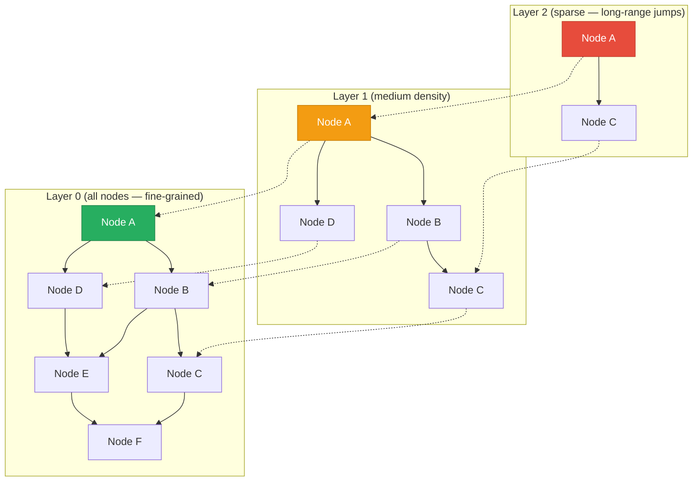
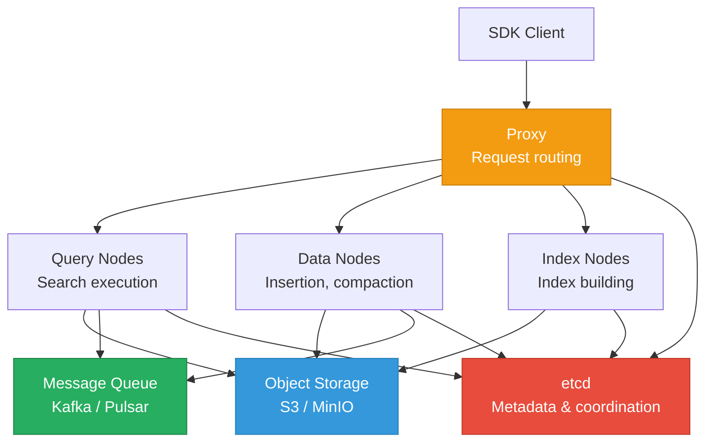
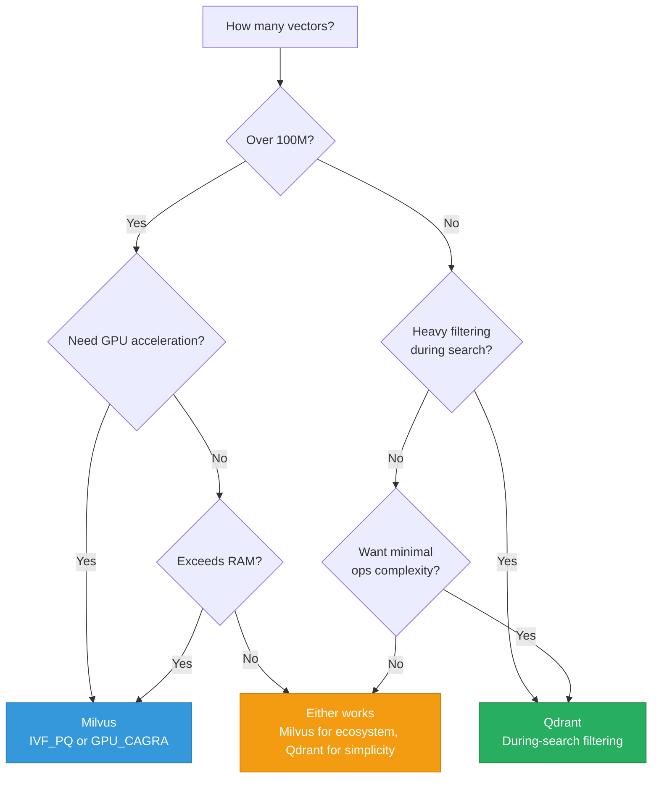

# Vector Database Internals

> **TL;DR:** Vector databases optimize for **approximate nearest neighbor (ANN)** search in high-dimensional spaces. **Qdrant** (Rust, HNSW) excels at fast filtered search under 100M vectors. **Milvus** (Go/C++, multiple index types) is built for billion-scale distributed workloads with GPU acceleration. This section goes deeper into the algorithms and architectures than the RAG-focused comparison in the LLMs repo.

## Table of Contents

- [Why This Matters](#why-this-matters)
- [Relationship to the LLMs Repo](#relationship-to-the-llms-repo)
- [ANN Algorithms Deep Dive](#ann-algorithms-deep-dive)
- [Qdrant Architecture](#qdrant-architecture)
- [Milvus Architecture](#milvus-architecture)
- [Qdrant vs Milvus](#qdrant-vs-milvus)
- [Filtering in Vector Databases](#filtering-in-vector-databases)
- [Key Takeaways](#key-takeaways)
- [References](#references)

---

## Why This Matters

Vector search is the retrieval backbone of every RAG pipeline, recommendation engine, and similarity search system. The choice of ANN algorithm determines your recall-latency tradeoff. The choice of vector database determines your operational complexity, filtering capability, and scale ceiling. Understanding how HNSW, IVF, and product quantization actually work — not just their names — lets you tune these systems intelligently instead of guessing at parameters.

## Relationship to the LLMs Repo

The file `deep-dive-llms/docs/02-retrieval-augmented-generation/vector-databases.md` covers Elasticsearch, Qdrant, and Milvus from the perspective of **RAG pipeline selection** — when to use which, comparison table, decision tree. **This page goes deeper into the internal algorithms and architectures.** The two are complementary: read the LLMs version for "which to choose," read this version for "how they work."

---

## ANN Algorithms Deep Dive

Exact nearest neighbor search in high-dimensional spaces requires comparing the query vector against every vector in the database — O(N) per query. This is impractical at scale. ANN algorithms trade a small amount of accuracy (recall) for dramatically faster search.

### HNSW (Hierarchical Navigable Small World)

HNSW is the most widely used ANN algorithm. It builds a multi-layer proximity graph where higher layers have fewer nodes (long-range connections) and lower layers have more nodes (local connections).

**Search algorithm:**
1. Enter at the top layer's entry point
2. Greedily move to the nearest neighbor at the current layer
3. When no closer neighbor exists, drop to the next layer
4. Repeat until Layer 0
5. At Layer 0, explore the neighborhood more thoroughly (beam search)

**Key parameters:**

| Parameter | What It Controls | Tradeoff |
|---|---|---|
| **M** | Max connections per node per layer | Higher M = better recall, more memory, slower build |
| **ef_construction** | Beam width during index building | Higher = better graph quality, slower build |
| **ef_search** | Beam width during query | Higher = better recall, slower query |

**Complexity:** O(log N) search time. Memory: O(N × M × dimensions).

### IVF (Inverted File Index)

IVF partitions the vector space into clusters using k-means, then searches only the nearest clusters.

**How it works:**
1. **Training phase**: Run k-means clustering to create `nlist` centroids
2. **Indexing**: Assign each vector to its nearest centroid
3. **Search**: Find the `nprobe` nearest centroids, then search only vectors in those clusters

| Parameter | What It Controls | Tradeoff |
|---|---|---|
| **nlist** | Number of clusters | More clusters = finer partitioning, slower training |
| **nprobe** | Clusters searched per query | Higher = better recall, slower query |

**Complexity:** O(nprobe × N/nlist) search time.

**Best for:** Very large datasets where HNSW's memory requirements are prohibitive. Often combined with PQ for compression.

### Product Quantization (PQ)

PQ is a **compression technique** that reduces vector memory footprint by 8-32x with moderate accuracy loss.

**How it works:**
1. Split each vector into *m* sub-vectors
2. For each sub-vector dimension, learn a codebook of *k* centroids (typically k=256)
3. Replace each sub-vector with its nearest centroid ID (1 byte per sub-vector)

**Result:** A 768-dimensional float32 vector (3072 bytes) compressed to 96 bytes (m=96 sub-vectors, 1 byte each) — a 32x reduction.

**Used by:** Milvus (IVF_PQ), FAISS, and others for billion-scale search where keeping all vectors in RAM is impossible.

### DiskANN

DiskANN is an SSD-based ANN algorithm for datasets that exceed RAM.

**How it works:**
- Builds a graph structure similar to HNSW but optimized for SSD access patterns
- Keeps a compressed representation in memory for navigation
- Fetches full vectors from SSD only for final distance computation
- Achieves 95%+ recall with 1-5 ms latency on billion-scale datasets

**Used by:** Milvus (DiskANN index type), Microsoft's production systems.

### Algorithm Comparison

| Algorithm | Memory | Query Speed | Build Time | Recall @ 90% | Best For |
|---|---|---|---|---|---|
| **HNSW** | High (full vectors + graph) | Very fast | Medium | High | <100M vectors, in-memory |
| **IVF** | Medium (vectors + centroids) | Fast | Fast (k-means) | Medium-High | Large datasets, GPU acceleration |
| **IVF_PQ** | Low (compressed vectors) | Fast | Medium | Medium | Billion-scale, memory-constrained |
| **DiskANN** | Low (compressed in RAM) | Fast (SSD) | Slow | High | Datasets exceeding RAM |
| **Flat (brute force)** | Low (vectors only) | Slow (O(N)) | None | Perfect (100%) | <100K vectors, ground truth |

---

## Qdrant Architecture

Qdrant is a vector database written in **Rust**, focused on performance, safety, and filtering during search.

### Core Architecture

- **Segments**: The fundamental storage unit. Each segment contains vectors, payloads, and an HNSW index. Segments are similar to Lucene segments — they can be merged and are independently searchable.
- **Collections**: Logical groupings of segments (analogous to a table or index).
- **Points**: Vectors with associated payloads (metadata).

### Key Design Decisions

| Feature | Implementation | Why It Matters |
|---|---|---|
| **ANN index** | HNSW (custom Rust implementation) | High recall, fast query, well-suited for filtered search |
| **Filtering** | During-search filtering (not pre/post) | Maintains recall even with restrictive filters |
| **Payload indexing** | Separate indexes on payload fields (keyword, integer, geo) | Enables efficient filtered search without scanning all vectors |
| **Quantization** | Scalar (int8) and product quantization | Reduces memory 4-32x with tunable accuracy loss |
| **WAL** | Write-ahead log per segment | Crash recovery, no data loss |
| **Durability** | On-disk snapshots + WAL | Full data recovery from snapshots |

### Distributed Deployment

- **Sharding**: Collections are split across shards, each shard is a subset of vectors
- **Replication**: Each shard has configurable replicas on different nodes
- **Consensus**: Uses Raft for shard replication coordination

---

## Milvus Architecture

Milvus is a distributed vector database designed for **billion-scale** workloads. Its architecture separates storage, compute, and coordination.

### Key Architectural Components

| Component | Role | Technology |
|---|---|---|
| **Proxy** | Routes requests, load balances | Stateless, horizontally scalable |
| **Query nodes** | Execute searches on sealed segments | Can scale independently of other components |
| **Data nodes** | Handle insertions, manage growing segments | Write to message queue, flush to object storage |
| **Index nodes** | Build indexes on sealed segments | GPU-accelerated for IVF indexes |
| **etcd** | Metadata coordination, service discovery | See [etcd Internals](../03-document-and-key-value-databases/etcd-internals.md) |
| **Message queue** | Data flow between components | Kafka or Pulsar |
| **Object storage** | Persistent storage for segments | S3, MinIO, or local disk |

### Growing vs Sealed Segments

- **Growing segment**: Receives new insertions, not yet indexed. Searched via brute force.
- **Sealed segment**: No longer accepting writes. Index nodes build ANN indexes (HNSW, IVF, etc.) on sealed segments.
- **Compaction**: Merges small sealed segments and removes deleted vectors.

### Index Types in Milvus

| Index | Algorithm | GPU Support | Best For |
|---|---|---|---|
| **FLAT** | Brute force | No | Ground truth, small datasets |
| **IVF_FLAT** | IVF (no compression) | Yes | Medium datasets, high accuracy |
| **IVF_PQ** | IVF + product quantization | Yes | Billion-scale, memory-constrained |
| **IVF_SQ8** | IVF + scalar quantization (int8) | Yes | Good accuracy/memory tradeoff |
| **HNSW** | HNSW graph | No | High recall, moderate scale |
| **DiskANN** | SSD-based graph | No | Datasets exceeding RAM |
| **GPU_CAGRA** | NVIDIA CAGRA | Yes (required) | Maximum throughput with GPU |

---

## Qdrant vs Milvus

| Feature | Qdrant | Milvus |
|---|---|---|
| **Language** | Rust | Go (coordinator) + C++ (engine) |
| **Primary ANN** | HNSW | HNSW, IVF, DiskANN, GPU_CAGRA |
| **Filtering** | During-search (HNSW-aware) | Pre-filtering (bitmap) + post-filtering |
| **GPU support** | No | Yes (IVF, CAGRA) |
| **Architecture** | Monolithic (simpler) | Disaggregated storage + compute |
| **Operational complexity** | Low-medium | High (etcd + MQ + object storage) |
| **Max practical scale** | ~100M vectors | Billions |
| **Quantization** | Scalar (int8), product | Scalar (int8), product |
| **Cloud offering** | Qdrant Cloud | Zilliz Cloud |
| **Ideal workload** | Fast filtered search, moderate scale | Massive scale, GPU-accelerated, multi-index |

### Decision Framework

---

## Filtering in Vector Databases

Filtering is one of the most important — and most misunderstood — aspects of vector search. Real queries are almost always filtered: "find similar products **in this category**" or "find relevant documents **from this user**."

### Three Approaches

| Approach | How It Works | Pros | Cons |
|---|---|---|---|
| **Pre-filtering** | Filter first, then ANN search on the filtered subset | Exact filter results | Filtered subset may be too small for ANN index to work efficiently |
| **Post-filtering** | ANN search first (get top-K), then filter results | Uses ANN index at full efficiency | May return fewer than K results after filtering |
| **During-search filtering** | Integrate filter checks into ANN traversal (e.g., HNSW navigation) | Maintains both recall and efficiency | More complex to implement |

### How Qdrant and Milvus Differ

- **Qdrant**: Uses **during-search filtering**. As the HNSW graph is traversed, nodes that don't match the filter are skipped but their neighbors are still explored. This maintains recall even with restrictive filters.
- **Milvus**: Uses a combination of **pre-filtering** (bitmap filters applied before search) and **post-filtering**. For very selective filters, it falls back to brute-force search on the filtered subset.

**Practical implication:** If your queries have restrictive filters (returning <1% of vectors), Qdrant's during-search approach typically maintains higher recall. For broad filters (>10% of vectors), both approaches perform similarly.

---

## Key Takeaways

- **HNSW is the dominant ANN algorithm** — O(log N) search, high recall, used by Qdrant, Elasticsearch, and Milvus. Tune `ef_search` for the recall-latency tradeoff you need.
- **IVF + PQ enables billion-scale search** by compressing vectors 8-32x. The accuracy cost is real but manageable for most applications.
- **Qdrant excels at filtered search** with its during-search filtering approach. Choose it for sub-100M vector workloads where filtering and operational simplicity matter.
- **Milvus is built for massive scale** with disaggregated architecture, GPU acceleration, and multiple index types. Choose it when you need billions of vectors or GPU-powered index building.
- **Filtering strategy matters as much as ANN algorithm choice.** Real queries are almost always filtered. Test recall with your actual filter selectivity, not just unfiltered benchmarks.
- **DiskANN is the emerging choice** for datasets that exceed RAM — it achieves high recall with SSD-backed storage at low memory cost.

---

## References

1. Malkov, Y. & Yashunin, D. (2018). [Efficient and Robust Approximate Nearest Neighbor using Hierarchical Navigable Small World Graphs](https://arxiv.org/abs/1603.09320). IEEE TPAMI.
2. Jegou, H., Douze, M., & Schmid, C. (2011). [Product Quantization for Nearest Neighbor Search](https://hal.inria.fr/inria-00514462v2/document). IEEE TPAMI.
3. Subramanya, S. J. et al. (2019). [DiskANN: Fast Accurate Billion-point Nearest Neighbor Search on a Single Node](https://proceedings.neurips.cc/paper/2019/file/09853c7fb1d3f8ee67a61b6bf4a7f8e6-Paper.pdf). NeurIPS.
4. [Qdrant Architecture Documentation](https://qdrant.tech/documentation/concepts/)
5. [Milvus Architecture Overview](https://milvus.io/docs/architecture_overview.md)
6. [ANN Benchmarks](https://ann-benchmarks.com/)
