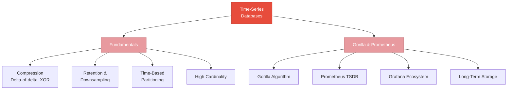

# Time-Series Databases

> Data that never stops arriving — specialized storage, compression, and retention for metrics, events, and sensor data.

## What This Section Covers

Time-series data — metrics, logs, sensor readings, financial ticks — has characteristics that make general-purpose databases inefficient: it's append-only, temporally ordered, and queried by time ranges. This section covers why dedicated time-series databases exist, how they achieve 10-20x compression through algorithms like delta-of-delta and XOR encoding, and how the Prometheus/Grafana ecosystem provides a complete monitoring stack.

## Concept Map

## Pages in This Section

| Page | What You'll Learn |
|---|---|
| [Time-Series Fundamentals](time-series-fundamentals.md) | What makes time-series data different, compression techniques, indexing, retention strategies, and when to use a dedicated TSDB vs PostgreSQL |
| [Gorilla & Prometheus](gorilla-and-prometheus.md) | Facebook Gorilla's compression algorithms in detail, Prometheus TSDB architecture, the Grafana ecosystem, and long-term storage options |

## Suggested Reading Order

1. Start with **[Time-Series Fundamentals](time-series-fundamentals.md)** — understand the data characteristics and techniques before diving into specific implementations
2. Then read **[Gorilla & Prometheus](gorilla-and-prometheus.md)** — see how the theory is applied in the two most influential time-series systems
