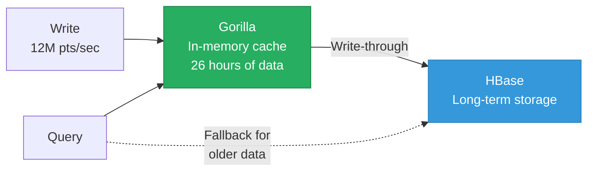
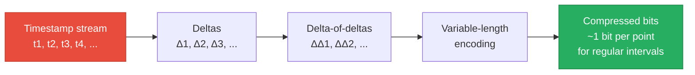
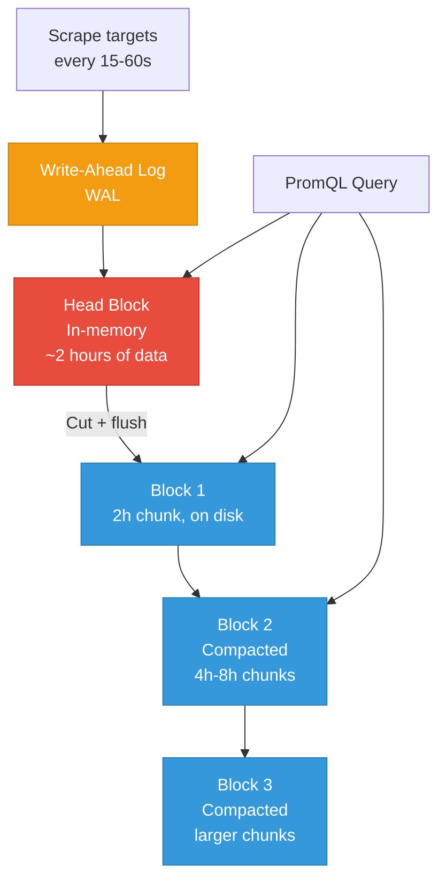
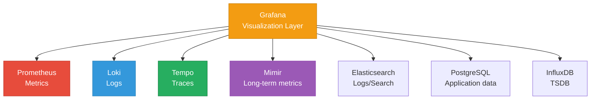

# Gorilla & Prometheus

> **TL;DR:** Facebook's Gorilla (2015) pioneered in-memory time-series storage with **delta-of-delta** and **XOR compression**, achieving 12x compression on real workloads. Prometheus adopted similar ideas for its TSDB, combining append-only blocks with an inverted label index. Together, they define the modern approach to time-series storage. **Grafana** connects to both (and many other sources) as the standard visualization layer.

## Table of Contents

- [Why This Matters](#why-this-matters)
- [Facebook Gorilla](#facebook-gorilla)
- [Prometheus TSDB Architecture](#prometheus-tsdb-architecture)
- [The Grafana Ecosystem](#the-grafana-ecosystem)
- [Beyond Gorilla: Other Time-Series Databases](#beyond-gorilla-other-time-series-databases)
- [Key Takeaways](#key-takeaways)
- [References](#references)

---

## Why This Matters

Gorilla is one of those papers that changed an entire category. Before Gorilla, time-series databases stored data in HBase or custom LSM-tree implementations with mediocre compression and high query latency. Gorilla demonstrated that with the right encoding, time-series data compresses so well that you can keep it entirely in memory — and query it 73x faster than HBase. Prometheus took these ideas and built the monitoring system that now underpins most Kubernetes infrastructure. Understanding both systems gives you the foundation to reason about any modern TSDB.

## Facebook Gorilla

### The Problem

Facebook needed to monitor its infrastructure: 2 billion unique time series, 12 million data points written per second, 40,000 queries per second. Their existing solution (HBase-backed) had query latencies of 10+ seconds for dashboards — unacceptable for operational monitoring.

### Architecture

Gorilla is an **in-memory** time-series cache with **write-through to disk** for durability. It's not a full database — it stores the most recent 26 hours of data in memory and relies on HBase for long-term storage.



### Delta-of-Delta Timestamp Compression

Gorilla's timestamp compression exploits the regularity of time-series data: most series have a fixed collection interval (e.g., every 60 seconds).

**Algorithm:**
1. Store the **first timestamp** in full (64 bits)
2. For subsequent timestamps, compute the **delta** (difference from previous)
3. Compute the **delta-of-delta** (difference between consecutive deltas)
4. Encode the delta-of-delta with variable-length encoding:

| Delta-of-delta value | Encoding | Bits used |
|---|---|---|
| 0 | `0` | 1 bit |
| [-63, 64] | `10` + 7-bit value | 9 bits |
| [-255, 256] | `110` + 9-bit value | 12 bits |
| [-2047, 2048] | `1110` + 12-bit value | 16 bits |
| Anything else | `1111` + 32-bit value | 36 bits |

**Example:**
```
Timestamps:     1609459200, 1609459260, 1609459320, 1609459380
Deltas:                 60,         60,         60
Delta-of-delta:              0,          0

→ First timestamp: 64 bits
→ Each subsequent: 1 bit (delta-of-delta = 0)
→ For regular intervals: ~1 bit per timestamp instead of 64 bits
```



### XOR Value Compression

Gorilla exploits the fact that consecutive floating-point values in a time series are often similar (e.g., CPU utilization: 45.2%, 45.3%, 45.1%).

**Algorithm:**
1. XOR the current value with the previous value
2. If the XOR result is 0 (identical values): store `0` (1 bit)
3. If the XOR has the same leading/trailing zeros as the previous XOR: store `10` + just the meaningful bits
4. Otherwise: store `11` + leading zeros count + meaningful bits length + meaningful bits

**Result:** For slowly changing values (most metrics), each data point uses **~2-6 bits** instead of 64 bits.

### Results

| Metric | Before (HBase) | After (Gorilla) |
|---|---|---|
| Query latency (p50) | 10,000 ms | 135 ms (73x faster) |
| Compression ratio | ~1.37 bytes/point | ~1.37 bytes/point (similar — but **in memory**) |
| Overall compression | — | **12x** on real Facebook workloads |
| Write throughput | Limited by HBase | 12M data points/sec |

### Implementations

- [GitHub: keisku/gorilla](https://github.com/keisku/gorilla/tree/main) — Go implementation
- [GitHub: ghilesmeddour/gorilla-time-series-compression](https://github.com/ghilesmeddour/gorilla-time-series-compression) — Python implementation

---

## Prometheus TSDB Architecture

Prometheus adopted Gorilla-inspired compression but built a full on-disk TSDB rather than an in-memory cache.

### High-Level Architecture



### Components

**Head Block (in-memory):**
- Stores the most recent ~2 hours of samples
- Uses Gorilla-style compression (delta-of-delta for timestamps, XOR for values)
- WAL provides durability: if Prometheus crashes, the WAL is replayed on startup
- New samples are appended to in-memory "chunks" (one per time series)

**Persisted Blocks (on disk):**
- When the head block reaches its retention period, it's "cut" into a persisted block
- Each block is a self-contained directory containing:
  - `chunks/`: Compressed sample data (Gorilla encoding)
  - `index`: Inverted index mapping labels to series, plus postings lists
  - `meta.json`: Block metadata (time range, number of series)
  - `tombstones`: Records of deleted data

**Block structure:**
```
block-<ulid>/
├── chunks/
│   ├── 000001    # Compressed sample chunks
│   └── 000002
├── index         # Label inverted index + series metadata
├── meta.json     # {minTime, maxTime, numSeries, ...}
└── tombstones    # Deletion markers
```

### Compaction

Prometheus merges smaller blocks into larger ones over time:
- Multiple 2-hour blocks → one 6-hour block
- Multiple 6-hour blocks → one 18-hour block
- Maximum block size: 10% of the retention period (capped at 31 days)

Compaction serves two purposes:
1. **Reduce block count** — fewer blocks to scan during queries
2. **Apply tombstones** — physically remove deleted data

### Label Indexing

Prometheus uses a **postings list** (inverted index) to map label pairs to series IDs:

```
Label pair          → Series IDs
__name__=http_requests → [1, 2, 3, 4]
method=GET           → [1, 3, 5]
method=POST          → [2, 4, 6]
status=200           → [1, 2, 5]
```

Query `http_requests{method="GET", status="200"}` → intersect postings → series [1].

### Gorilla vs Prometheus Comparison

| Feature | Gorilla | Prometheus TSDB |
|---|---|---|
| Storage | In-memory (26h cache) | On-disk with in-memory head |
| Compression | Delta-of-delta + XOR | Delta-of-delta + XOR (adapted) |
| Indexing | In-memory hash maps | On-disk inverted index (postings lists) |
| Retention | 26 hours | Configurable (default: 15 days) |
| Query language | Custom API | PromQL |
| Durability | Write-through to HBase | WAL + on-disk blocks |
| Scale model | Single-node in-memory | Single-node (scale via sharding or Mimir/Thanos) |

---

## The Grafana Ecosystem

Grafana is a **visualization and observability platform** — it is not a database. It connects to data sources (databases) and renders dashboards.



### Grafana Stack Components

| Component | Role | Architecture |
|---|---|---|
| **Grafana** | Dashboards, alerting, visualization | Web application (Go backend, React frontend) |
| **Prometheus** | Short-term metrics collection and storage | Pull-based scraping, local TSDB |
| **Mimir** | Horizontally scalable long-term metrics storage | Prometheus-compatible; replaces Cortex; uses object storage |
| **Loki** | Log aggregation (like Prometheus, but for logs) | Indexes labels only (not log content); stores chunks in object storage |
| **Tempo** | Distributed tracing backend | Stores traces in object storage; integrates with Grafana for visualization |
| **Alloy** | Telemetry collector (replaces Grafana Agent) | Collects and ships metrics, logs, and traces |

### The Long-Term Storage Problem

Prometheus is designed for short-term storage (15 days default). For long-term retention, you need a separate system:

| Solution | Approach | Prometheus Compatible | Scale |
|---|---|---|---|
| **Mimir** (Grafana) | Horizontally scalable, object storage backend | Yes (remote write) | Billions of series |
| **Thanos** (CNCF) | Sidecar uploads Prometheus blocks to object storage | Yes (sidecar + store gateway) | Billions of series |
| **VictoriaMetrics** | Drop-in Prometheus replacement with better performance | Yes (remote write + PromQL) | Billions of series |
| **Cortex** (legacy) | Predecessor to Mimir | Yes | Deprecated in favor of Mimir |

---

## Beyond Gorilla: Other Time-Series Databases

| TSDB | Storage Engine | Query Language | Compression | Scale Model | Ecosystem |
|---|---|---|---|---|---|
| **Prometheus** | Custom (Gorilla-inspired) | PromQL | Excellent | Single-node + remote write | Kubernetes/Grafana |
| **InfluxDB** | TSM (Time-Structured Merge) | Flux / InfluxQL | Good | Single-node or InfluxDB Cloud | Standalone, Telegraf |
| **TimescaleDB** | PostgreSQL + hypertables | SQL | Good (with native compression) | Single-node or multi-node | PostgreSQL ecosystem |
| **VictoriaMetrics** | Custom (merge tree variant) | PromQL / MetricsQL | Excellent | Single-node or cluster | Prometheus-compatible |
| **ClickHouse** | MergeTree (columnar) | SQL | Excellent | Distributed | Analytics, logs, metrics |
| **QuestDB** | Custom (column-based) | SQL + InfluxDB Line Protocol | Good | Single-node | High-ingestion use cases |

---

## Key Takeaways

- **Gorilla's delta-of-delta + XOR compression** achieves ~12x compression on real workloads, making in-memory time-series storage practical at Facebook scale. This paper influenced every modern TSDB.
- **Prometheus adopted Gorilla's compression** but added on-disk persistence with a block-based architecture (WAL → head block → persisted blocks → compacted blocks).
- **The label inverted index** is how Prometheus (and most TSDBs) answer "give me metric X for host Y" — it's the same concept as Elasticsearch's inverted index, applied to metric labels.
- **Prometheus is single-node by design.** For long-term storage and horizontal scaling, use Mimir, Thanos, or VictoriaMetrics.
- **Grafana is the visualization layer**, not a database. It connects to Prometheus, Loki, Tempo, and dozens of other data sources.
- **The Grafana stack** (Prometheus + Loki + Tempo + Mimir + Alloy) provides a complete observability platform for metrics, logs, and traces.

---

## References

1. Pelkonen, T. et al. (2015). [Gorilla: A Fast, Scalable, In-Memory Time Series Database](https://www.vldb.org/pvldb/vol8/p1816-teller.pdf). VLDB.
2. [The Morning Paper — Gorilla: A fast, scalable, in-memory time series database](https://blog.acolyer.org/2016/05/03/gorilla-a-fast-scalable-in-memory-time-series-database/)
3. [GitHub: keisku/gorilla](https://github.com/keisku/gorilla/tree/main) — Go implementation
4. [GitHub: ghilesmeddour/gorilla-time-series-compression](https://github.com/ghilesmeddour/gorilla-time-series-compression) — Python implementation
5. [Prometheus TSDB — The Head Block](https://ganeshvernekar.com/blog/prometheus-tsdb-the-head-block/)
6. [Grafana Mimir Documentation](https://grafana.com/docs/mimir/latest/)
7. [Grafana Loki Documentation](https://grafana.com/docs/loki/latest/)
