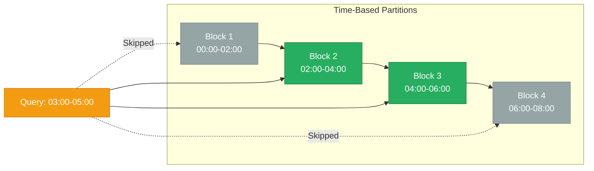
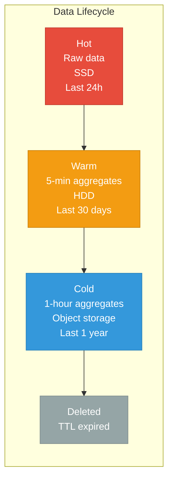

# Time-Series Fundamentals

> **TL;DR:** Time-series data arrives continuously, is almost always appended (never updated), and is queried by time ranges. These characteristics enable specialized storage (columnar, compressed), indexing (time-based partitioning), and retention strategies that general-purpose databases cannot match. Understanding these fundamentals explains why dedicated TSDBs exist and when you actually need one.

## Table of Contents

- [Why This Matters](#why-this-matters)
- [What Makes Time-Series Data Different](#what-makes-time-series-data-different)
- [Compression Techniques](#compression-techniques)
- [Indexing for Time-Series](#indexing-for-time-series)
- [Retention and Downsampling](#retention-and-downsampling)
- [Time-Series in General-Purpose Databases](#time-series-in-general-purpose-databases)
- [Key Takeaways](#key-takeaways)
- [References](#references)

---

## Why This Matters

Metrics from servers, sensor readings from IoT devices, financial tick data, application logs — time-series data is everywhere. It's also one of the fastest-growing data categories: a single Kubernetes cluster can generate millions of time-series data points per minute. General-purpose databases *can* store time-series data, but they do it inefficiently — without specialized compression, their storage costs explode; without time-aware indexing, query latency degrades as data grows. Understanding why time-series data is fundamentally different from transactional data explains both the existence of dedicated TSDBs and the design decisions behind them.

## What Makes Time-Series Data Different

| Characteristic | Time-Series Data | General-Purpose Data |
|---|---|---|
| **Write pattern** | Append-only (almost never update or delete) | CRUD (create, read, update, delete) |
| **Access pattern** | Range queries by time (`WHERE ts BETWEEN ...`) | Point queries by key, joins, aggregations |
| **Data arrival** | Continuous, high-frequency, predictable | Sporadic, event-driven |
| **Value distribution** | Consecutive values are often similar | Values are independent |
| **Cardinality** | High cardinality of series (many unique metric names × label combinations) | Cardinality varies by table |
| **Lifecycle** | Data value decreases with age; old data is downsampled or deleted | Data value is constant; deletion is domain-specific |
| **Schema** | Uniform (timestamp + value + labels) | Varied (application-specific schema) |

**Key insight:** The combination of append-only writes, temporal access patterns, and value similarity enables compression ratios and query optimizations that are impossible with general-purpose storage engines.

---

## Compression Techniques

Time-series data compresses exceptionally well because consecutive data points are highly correlated — timestamps are (nearly) evenly spaced, and values change gradually.

### Delta-of-Delta Encoding (Timestamps)

Timestamps in a regular time-series arrive at predictable intervals. Instead of storing absolute timestamps, store the **delta** (difference between consecutive timestamps). For regular intervals, the delta is constant, so store the **delta-of-delta** (difference between consecutive deltas) — which is usually 0.

```
Timestamps:  1000, 1060, 1120, 1180, 1240
Deltas:            60,   60,   60,   60
Delta-of-delta:         0,    0,    0
```

With variable-length encoding, a delta-of-delta of 0 is stored in **1 bit**. This is the core of Gorilla's timestamp compression — see [Gorilla & Prometheus](gorilla-and-prometheus.md) for the full algorithm.

### XOR Encoding (Floating-Point Values)

Consecutive metric values are often similar (CPU: 45.2%, 45.3%, 45.1%). XOR-ing consecutive IEEE 754 floating-point representations produces values with many leading and trailing zeros, which compress well with variable-length encoding.

```
Value 1: 45.20 → IEEE 754: 0100 0010 0011 0100 1100 1100 1100 1101
Value 2: 45.30 → IEEE 754: 0100 0010 0011 0101 0011 0011 0011 0011
XOR:                        0000 0000 0000 0001 1111 1111 1111 1110
                            ^^^^^^^^^^^^^^^^ leading zeros (16 bits of context saved)
```

### Dictionary Encoding (Labels/Tags)

Time-series labels (e.g., `host=web-01`, `region=us-east`) are repeated across millions of data points. Dictionary encoding maps each unique label value to a small integer, storing the integer instead of the string.

### Run-Length Encoding

For series with constant values over time (e.g., `status=healthy` for hours), run-length encoding stores the value once with a count.

### Compression Comparison

| Technique | Data Type | Typical Compression | Speed | Used By |
|---|---|---|---|---|
| **Delta-of-delta** | Timestamps | 10-20x | Very fast | Gorilla, Prometheus |
| **XOR encoding** | Float values | 8-12x | Fast | Gorilla, Prometheus |
| **Dictionary encoding** | String labels | 5-50x | Fast | Prometheus, InfluxDB |
| **Run-length encoding** | Constant values | Variable (up to 1000x) | Very fast | Most TSDBs |
| **General-purpose (LZ4/zstd)** | Any | 2-5x | Fast/Medium | On top of domain-specific encoding |

**Key insight:** Domain-specific compression (delta-of-delta, XOR) runs **before** general-purpose compression. The two are complementary, not alternatives.

---

## Indexing for Time-Series

### Time-Based Partitioning

The most fundamental optimization: split data into time-based chunks (e.g., 2-hour blocks in Prometheus, monthly partitions in TimescaleDB). Queries with time range filters only scan relevant partitions.



### Inverted Index on Labels

To answer "give me CPU for host=web-01", TSDBs maintain an inverted index mapping label pairs to series IDs:

```
host=web-01  → series [1, 5, 12, 89]
host=web-02  → series [2, 6, 13, 90]
metric=cpu   → series [1, 2, 3, 4]
region=us    → series [1, 2, 5, 6, 12, 13]
```

Query `host=web-01 AND metric=cpu` → intersect postings lists → series [1].

This is the same concept as Elasticsearch's inverted index, applied to time-series labels.

### The High-Cardinality Problem

**Cardinality** = number of unique label combinations (unique time series). For example:
- 1,000 hosts × 50 metrics × 5 regions = 250,000 series (manageable)
- 1,000 hosts × 50 metrics × 1,000 pods × 10 containers = 500,000,000 series (problematic)

High cardinality bloats the label inverted index (which must fit in memory) and increases chunk overhead. Container orchestration (Kubernetes) and microservices architectures drive cardinality explosions.

**Mitigations:**
- Drop unnecessary labels (do you need per-container metrics, or per-pod?)
- Use recording rules to pre-aggregate high-cardinality metrics
- Choose a TSDB that handles high cardinality well (VictoriaMetrics, Mimir)

---

## Retention and Downsampling

Time-series data has a natural lifecycle: recent data is queried at high resolution, older data is queried at lower resolution (or not at all).

### Retention Strategies



### Downsampling

Downsampling reduces storage by replacing raw data points with aggregates:
- **Raw**: 1 data point per 15 seconds → 5,760 points/day
- **5-minute aggregate**: min, max, avg, count per 5 minutes → 288 points/day (20x reduction)
- **1-hour aggregate**: min, max, avg, count per hour → 24 points/day (240x reduction)

### TTL-Based Deletion

Time-based partitioning enables efficient deletion: instead of scanning and deleting individual rows, **drop the entire partition**. This is O(1) and doesn't generate dead tuples (no VACUUM needed in PostgreSQL terms).

This is the primary operational advantage of time-based partitioning — and why compaction strategies like TWCS (Time-Window Compaction) exist in Cassandra.

---

## Time-Series in General-Purpose Databases

You don't always need a dedicated TSDB. Here's when a general-purpose database works and when it doesn't.

### PostgreSQL + TimescaleDB

TimescaleDB is a PostgreSQL extension that adds automatic time-based partitioning (hypertables), compression, and continuous aggregates. You get full SQL, PostgreSQL's ecosystem, and time-series optimizations.

### ClickHouse

ClickHouse is a columnar analytics database that excels at time-series analytics — fast aggregations over large time ranges. It's not a TSDB in the traditional sense (no label-based inverted index), but it handles time-series analytics workloads exceptionally well.

### When to Use What

| Approach | Write Throughput | Compression | Query Latency | SQL Support | Operational Complexity | Best For |
|---|---|---|---|---|---|---|
| **Prometheus** | High (pull-based) | Excellent (Gorilla) | Low (PromQL) | No | Low | Infrastructure monitoring |
| **TimescaleDB** | Medium-High | Good (with compression) | Low (SQL) | Full SQL | Low (PostgreSQL) | Applications needing SQL + time-series |
| **ClickHouse** | Very High | Excellent (columnar) | Low for aggregations | SQL-like | Medium | Time-series analytics |
| **Raw PostgreSQL** | Medium | Poor | Medium-High at scale | Full SQL | Low | <10M data points, already using PostgreSQL |
| **InfluxDB** | High | Good (TSM engine) | Low (Flux/InfluxQL) | Flux | Low-Medium | Standalone TSDB with query language |

**Rule of thumb:** If you already run PostgreSQL and have <100M time-series data points, use TimescaleDB. If you're in the Kubernetes/Grafana ecosystem, use Prometheus + a long-term store (Mimir, Thanos, or VictoriaMetrics). If you need analytics over time-series data, consider ClickHouse.

---

## Key Takeaways

- **Time-series data is fundamentally different** from transactional data: append-only, time-ordered, temporally correlated values. These properties enable 10-20x compression and time-based partitioning that general-purpose databases can't match.
- **Delta-of-delta + XOR encoding** compress timestamps and values to a fraction of their raw size. This is the core innovation behind Gorilla and Prometheus TSDB.
- **High cardinality** (too many unique label combinations) is the #1 scaling challenge for TSDBs. Monitor your cardinality and drop unnecessary labels.
- **Retention and downsampling** are operational necessities, not optional features. Recent data at full resolution, older data at lower resolution, expired data dropped.
- **Time-based partitioning** enables O(1) partition drops instead of expensive deletes. This is the single biggest operational advantage over row-level deletion.
- **You don't always need a dedicated TSDB.** PostgreSQL + TimescaleDB handles moderate time-series workloads with full SQL support.

---

## References

1. Pelkonen, T. et al. (2015). [Gorilla: A Fast, Scalable, In-Memory Time Series Database](https://www.vldb.org/pvldb/vol8/p1816-teller.pdf). VLDB.
2. [Prometheus TSDB Design](https://ganeshvernekar.com/blog/prometheus-tsdb-the-head-block/)
3. [TimescaleDB Documentation](https://docs.timescale.com/)
4. [ClickHouse Documentation](https://clickhouse.com/docs/)
5. [VictoriaMetrics — High Cardinality Handling](https://valyala.medium.com/high-cardinality-tsdb-benchmarks-victoriametrics-vs-timescaledb-vs-influxdb-13e6ee64dd6b)
