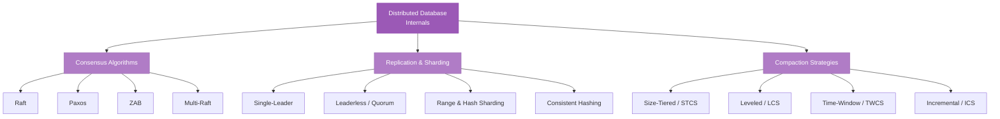

# Distributed Database Internals

> The algorithms and strategies that make databases work across multiple machines — consensus, replication, sharding, and compaction.

## What This Section Covers

Distributing a database across multiple machines introduces three fundamental challenges: **agreeing on state** (consensus), **copying data for fault tolerance and read scaling** (replication and sharding), and **managing the background maintenance that keeps storage efficient** (compaction). These are the mechanisms behind the theoretical tradeoffs from [Consistency & Guarantees](../01-database-foundations/consistency-and-guarantees.md). Every concept in this section appears in the database-specific sections — Raft in etcd, replica sets in MongoDB, compaction in Cassandra — but here we examine them as standalone topics, independent of any single database.

## Concept Map

## Pages in This Section

| Page | What You'll Learn |
|---|---|
| [Consensus Algorithms](consensus-algorithms.md) | How Raft, Paxos, and ZAB allow distributed nodes to agree on state — leader election, log replication, safety properties, Multi-Raft scaling, and where each algorithm is used in production |
| [Replication & Sharding](replication-and-sharding.md) | Single-leader, multi-leader, and leaderless replication models. Range vs hash sharding, consistent hashing, rebalancing strategies, and how production databases combine both |
| [Compaction Strategies](compaction-strategies.md) | How LSM-tree databases manage background compaction — STCS, LCS, TWCS, ICS, and Gorilla's block-based approach. The write-read-space amplification tradeoff and how to choose |

## Suggested Reading Order

1. Start with **[Consensus Algorithms](consensus-algorithms.md)** — Raft is the foundation for understanding how any strongly-consistent distributed database works
2. Then read **[Replication & Sharding](replication-and-sharding.md)** — the mechanisms that distribute data across nodes, building on consensus for leader election and commit protocols
3. Finally, **[Compaction Strategies](compaction-strategies.md)** — the background maintenance that keeps LSM-tree storage engines healthy, connecting back to the storage engine concepts from Section 01

## How This Section Connects

- **To Database Foundations (Section 01)** — Consensus implements the strong consistency models from [Consistency & Guarantees](../01-database-foundations/consistency-and-guarantees.md). Compaction is the maintenance cost of the LSM-tree architecture from [Storage Engines](../01-database-foundations/storage-engines.md).
- **To Relational Databases (Section 02)** — PostgreSQL's streaming replication is a single-leader model. CockroachDB and TiDB use Multi-Raft with range sharding to build distributed SQL.
- **To Document & Key-Value Databases (Section 03)** — etcd's Raft implementation is a concrete case study of [Consensus Algorithms](consensus-algorithms.md). MongoDB's replica sets and sharding are covered in detail in [Replication & Sharding](replication-and-sharding.md).
- **To Search & Vector Databases (Section 04)** — Elasticsearch uses hash-based sharding with local indexes and scatter-gather queries, covered in Replication & Sharding.
- **To Time-Series Databases (Section 05)** — TWCS and Gorilla's block-based compaction are purpose-built for time-series workloads. The connection between [Gorilla & Prometheus](../05-time-series-databases/gorilla-and-prometheus.md) and [Compaction Strategies](compaction-strategies.md) is direct.
