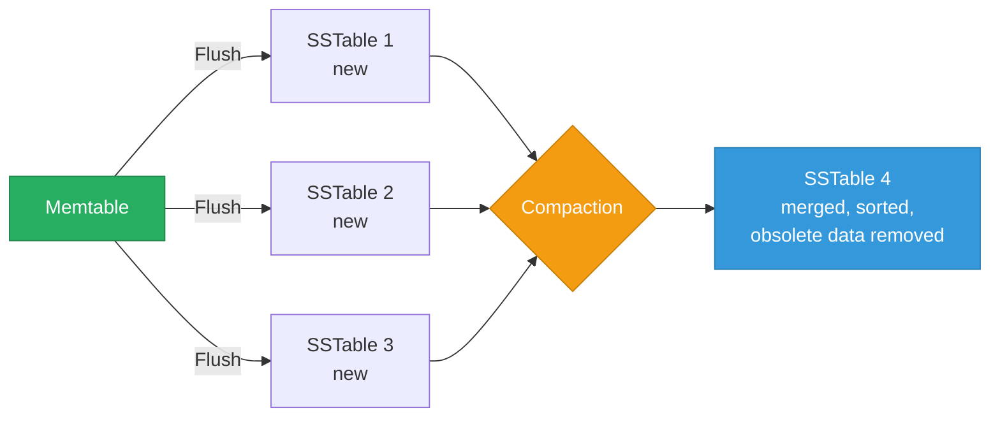
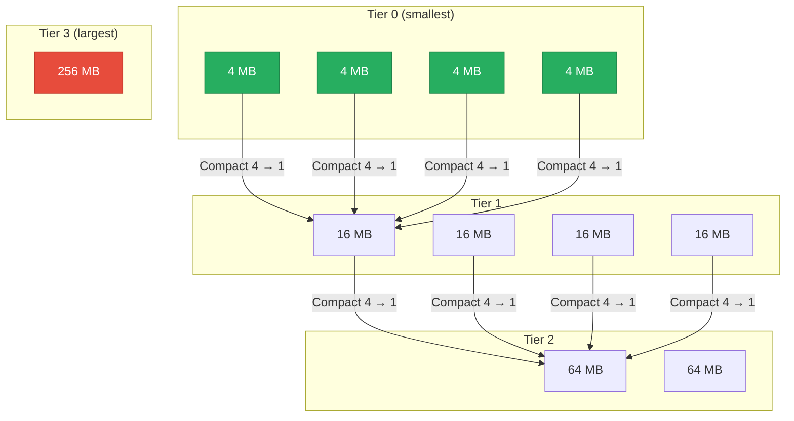
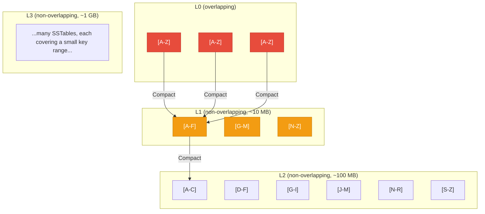
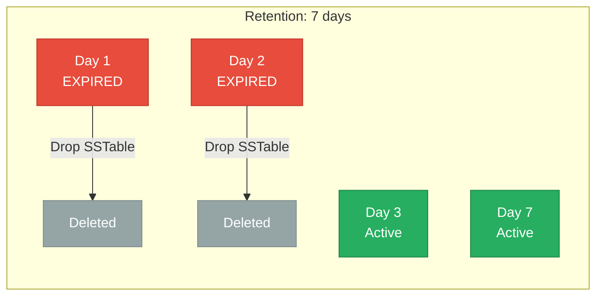
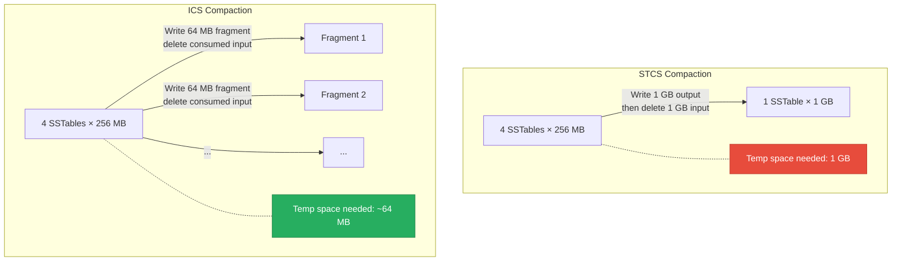
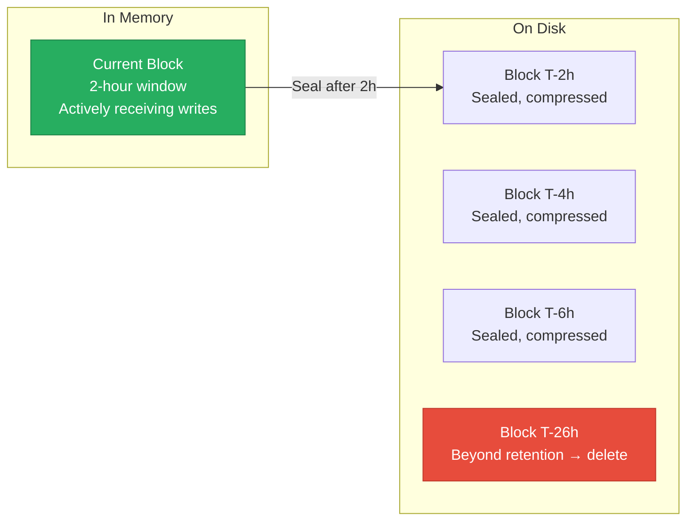
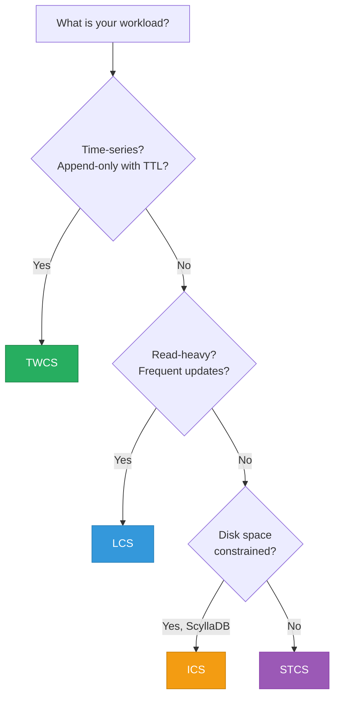

# Compaction Strategies

> **TL;DR:** Compaction is the process LSM-tree databases use to merge, sort, and discard obsolete data from SSTables on disk. The strategy you choose controls the tradeoff between **write amplification** (how much extra I/O compaction causes), **read amplification** (how many files a read must check), and **space amplification** (how much temporary disk space is consumed). **Size-Tiered (STCS)** optimizes for write throughput. **Leveled (LCS)** optimizes for read performance. **Time-Window (TWCS)** optimizes for time-series workloads. **Incremental (ICS)** is ScyllaDB's improvement that reduces compaction's disk footprint.

## Table of Contents

- [Why This Matters](#why-this-matters)
- [How LSM-tree Compaction Works](#how-lsm-tree-compaction-works)
- [Size-Tiered Compaction Strategy (STCS)](#size-tiered-compaction-strategy-stcs)
- [Leveled Compaction Strategy (LCS)](#leveled-compaction-strategy-lcs)
- [Time-Window Compaction Strategy (TWCS)](#time-window-compaction-strategy-twcs)
- [Incremental Compaction Strategy (ICS)](#incremental-compaction-strategy-ics)
- [Gorilla's Compaction](#gorillas-compaction)
- [Comparing Strategies](#comparing-strategies)
- [Choosing a Compaction Strategy](#choosing-a-compaction-strategy)
- [Key Takeaways](#key-takeaways)
- [References](#references)

---

## Why This Matters

Compaction is the **dominant background operation** in any LSM-tree database. In a Cassandra or ScyllaDB cluster, compaction typically consumes 50-80% of all disk I/O. A misconfigured compaction strategy can:

- **Exhaust disk space** — STCS temporarily needs 2x the data size during compaction
- **Spike read latency** — too many uncompacted SSTables force reads to check more files
- **Saturate disk bandwidth** — aggressive compaction starves foreground reads and writes
- **Cause write stalls** — if compaction falls behind, Level 0 accumulates too many files and the database throttles writes

If you operate Cassandra, ScyllaDB, RocksDB, or any LSM-based system, compaction strategy is one of the most impactful tuning decisions you'll make.

## How LSM-tree Compaction Works

Recall from [Storage Engines](../01-database-foundations/storage-engines.md) that an LSM-tree buffers writes in a memtable, then flushes them as immutable **SSTables** (Sorted String Tables) to disk. Over time, SSTables accumulate and must be merged to:

1. **Remove deleted data** (tombstones)
2. **Remove overwritten values** (keep only the latest version)
3. **Reduce the number of SSTables** a read must check (lower read amplification)
4. **Reclaim disk space** from obsolete data

### The Three Amplification Factors

Every compaction strategy trades off between three forms of amplification:

| Factor | Definition | Impact |
|---|---|---|
| **Write amplification** | Ratio of bytes written to disk vs. bytes written by application | SSD wear, write throughput |
| **Read amplification** | Number of SSTables that must be checked for a single read | Read latency, IOPS |
| **Space amplification** | Ratio of disk space used vs. logical data size | Disk cost, compaction feasibility |

**No strategy optimizes all three simultaneously.** This is the fundamental tradeoff of LSM-tree design.

---

## Size-Tiered Compaction Strategy (STCS)

STCS groups SSTables of similar size into **tiers** and merges them when enough similarly-sized SSTables accumulate.

### How STCS Works

1. When memtables flush, they create small SSTables (tier 0)
2. When `min_threshold` (default: 4) SSTables of similar size accumulate, they are merged into a single larger SSTable
3. This larger SSTable joins the next tier
4. The process repeats as tiers grow

### STCS Characteristics

| Property | Value | Notes |
|---|---|---|
| **Write amplification** | Low (~4-8x) | Each byte is rewritten only when its tier merges |
| **Read amplification** | High | Multiple SSTables at each tier may overlap on the same key range |
| **Space amplification** | High (~2x during compaction) | Merging requires writing the new SSTable before deleting the old ones |
| **Compaction granularity** | Large | Entire tiers merge at once |

### When to Use STCS

- **Write-heavy workloads** where write throughput is the priority
- Workloads with **few overwrites** (append-only or mostly inserts)
- When you can tolerate higher read latency and have enough disk headroom for temporary space amplification

### STCS Problems

1. **Space amplification spike**: When merging the largest tier, you temporarily need ~2x the data size in disk space. On a node with 1 TB of data, you need 1 TB free for compaction.
2. **Read amplification grows over time**: SSTables at the same tier can have overlapping key ranges, so reads may need to check multiple files.
3. **Tombstone accumulation**: Deleted data persists until the SSTables containing it are compacted. At the largest tier, this can take a very long time.

---

## Leveled Compaction Strategy (LCS)

LCS organizes SSTables into **levels** where each level is ~10x the size of the previous one. Within each level (except L0), SSTables have **non-overlapping key ranges** — this is the key property that reduces read amplification.

### How LCS Works

1. Memtable flushes create SSTables in **Level 0** (L0) — these may overlap
2. When L0 has enough SSTables, they are merged into **Level 1**
3. When a level exceeds its size limit (level_i_size = 10^i × L1_size), SSTables are merged into the next level
4. During compaction: pick an SSTable from level L, find all overlapping SSTables in level L+1, merge them, write the result back to L+1

### LCS Characteristics

| Property | Value | Notes |
|---|---|---|
| **Write amplification** | High (~10-30x) | Each SSTable in level L overlaps with ~10 in level L+1, so each merge rewrites ~10x data |
| **Read amplification** | Low (~1-2 SSTables) | Non-overlapping ranges mean at most one SSTable per level needs to be checked |
| **Space amplification** | Low (~10%) | Only one SSTable from each level is being compacted at a time |
| **Compaction granularity** | Small | One SSTable from L merged with ~10 from L+1 |

### LCS Write Amplification Analysis

This is the critical tradeoff. For leveled compaction with a size ratio of 10:

| Level | Size | Write amplification at this level |
|---|---|---|
| L0 → L1 | 10 MB | ~1x (flush) |
| L1 → L2 | 100 MB | ~10x (each L1 SSTable overlaps with ~10 L2 SSTables) |
| L2 → L3 | 1 GB | ~10x |
| L3 → L4 | 10 GB | ~10x |

**Total write amplification**: Each byte written by the application is eventually rewritten at every level. With 4 levels: `1 + 10 + 10 + 10 = ~31x`. Facebook measured 10-30x in production RocksDB deployments.

### When to Use LCS

- **Read-heavy workloads** where low read latency is the priority
- Workloads with **frequent updates** to existing keys (LCS efficiently garbage-collects old versions)
- When write amplification is tolerable (sufficient I/O bandwidth, SSDs with good endurance)

### LCS Problems

1. **Write amplification is very high**: Each application write triggers ~10-30x disk writes. This wears SSDs faster and reduces write throughput.
2. **Compaction debt**: If the write rate exceeds the compaction rate, L0 accumulates too many files. RocksDB and Cassandra will **throttle writes** (write stalls) when L0 passes a threshold.
3. **Not suitable for time-series**: Time-series data is append-only and rarely updated. LCS pays the write amplification cost without the read benefit (TWCS is better).

---

## Time-Window Compaction Strategy (TWCS)

TWCS is designed for **time-series data** — data that is written once, never updated, and queried by time range. It partitions SSTables by time window and only compacts within each window.

### How TWCS Works

1. Configure a **time window** (e.g., 1 hour, 1 day)
2. During each window, SSTables are compacted using STCS (merge similar-sized files)
3. Once a window closes (no more data will arrive for that time range), SSTables within it are merged into a single SSTable
4. **Closed windows are never compacted again** — the final SSTable is immutable

```mermaid
gantt
    title TWCS: SSTables Organized by Time Window
    dateFormat HH:mm
    axisFormat %H:%M

    section Window 1 (closed)
    Final SSTable - compacted : done, 00:00, 01:00

    section Window 2 (closed)
    Final SSTable - compacted : done, 01:00, 02:00

    section Window 3 (active)
    SSTable A : active, 02:00, 02:20
    SSTable B : active, 02:20, 02:40
    SSTable C : active, 02:40, 03:00
```

### TWCS Characteristics

| Property | Value | Notes |
|---|---|---|
| **Write amplification** | Very low | Data is compacted once (when the window closes) and never rewritten |
| **Read amplification** | Low for time-range queries | Each time range maps to one SSTable; point queries may check multiple windows |
| **Space amplification** | Low | No redundant data across windows |
| **TTL/deletion efficiency** | Excellent | Drop an entire SSTable when all data in the window expires |

### TWCS and TTL

TWCS pairs perfectly with **Time-to-Live (TTL)** settings. When all data in a time window's SSTable has expired, the entire SSTable is dropped — no compaction needed, no tombstone processing.

### When to Use TWCS

- **Time-series data**: metrics, logs, sensor readings, IoT data
- Data with a **TTL** (retention period)
- Data that is **never updated** after being written
- Workloads where queries are **time-bounded** (e.g., "last 24 hours")

### TWCS Constraints

1. **No out-of-order writes**: If old data arrives after a window closes, it creates a new SSTable that spans an already-closed window. This SSTable will never be compacted with the closed window's SSTable, leading to space waste and read amplification.
2. **No updates or deletes**: Updates to existing data break the assumption that closed windows are immutable. Tombstones for deleted data may not be compacted with the data they're deleting.
3. **Window size matters**: Too small → many SSTables, too large → large SSTables that take long to compact.

---

## Incremental Compaction Strategy (ICS)

ICS is ScyllaDB's compaction strategy, designed to solve the **space amplification problem** of STCS while maintaining its write-friendly characteristics.

### The Problem ICS Solves

STCS needs ~2x disk space during compaction (the new merged SSTable is written before the old ones are deleted). For a node with 1 TB of data, you need 1 TB free. This means STCS nodes can only use ~50% of their disk capacity.

### How ICS Works

1. Like STCS, ICS groups SSTables into size tiers
2. Unlike STCS, ICS does **not** merge an entire tier at once
3. Instead, ICS splits the merge into **incremental steps**, writing small output fragments and deleting input data as it goes
4. At any point, the temporary space overhead is bounded to a small fraction of the data size

### ICS Characteristics

| Property | Value | Notes |
|---|---|---|
| **Write amplification** | Low (similar to STCS) | Same merge pattern as STCS, just done incrementally |
| **Read amplification** | Medium | Similar to STCS but with better garbage collection |
| **Space amplification** | Very low (~10-20%) | Incremental merge keeps temporary space minimal |
| **Disk utilization** | ~85-90% | vs. ~50% for STCS |

### When to Use ICS

- ScyllaDB deployments where disk utilization matters
- Workloads that would benefit from STCS but can't afford the 2x disk overhead
- ICS is ScyllaDB's **default and recommended** strategy for most workloads

---

## Gorilla's Compaction

Facebook's Gorilla (the time-series database behind their monitoring infrastructure) uses a different approach to compaction, tied to its in-memory architecture.

### How Gorilla Manages Data

Gorilla stores data in **2-hour blocks** in memory:

1. Incoming data points are compressed using **delta-of-delta** (timestamps) and **XOR** (values) encoding into the current block
2. After 2 hours, the block is sealed and flushed to disk
3. Blocks are immutable once written — no compaction in the LSM-tree sense
4. Old blocks are simply deleted after the retention period

### Why Gorilla Doesn't Need Traditional Compaction

| Traditional LSM Concern | Gorilla's Answer |
|---|---|
| Obsolete data (overwrites) | Data is append-only — no overwrites |
| Tombstone accumulation | Data expires by block — drop the entire block |
| Multiple SSTables per read | Each time range maps to exactly one block |
| Write amplification | Data is written once (memtable → disk) and never rewritten |

**Key insight:** Gorilla's approach is the conceptual basis for TWCS. Both exploit the properties of time-series data (append-only, time-bounded queries, TTL-based retention) to avoid the overhead of general-purpose compaction. Prometheus TSDB uses a similar block-based architecture.

For more on Gorilla's compression algorithms, see [Gorilla & Prometheus](../05-time-series-databases/gorilla-and-prometheus.md).

---

## Comparing Strategies

### Amplification Tradeoffs

| Strategy | Write Amplification | Read Amplification | Space Amplification | Best For |
|---|---|---|---|---|
| **STCS** | Low (~4-8x) | High (many overlapping SSTables) | High (~2x during compaction) | Write-heavy, append-only |
| **LCS** | High (~10-30x) | Low (~1-2 SSTables per read) | Low (~10%) | Read-heavy, update-heavy |
| **TWCS** | Very low (~1-2x) | Low (time-bounded) | Low | Time-series, TTL data |
| **ICS** | Low (~4-8x) | Medium | Very low (~10-20%) | General purpose (ScyllaDB) |

### Decision Matrix

### Implementation by Database

| Database | Available Strategies | Default | Notes |
|---|---|---|---|
| **Cassandra** | STCS, LCS, TWCS | STCS | Configurable per table |
| **ScyllaDB** | STCS, LCS, TWCS, ICS | ICS | ICS is ScyllaDB's unique contribution |
| **RocksDB** | Leveled, Universal (≈STCS), FIFO | Leveled | Universal compaction is RocksDB's STCS variant |
| **LevelDB** | Leveled only | Leveled | No strategy choice — leveled is built-in |
| **InfluxDB (TSM)** | Time-window-based | — | Similar to TWCS, optimized for time-series |

---

## Choosing a Compaction Strategy

### Practical Guidelines

| If your workload has... | Choose | Why |
|---|---|---|
| Mostly inserts, few reads | **STCS** | Low write amplification, don't pay for read optimization you don't need |
| Heavy reads on existing keys | **LCS** | Non-overlapping levels minimize read amplification |
| Time-series data with TTL | **TWCS** | Drop whole SSTables on expiry, no compaction of old data |
| Mixed workload, disk-constrained | **ICS** (ScyllaDB) | STCS-like performance with much lower space overhead |
| Mixed workload, general purpose | **LCS** | Read performance is usually more important than write amplification |

### Monitoring Compaction Health

Key metrics to watch in any LSM-based database:

| Metric | What It Tells You | Warning Sign |
|---|---|---|
| **Pending compaction bytes** | How much data needs to be compacted | Growing continuously → compaction can't keep up |
| **L0 SSTable count** | How many uncompacted SSTables in L0 | >20 in RocksDB → write stalls imminent |
| **Write stalls** | Database is throttling writes | Any occurrence → compaction is the bottleneck |
| **Space amplification ratio** | Actual disk usage / logical data size | >2x → STCS compaction needs more headroom |
| **Compaction throughput (MB/s)** | Speed of background compaction | Dropping → disk is saturated |

---

## Key Takeaways

- **Compaction is the price LSM-trees pay for fast writes.** Every LSM-based database (Cassandra, ScyllaDB, RocksDB, LevelDB) spends significant I/O on background compaction.
- **The write-read-space amplification tradeoff is fundamental.** No strategy optimizes all three — you must choose based on your workload.
- **STCS is write-optimized** but needs ~2x disk space during compaction and has high read amplification. Use it for write-heavy, insert-dominated workloads.
- **LCS is read-optimized** with non-overlapping key ranges per level, but write amplification (10-30x) wears SSDs and limits write throughput. Use it for read-heavy and update-heavy workloads.
- **TWCS is purpose-built for time-series data** — append-only writes, time-bounded queries, TTL-based retention. If your data fits this pattern, TWCS dramatically reduces compaction overhead.
- **ICS (ScyllaDB) solves STCS's worst problem** — the 2x space amplification during compaction — by merging incrementally. It's the best general-purpose choice for ScyllaDB.
- **Gorilla and Prometheus avoid traditional compaction entirely** by using immutable time-bounded blocks. This is only possible because time-series data is append-only.
- **Monitor compaction metrics.** Pending compaction bytes, L0 file count, and write stalls are the early warning signs that compaction is falling behind.

---

## References

1. O'Neil, P., Cheng, E., Gawlick, D., & O'Neil, E. (1996). [The Log-Structured Merge-Tree (LSM-Tree)](https://www.cs.umb.edu/~poneil/lsmtree.pdf). Acta Informatica.
2. [RocksDB Wiki — Leveled Compaction](https://github.com/facebook/rocksdb/wiki/Leveled-Compaction)
3. [RocksDB Wiki — Universal Compaction](https://github.com/facebook/rocksdb/wiki/Universal-Compaction)
4. [ScyllaDB's Compaction Strategies Series: Write Amplification in Leveled Compaction](https://www.scylladb.com/2018/01/31/compaction-series-leveled-compaction/)
5. [ScyllaDB — Incremental Compaction Strategy](https://www.scylladb.com/2022/06/08/incremental-compaction-strategy-for-scylla-enterprise/)
6. Pelkonen, T., et al. (2015). [Gorilla: A Fast, Scalable, In-Memory Time Series Database](https://www.vldb.org/pvldb/vol8/p1816-teller.pdf). VLDB.
7. [DataStax — Leveled Compaction in Apache Cassandra](https://www.datastax.com/blog/leveled-compaction-apache-cassandra)
8. [Apache Cassandra Documentation — Compaction](https://cassandra.apache.org/doc/latest/cassandra/operating/compaction/)
9. Dong, S., Callaghan, M., Galanis, L., et al. (2017). [Optimizing Space Amplification in RocksDB](http://cidrdb.org/cidr2017/papers/p82-dong-cidr17.pdf). CIDR.
10. [The Morning Paper — Gorilla: A fast, scalable, in-memory time series database](https://blog.acolyer.org/2016/05/03/gorilla-a-fast-scalable-in-memory-time-series-database/)
