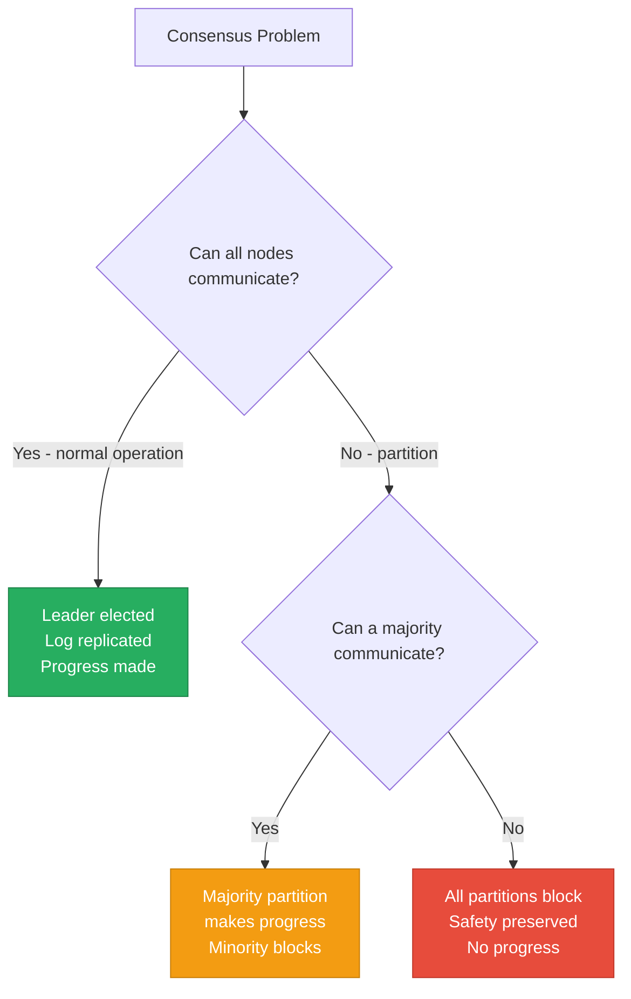
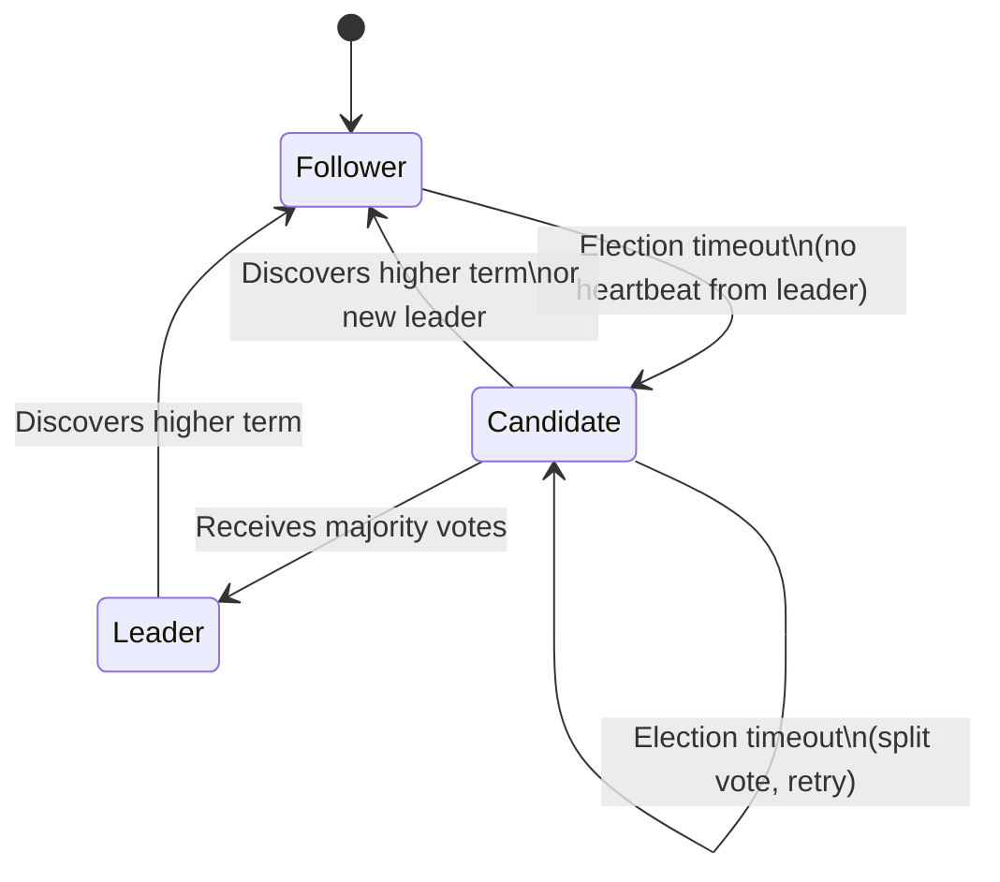
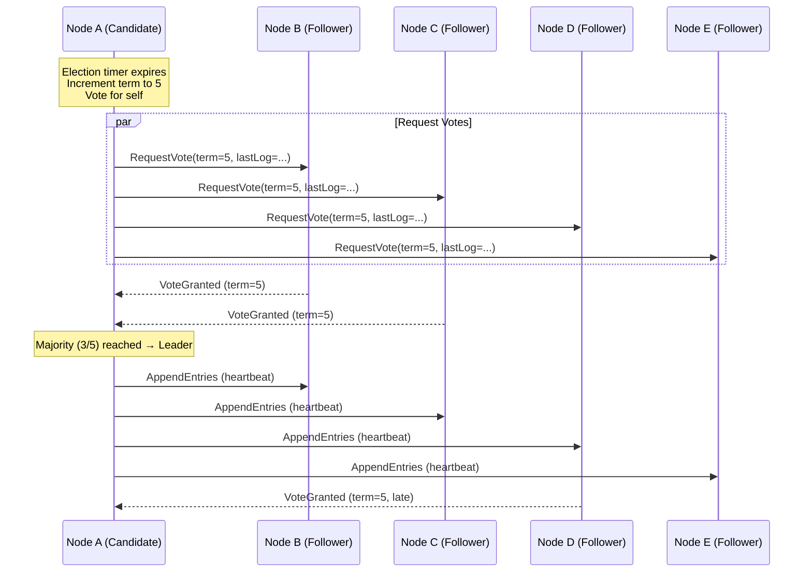
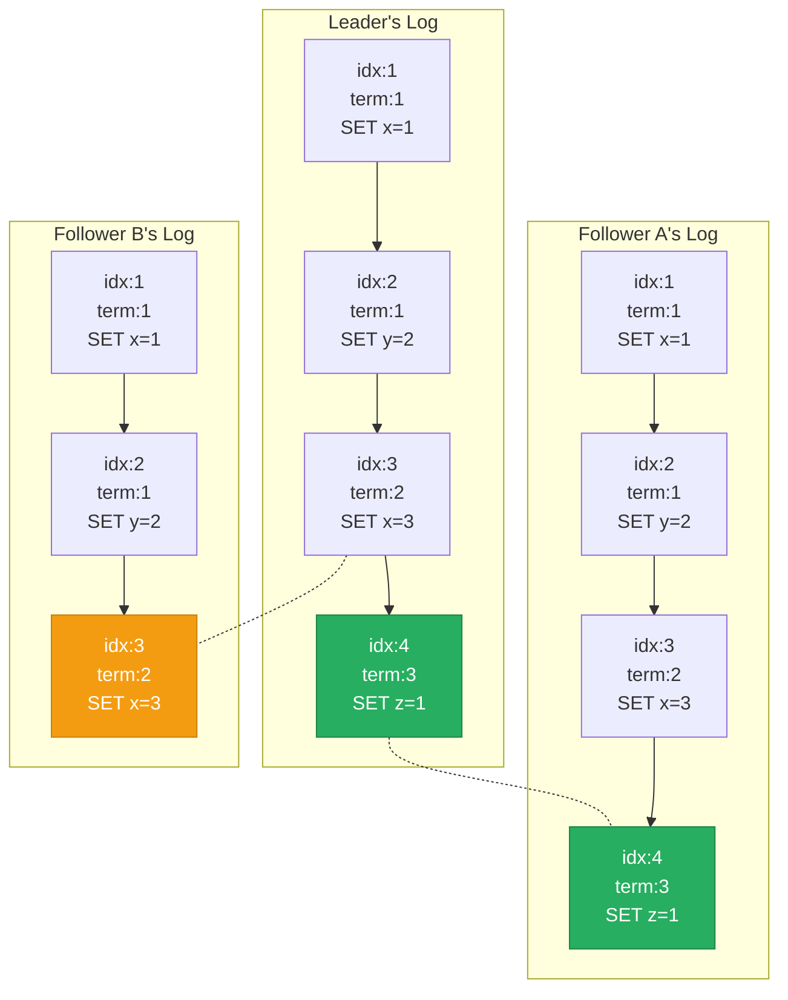
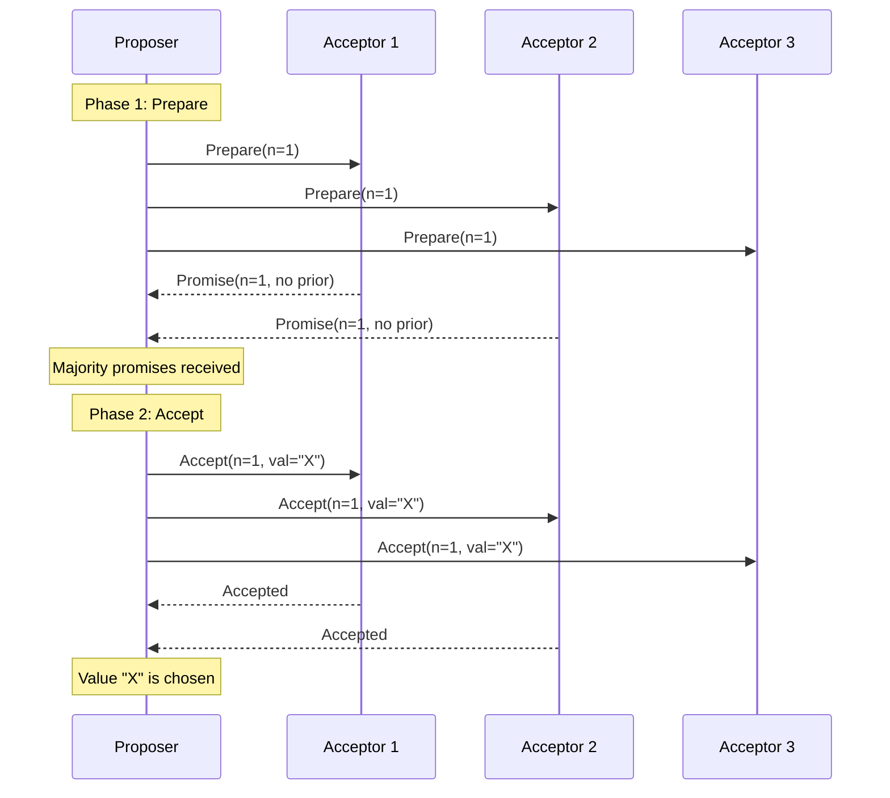
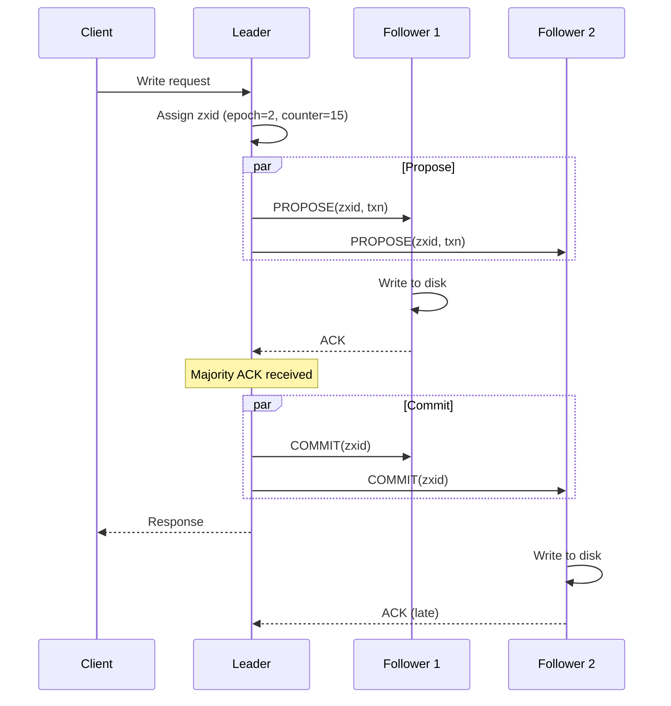
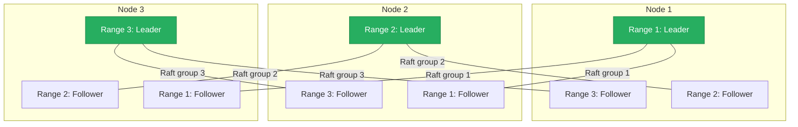

# Consensus Algorithms

> **TL;DR:** Consensus algorithms allow a cluster of unreliable machines to agree on a single value — even when nodes crash and networks partition. **Raft** is the dominant algorithm today: it elects a leader, replicates a log, and guarantees safety through term numbers and log matching. **Paxos** is the theoretical foundation but notoriously hard to implement. **ZAB** (ZooKeeper Atomic Broadcast) solves the same problem with a primary-backup model. If you understand Raft's leader election, log replication, and safety properties, you can reason about any consensus-based system.

## Table of Contents

- [Why This Matters](#why-this-matters)
- [What Is Consensus?](#what-is-consensus)
- [Raft](#raft)
- [Paxos](#paxos)
- [ZAB (ZooKeeper Atomic Broadcast)](#zab-zookeeper-atomic-broadcast)
- [Comparing Consensus Algorithms](#comparing-consensus-algorithms)
- [Consensus in Practice](#consensus-in-practice)
- [Key Takeaways](#key-takeaways)
- [References](#references)

---

## Why This Matters

Every distributed database that claims strong consistency depends on some form of consensus. When etcd stores your Kubernetes cluster state, Raft ensures every node agrees on every key-value pair. When CockroachDB executes a distributed transaction, Raft replicates the commit record. When Kafka guarantees exactly-once delivery, it relies on ZooKeeper's ZAB (or KRaft, its Raft-based replacement) for controller election.

Consensus is the hardest problem in distributed systems — provably impossible in the general asynchronous case (FLP impossibility, 1985), and solved in practice only by making timing assumptions. Understanding how these algorithms work — and where they break — is essential for operating any distributed database.

## What Is Consensus?

A consensus algorithm allows a set of nodes to agree on a sequence of values (a **replicated log**), even when some nodes crash. A correct consensus algorithm must satisfy three properties:

| Property | Meaning |
|---|---|
| **Agreement** | All non-faulty nodes decide on the same value |
| **Validity** | The decided value was proposed by some node |
| **Termination** | All non-faulty nodes eventually decide |

### The FLP Impossibility Result

Fischer, Lynch, and Paterson (1985) proved that **no deterministic consensus algorithm can guarantee termination** in a purely asynchronous system where even one node can crash. Every practical algorithm (Raft, Paxos, ZAB) sidesteps this by using **timeouts** — introducing a timing assumption that converts the model from asynchronous to partially synchronous.

**Practical implication:** Consensus algorithms can get "stuck" (fail to elect a leader) if the network is partitioned or timing assumptions are violated. They never produce incorrect results — they just stop making progress. This is the CP side of CAP.

---

## Raft

Raft was designed by Diego Ongaro and John Ousterhout (2014) specifically to be **understandable**. It decomposes consensus into three sub-problems: leader election, log replication, and safety.

### Node States

Every node in a Raft cluster is in one of three states:

- **Follower**: Passive — responds to RPCs from leader and candidates
- **Candidate**: Actively seeking votes for leader election
- **Leader**: Handles all client requests, replicates log entries to followers

### Terms

Raft divides time into **terms**, each identified by a monotonically increasing integer. A term begins with an election and continues until the leader fails or a new election occurs. Terms act as a **logical clock** — if a node receives a message with a higher term than its own, it immediately updates its term and reverts to follower.

```mermaid
gantt
    title Raft Terms Over Time
    dateFormat X
    axisFormat %s

    section Term 1
    Leader A serves requests : 0, 8
    section Election
    Leader A fails, election : 8, 10
    section Term 2
    Leader B serves requests : 10, 22
    section Election
    Network partition, election : 22, 25
    section Term 3
    Leader C serves requests : 25, 35
```

**Key property:** At most one leader can exist per term. If two nodes believe they are leader, they must be in different terms, and the one with the lower term will step down upon discovering the higher term.

### Leader Election

1. A follower's **election timer** expires (randomized, typically 150-300 ms)
2. The follower increments its term and transitions to **candidate**
3. It votes for itself and sends `RequestVote` RPCs to all other nodes
4. Each node votes for **at most one candidate per term** (first-come-first-served)
5. If the candidate receives votes from a **majority**, it becomes leader
6. The new leader immediately sends heartbeats to establish authority

**Split votes:** If two candidates start elections simultaneously and split the vote (neither gets a majority), both time out and retry with a new term. Randomized election timeouts make this unlikely to repeat.

### Log Replication

Once a leader is elected, it handles all client requests by appending entries to its log and replicating them:

1. Client sends a command to the leader
2. Leader appends the command to its local log
3. Leader sends `AppendEntries` RPCs to all followers with the new entry
4. Each follower appends the entry to its log and responds
5. Once a **majority** of followers acknowledge, the entry is **committed**
6. Leader applies the committed entry to its state machine and responds to the client
7. Followers learn about commits via subsequent `AppendEntries` RPCs and apply to their state machines

**Log Matching Property:** If two logs contain an entry with the same index and term, then:
1. They store the same command
2. All preceding entries are identical

This is enforced by the `AppendEntries` consistency check: the leader includes the index and term of the entry immediately preceding the new entry. If the follower doesn't have a matching entry, it rejects the RPC, and the leader decrements its `nextIndex` for that follower and retries.

### Safety: Why the Right Leader Always Wins

Raft's **Election Restriction** ensures that a candidate cannot win an election unless its log is at least as up-to-date as a majority of nodes. "Up-to-date" is defined as:
- Higher last log term wins
- If terms are equal, longer log wins

This guarantees that the elected leader always contains all committed entries — no committed data is ever lost during a leader transition.

### Log Compaction (Snapshots)

Without compaction, the Raft log grows without bound. Raft uses **snapshots** to compact the log:

1. A node takes a snapshot of its state machine at a given log index
2. All log entries up to that index are discarded
3. The snapshot is stored on disk
4. If a follower falls far behind, the leader sends its snapshot via `InstallSnapshot` RPC instead of replaying potentially millions of log entries

### Raft RPCs Summary

| RPC | Sender | Purpose |
|---|---|---|
| **RequestVote** | Candidate | Request votes during leader election |
| **AppendEntries** | Leader | Replicate log entries and serve as heartbeat (empty payload) |
| **InstallSnapshot** | Leader | Send full state snapshot to a far-behind follower |

---

## Paxos

Paxos, invented by Leslie Lamport (1989, published 1998), is the theoretical foundation of distributed consensus. It's proven correct but famously difficult to understand and implement.

### Basic Paxos (Single-Value Consensus)

Basic Paxos agrees on a **single value** through two phases:

**Phase 1: Prepare**
1. A **proposer** selects a proposal number `n` and sends `Prepare(n)` to a majority of **acceptors**
2. Each acceptor, if `n` is the highest proposal number it has seen:
   - Promises not to accept any proposal numbered less than `n`
   - Returns any value it has already accepted (with its proposal number)

**Phase 2: Accept**
1. If the proposer receives promises from a majority:
   - If any acceptor already accepted a value, the proposer must propose that value (with the highest-numbered proposal)
   - Otherwise, the proposer can propose its own value
2. The proposer sends `Accept(n, value)` to the majority
3. Acceptors accept unless they've promised to a higher proposal number

### Multi-Paxos

Basic Paxos is impractical for a replicated log — it requires two round-trips per value. **Multi-Paxos** optimizes this by:

1. Running Phase 1 once to establish a **distinguished proposer** (leader)
2. The leader skips Phase 1 for subsequent values, running only Phase 2
3. This reduces per-entry latency to a single round-trip (same as Raft)

Multi-Paxos is effectively equivalent to Raft in steady state. The difference is that Paxos is described abstractly (roles, proposal numbers) while Raft specifies concrete implementation details (leader election with randomized timers, log structure, snapshotting).

### Why Paxos Is Hard to Implement

1. **The paper describes single-value consensus**, not a replicated log. Building a log requires Multi-Paxos, which Lamport described only informally.
2. **No specified leader election mechanism.** Raft prescribes randomized timeouts; Paxos leaves this to the implementer.
3. **Reconfiguration** (adding/removing nodes) is not part of the core algorithm.
4. **Log gaps** are possible — if a leader fails mid-replication, some slots may have values and others may not. Raft avoids this by requiring consecutive log entries.

> "There are significant gaps between the description of the Paxos algorithm and the needs of a real-world system... the final system will be based on an unproven protocol." — Chubby authors (Google), 2007

---

## ZAB (ZooKeeper Atomic Broadcast)

ZAB is the consensus protocol behind Apache ZooKeeper. It's designed as an **atomic broadcast** protocol — all nodes deliver the same messages in the same order — rather than a pure consensus algorithm. This makes it naturally suited for a replicated state machine.

### How ZAB Works

ZAB operates in two modes:

**Recovery mode** (leader election):
1. Nodes exchange their transaction history
2. The node with the most complete history is elected leader
3. The leader synchronizes all followers to its state

**Broadcast mode** (normal operation):
1. All write requests are forwarded to the leader
2. The leader assigns a **zxid** (ZooKeeper transaction ID): `(epoch, counter)`
3. The leader sends a `PROPOSE` message to all followers
4. Followers write the proposal to disk and send `ACK`
5. Once a **majority** acknowledges, the leader sends `COMMIT`
6. All nodes deliver the transaction

### ZAB vs Raft

| Aspect | ZAB | Raft |
|---|---|---|
| **Abstraction** | Atomic broadcast (total order delivery) | Replicated log (state machine replication) |
| **Leader election** | Node with most complete history wins | Node with most up-to-date log wins (Election Restriction) |
| **ID scheme** | `zxid = (epoch, counter)` | `(term, index)` |
| **Recovery** | New leader synchronizes all followers before accepting writes | New leader begins immediately; missing entries filled via AppendEntries |
| **Ordering** | FIFO per-client + causal ordering guaranteed | Log order = commit order |
| **Primary use** | ZooKeeper | etcd, CockroachDB, TiKV, Consul, many others |

**Key insight:** ZAB and Raft solve the same fundamental problem with similar performance characteristics. ZAB's epoch/counter is analogous to Raft's term/index. The main practical difference is that Raft has become the dominant choice for new systems because of its clearer specification.

---

## Comparing Consensus Algorithms

### Feature Comparison

| Feature | Raft | Multi-Paxos | ZAB |
|---|---|---|---|
| **Understandability** | High (designed for it) | Low (abstract, underspecified) | Medium |
| **Leader required?** | Yes | Yes (in practice) | Yes |
| **Quorum size** | Majority (⌊n/2⌋ + 1) | Majority | Majority |
| **Fault tolerance** | ⌊(n-1)/2⌋ failures | ⌊(n-1)/2⌋ failures | ⌊(n-1)/2⌋ failures |
| **Log gaps possible?** | No | Yes | No |
| **Reconfiguration** | Joint consensus / single-server changes | Not specified | Dynamic reconfiguration |
| **Steady-state latency** | 1 RTT (leader to majority) | 1 RTT (Multi-Paxos) | 1 RTT (propose + commit) |

### Typical Cluster Sizes

| Cluster Size | Tolerated Failures | Use Case |
|---|---|---|
| 3 nodes | 1 failure | Development, small deployments |
| 5 nodes | 2 failures | Production standard |
| 7 nodes | 3 failures | High availability requirements |

**Why not more?** Every write must be acknowledged by a majority. More nodes means more network round-trips per write, increasing latency. Consensus clusters are typically 3-7 nodes — scaling reads is done by adding read replicas or caching, not by adding consensus participants.

### Performance Characteristics

Consensus introduces a fundamental latency floor: every write requires at least **one network round-trip** to a majority of nodes. This means:

| Metric | Typical Value | Bottleneck |
|---|---|---|
| Write latency | 1-10 ms (same datacenter) | Network RTT + fsync |
| Write latency | 50-200 ms (cross-datacenter) | Network RTT dominates |
| Write throughput | 10K-100K ops/sec | Leader is a bottleneck |
| Read throughput | Higher (can read from followers) | Stale reads if not linearizable |

**Key insight:** Consensus is fundamentally limited by the speed of light and fsync. Cross-datacenter consensus (e.g., Google Spanner) requires specialized techniques like TrueTime to achieve reasonable latency.

---

## Consensus in Practice

### Where Each Algorithm Is Used

| System | Algorithm | Notes |
|---|---|---|
| **etcd** | Raft | Powers Kubernetes; etcd/raft is a widely reused library |
| **Consul** | Raft | HashiCorp's service mesh and KV store |
| **CockroachDB** | Raft | One Raft group per range (multi-raft) |
| **TiKV/TiDB** | Raft | Distributed SQL; one Raft group per region |
| **ZooKeeper** | ZAB | Legacy coordination service; being replaced by Raft-based systems |
| **Kafka (KRaft)** | Raft | Replacing ZooKeeper dependency since Kafka 3.3 |
| **ScyllaDB** | Raft | Added in ScyllaDB 5.0 for schema management and topology |
| **Google Spanner** | Paxos | One of the few production Multi-Paxos implementations |
| **Google Chubby** | Paxos | Google's internal lock service (inspired ZooKeeper) |
| **Cassandra (LWT)** | Paxos | Lightweight transactions use single-decree Paxos |

### Multi-Raft: Scaling Beyond a Single Group

A single Raft group has a throughput ceiling because all writes funnel through one leader. Systems like CockroachDB and TiKV solve this with **Multi-Raft**: the data is split into ranges/regions, and each range has its own independent Raft group.

**Benefits:**
- Leaders are distributed across nodes — no single bottleneck
- Each range/region is typically 64-256 MB
- Ranges split when they grow too large, creating new Raft groups
- Load balancing moves Raft leadership between nodes

### Raft Optimizations in Production

Production Raft implementations include optimizations not in the original paper:

| Optimization | What It Does | Used By |
|---|---|---|
| **Batching** | Group multiple log entries into a single AppendEntries RPC | etcd, TiKV |
| **Pipelining** | Send next batch before previous is acknowledged | TiKV, CockroachDB |
| **Parallel appends** | Leader appends to its log in parallel with sending to followers | etcd |
| **Learner nodes** | Non-voting members that receive the log but don't participate in consensus | etcd, TiKV |
| **Pre-vote** | Candidate checks if it could win before incrementing term (prevents disruption) | etcd |
| **Leader lease** | Leader serves reads without confirming leadership (trades linearizability for latency) | TiKV, CockroachDB |

---

## Key Takeaways

- **Consensus is the foundation of strong consistency** in distributed systems. Any system that claims linearizable reads/writes uses some form of consensus.
- **Raft is the modern standard** — designed for understandability, widely implemented, and proven in production at scale (etcd, CockroachDB, TiKV, Kafka KRaft).
- **Paxos is the theoretical ancestor** but its underspecification makes it hard to implement correctly. Google Spanner and Chubby are the notable production implementations.
- **ZAB solved the same problem for ZooKeeper** but is being displaced by Raft in new systems (Kafka's migration from ZooKeeper to KRaft is the clearest example).
- **All three algorithms have the same steady-state performance**: one network round-trip to a majority per write. The differences are in leader election, recovery, and implementation complexity.
- **Multi-Raft** (one Raft group per data range) is how production systems scale beyond the throughput ceiling of a single consensus group.
- **Consensus is fundamentally limited by network latency and fsync**. Cross-datacenter consensus adds 50-200 ms per write — which is why most consensus-based systems are deployed within a single datacenter or region.

---

## References

1. Ongaro, D. & Ousterhout, J. (2014). [In Search of an Understandable Consensus Algorithm](https://raft.github.io/raft.pdf). USENIX ATC.
2. Lamport, L. (1998). [The Part-Time Parliament](https://lamport.azurewebsites.net/pubs/lamport-paxos.pdf). ACM TOCS.
3. Lamport, L. (2001). [Paxos Made Simple](https://lamport.azurewebsites.net/pubs/paxos-simple.pdf).
4. Junqueira, F., Reed, B., & Serafini, M. (2011). [Zab: High-performance broadcast for primary-backup systems](https://ieeexplore.ieee.org/document/5958223). IEEE DSN.
5. Howard, H. (2014). [ARC: Analysis of Raft Consensus](https://www.cl.cam.ac.uk/techreports/UCAM-CL-TR-857.pdf). Cambridge Technical Report.
6. [The Raft Consensus Algorithm — Visualization](https://raft.github.io/)
7. [etcd/raft — Production Raft Library](https://github.com/etcd-io/raft)
8. [TiKV Raft Engine Design](https://tikv.org/deep-dive/consensus-algorithm/raft/)
9. Burrows, M. (2006). [The Chubby Lock Service for Loosely-Coupled Distributed Systems](https://research.google/pubs/pub27897/). OSDI.
10. [KIP-500: Replace ZooKeeper with a Self-Managed Metadata Quorum](https://cwiki.apache.org/confluence/display/KAFKA/KIP-500)
