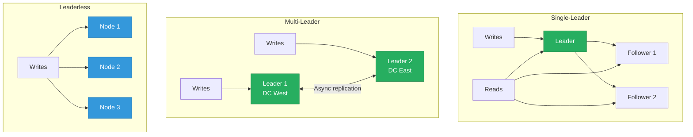
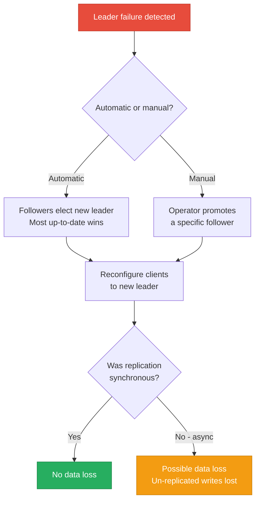
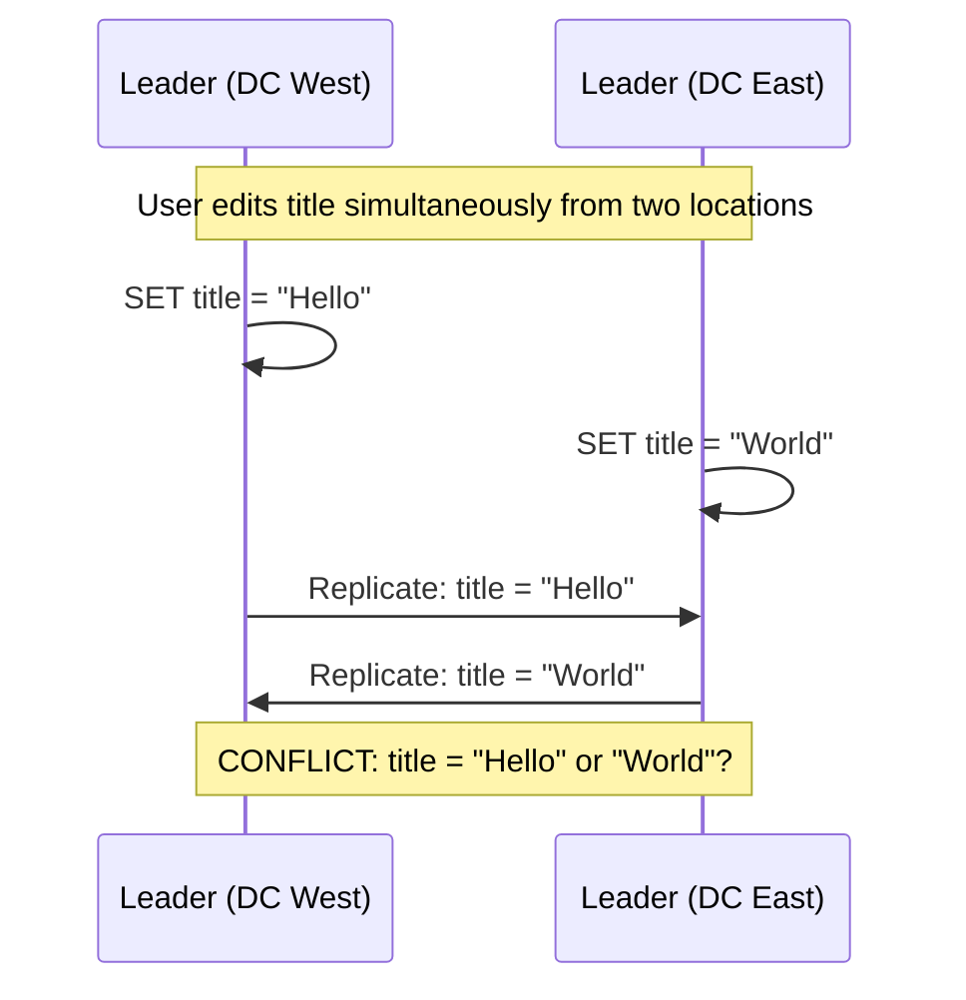
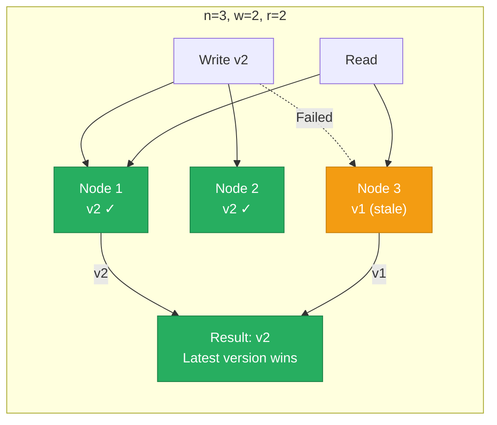
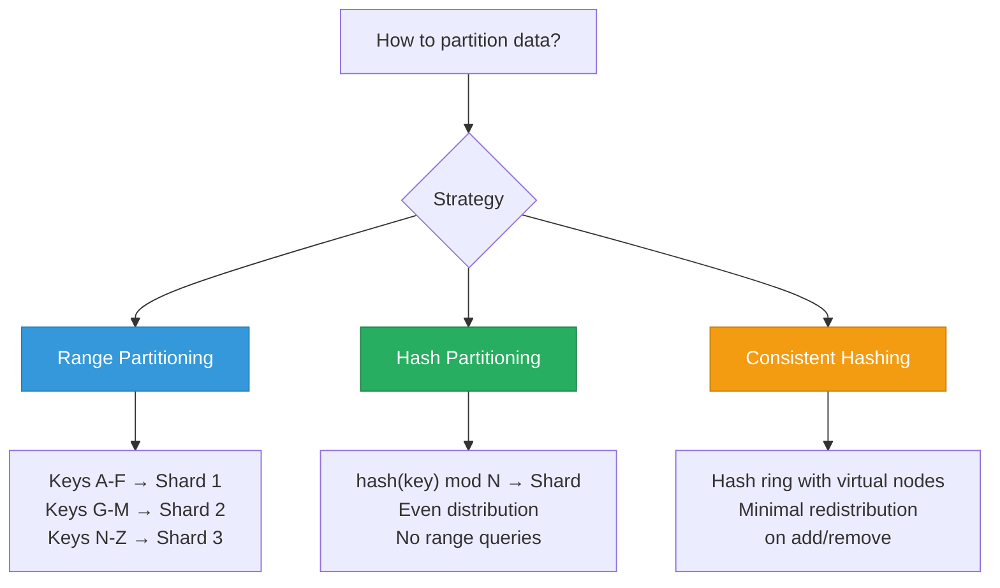
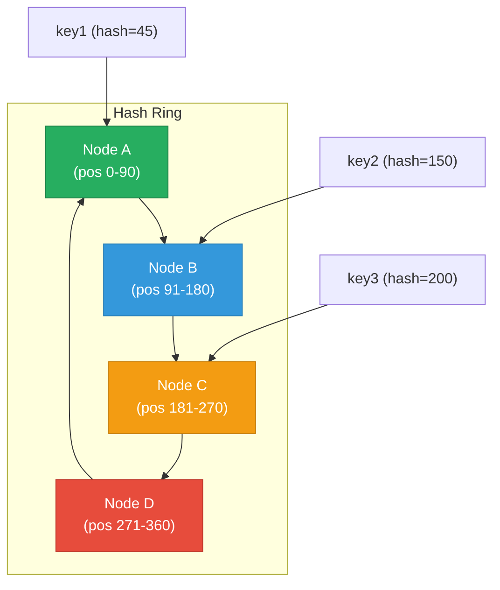
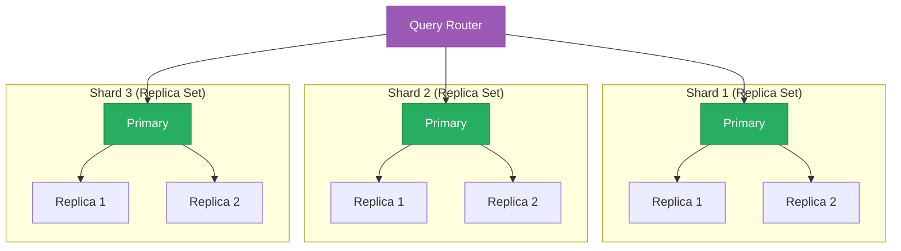

# Replication & Sharding

> **TL;DR:** Replication copies data to multiple nodes for fault tolerance and read scaling. Sharding splits data across nodes for write scaling and capacity. **Single-leader replication** (PostgreSQL, MongoDB, etcd) is the simplest model — one node accepts writes, others replicate. **Leaderless replication** (Cassandra, DynamoDB) allows any node to accept writes, using quorums for consistency. **Sharding** partitions data by range or hash — and the shard key determines whether your cluster scales evenly or collapses onto a single hotspot.

## Table of Contents

- [Why This Matters](#why-this-matters)
- [Replication](#replication)
- [Single-Leader Replication](#single-leader-replication)
- [Multi-Leader Replication](#multi-leader-replication)
- [Leaderless Replication](#leaderless-replication)
- [Sharding (Partitioning)](#sharding-partitioning)
- [Rebalancing](#rebalancing)
- [Combining Replication and Sharding](#combining-replication-and-sharding)
- [Key Takeaways](#key-takeaways)
- [References](#references)

---

## Why This Matters

A single database server has three hard limits: it can only store so much data (capacity), handle so many reads (read throughput), and handle so many writes (write throughput). Replication addresses read throughput and fault tolerance. Sharding addresses capacity and write throughput. Every distributed database uses some combination of both — and the specific choices determine the system's consistency guarantees, failure modes, and operational complexity.

If you've read the [Consistency & Guarantees](../01-database-foundations/consistency-and-guarantees.md) page, you know the theoretical tradeoffs (CAP, PACELC). This page covers the **mechanisms** that implement those tradeoffs.

## Replication

Replication maintains copies of the same data on multiple nodes. The three fundamental models differ in which nodes accept writes:

---

## Single-Leader Replication

The simplest and most common model. One node (the **leader/primary**) accepts all writes. Other nodes (**followers/replicas/secondaries**) replicate the leader's write stream.

### How It Works

1. Client sends a write to the leader
2. Leader writes to its local storage and its replication log (WAL, oplog, binlog)
3. Leader sends the log entries to followers
4. Followers apply the entries to their local storage

### Synchronous vs Asynchronous Replication

| Mode | How It Works | Consistency | Latency | Data Loss Risk |
|---|---|---|---|---|
| **Synchronous** | Leader waits for all followers to confirm before acknowledging | Strong | High (worst-case follower latency) | None |
| **Semi-synchronous** | Leader waits for at least one follower to confirm | Strong (majority) | Medium | Minimal |
| **Asynchronous** | Leader acknowledges immediately, replicates in background | Eventual | Low | Possible (leader fails before replication) |

Most production systems use **semi-synchronous** replication: the leader waits for a majority (or at least one) follower, balancing durability with latency.

### Replication Lag and Its Consequences

With asynchronous replication, followers may be behind the leader. This **replication lag** causes anomalies:

| Anomaly | What Happens | Example |
|---|---|---|
| **Read-your-writes** violation | User writes data, reads from a follower, and doesn't see their own write | User updates profile, refreshes page, sees old profile |
| **Monotonic reads** violation | User reads from different followers and sees data go "backward" | User sees a comment, refreshes, comment disappears |
| **Consistent prefix** violation | User sees an effect before its cause | User sees reply to a question before the question itself |

**Solutions:**
- **Read-your-writes**: Route reads to the leader for recently-written data, or track the client's last write position and wait for the follower to catch up
- **Monotonic reads**: Pin each user to a specific replica (session stickiness)
- **Consistent prefix**: Use causal consistency (track causal dependencies between writes)

### Failover

When the leader fails, a follower must be promoted:

**Failover risks:**
- **Data loss**: If the old leader had un-replicated writes, they're lost when the new leader takes over. If the old leader comes back, its extra writes conflict with the new leader's state.
- **Split-brain**: If the old leader doesn't realize it's been replaced, two nodes accept writes simultaneously. Fencing (STONITH) or consensus-based elections prevent this.

### Where Single-Leader Replication Is Used

| Database | Replication Mechanism | Notes |
|---|---|---|
| **PostgreSQL** | Streaming replication (WAL shipping) | Sync, async, or quorum-based |
| **MySQL** | Binary log (binlog) replication | GTID-based for positioning |
| **MongoDB** | Oplog (operations log) replication | Replica sets with automatic failover |
| **etcd** | Raft log replication | Consensus-based (covered in [Consensus Algorithms](consensus-algorithms.md)) |
| **Redis** | Async replication to replicas | No automatic failover without Sentinel |

---

## Multi-Leader Replication

Multiple nodes accept writes simultaneously, each replicating to the others. This is used primarily for **multi-datacenter** deployments where you need low-latency writes in every datacenter.

### When Multi-Leader Makes Sense

- You have datacenters on different continents and need local write latency
- Offline-capable clients (e.g., mobile apps, collaborative editing) that sync when reconnected
- A calendar app that must work offline

### The Fundamental Problem: Write Conflicts

If two leaders accept writes to the same key concurrently, the values diverge. This must be resolved somehow:

### Conflict Resolution Strategies

| Strategy | How It Works | Tradeoff |
|---|---|---|
| **Last-writer-wins (LWW)** | Highest timestamp wins; other write is silently discarded | Data loss — timestamps can be wrong, concurrent writes are lost |
| **Merge values** | Application-specific logic merges conflicting values | Complex but correct for some domains (e.g., CRDTs) |
| **Conflict-free Replicated Data Types (CRDTs)** | Data structures designed to merge without conflicts (counters, sets, LWW-registers) | Limited to specific data types |
| **Custom resolution** | Application handles conflicts on read (store all versions) | Most flexible but pushes complexity to application |

### Where Multi-Leader Replication Is Used

| Database | Implementation | Notes |
|---|---|---|
| **CouchDB/PouchDB** | Multi-leader with revision trees | Designed for offline-first apps |
| **Cassandra** | Leaderless (similar dynamics) | LWW by default, but not technically multi-leader |
| **MySQL Group Replication** | Multi-primary mode | Certification-based conflict detection |
| **Google Docs** | Operational Transformation (OT) | Real-time collaborative editing |

---

## Leaderless Replication

No single node is designated as leader. **Any node** can accept reads and writes. Consistency is achieved through **quorum** mechanisms.

### Quorum Reads and Writes

With `n` replicas, you configure:
- **w**: Number of nodes that must confirm a write
- **r**: Number of nodes that must respond to a read

As long as **w + r > n**, at least one read node will have the latest write.

### Common Quorum Configurations

| Configuration | Consistency | Availability | Use Case |
|---|---|---|---|
| **w=n, r=1** | Strong writes, fast reads | Low write availability (any node down blocks writes) | Read-heavy, consistency-critical |
| **w=1, r=n** | Fast writes, strong reads | Low read availability | Write-heavy, can tolerate read latency |
| **w=⌈(n+1)/2⌉, r=⌈(n+1)/2⌉** | Balanced (quorum) | Tolerates ⌊(n-1)/2⌋ failures | General purpose — most common |
| **w=1, r=1** | Eventual consistency | Maximum | Low-latency, loss-tolerant |

### Anti-Entropy: Repairing Stale Replicas

When a node misses a write (it was down or the write didn't reach it), the data must eventually be repaired:

| Mechanism | How It Works | When It Runs |
|---|---|---|
| **Read repair** | When a read detects a stale value on one node, the coordinator writes the latest value back to the stale node | On every quorum read |
| **Anti-entropy process** | A background process compares data between replicas using Merkle trees and copies missing data | Continuously in background |
| **Hinted handoff** | When a write can't reach a target node, another node temporarily stores it and forwards it when the target recovers | On write failure |

### Sloppy Quorums

In a strict quorum, reads and writes go to a **fixed set** of `n` nodes. A **sloppy quorum** allows writes to go to any `w` reachable nodes, even if they aren't the designated replicas. This improves availability at the cost of consistency — a sloppy quorum doesn't guarantee read overlap.

### Where Leaderless Replication Is Used

| Database | Quorum Mechanism | Notes |
|---|---|---|
| **Cassandra** | Configurable consistency level (ONE, QUORUM, ALL) | Anti-entropy via Merkle trees, read repair, hinted handoff |
| **DynamoDB** | Internal quorum (abstracted from user) | Inspired by Amazon's Dynamo paper |
| **Riak** | Configurable quorum, CRDTs for conflict resolution | Now discontinued, but architecturally influential |
| **ScyllaDB** | Same as Cassandra (drop-in replacement) | C++ implementation with better per-node performance |

---

## Sharding (Partitioning)

Sharding splits a dataset across multiple nodes so that each node stores only a **subset** of the data. This enables horizontal scaling for both capacity and write throughput.

### Partitioning Strategies

### Range Partitioning

Data is divided into contiguous key ranges, each assigned to a shard.

| Aspect | Detail |
|---|---|
| **How it works** | Keys are sorted; each shard owns a range (e.g., `[A-F)`, `[F-M)`, `[M-Z)`) |
| **Advantages** | Efficient range queries (scan a single shard), natural ordering |
| **Disadvantages** | Hotspots on popular ranges; sequential keys (timestamps) concentrate writes |
| **Used by** | HBase, CockroachDB, TiKV, MongoDB (range-based shard keys) |

### Hash Partitioning

A hash function maps each key to a shard, distributing data evenly regardless of key patterns.

| Aspect | Detail |
|---|---|
| **How it works** | `shard = hash(key) mod N` |
| **Advantages** | Even distribution, no hotspots from sequential keys |
| **Disadvantages** | Range queries require scatter-gather (must query all shards) |
| **Used by** | Cassandra (with Murmur3), DynamoDB, MongoDB (hashed shard keys), Redis Cluster |

### Consistent Hashing

Consistent hashing solves the **redistribution problem** with plain hash partitioning: when you add or remove a shard, `hash(key) mod N` changes for almost every key, requiring massive data movement. Consistent hashing minimizes this.

**How it works:**
1. Map both nodes and keys onto a circular hash ring (0 to 2^128)
2. Each key is assigned to the next node clockwise on the ring
3. When a node is added or removed, only keys adjacent to it on the ring are moved
4. **Virtual nodes**: Each physical node claims multiple positions on the ring for better balance

| Aspect | Detail |
|---|---|
| **Key movement on node add** | Only ~1/N of keys move (vs. nearly all with hash mod N) |
| **Virtual nodes** | Each physical node has 100-256 virtual positions for even distribution |
| **Used by** | Cassandra, DynamoDB, Riak, Amazon's Dynamo (the paper that popularized it) |

### Partitioning Strategy Comparison

| Strategy | Range Queries | Distribution | Hotspot Risk | Rebalancing Cost |
|---|---|---|---|---|
| **Range** | Excellent (single shard) | Uneven if keys are skewed | High (sequential keys) | Medium (split/merge ranges) |
| **Hash (mod N)** | Poor (scatter-gather) | Even | Low | Very high (rehash everything) |
| **Consistent hashing** | Poor (scatter-gather) | Even (with virtual nodes) | Low | Low (move ~1/N keys) |
| **Compound** | Good (within prefix) | Even across prefixes | Medium | Depends on strategy |

### Secondary Indexes with Sharding

Sharding complicates secondary indexes because the index must either be local to each shard or global across all shards:

| Approach | How It Works | Read Performance | Write Performance |
|---|---|---|---|
| **Local index** (document-partitioned) | Each shard indexes only its own data | Scatter-gather (query all shards) | Fast (index updated locally) |
| **Global index** (term-partitioned) | Index is partitioned across shards by index term | Single shard (if term maps to one) | Slow (write may update index on another shard) |

**MongoDB** uses local indexes — every query without the shard key is scatter-gather. **Elasticsearch** also uses local indexes (per-shard Lucene segments) with a scatter-gather query phase.

---

## Rebalancing

When you add or remove nodes, data must move between shards. How this happens affects availability during the transition.

### Rebalancing Strategies

| Strategy | How It Works | Data Movement | Used By |
|---|---|---|---|
| **Fixed number of partitions** | Create many more partitions than nodes; assign multiple partitions per node. When adding a node, move whole partitions. | Minimal (move partitions, not re-partition) | Cassandra, Riak, Elasticsearch, DynamoDB |
| **Dynamic partitioning** | Partitions split when they grow too large, merge when too small | Moderate | HBase, CockroachDB, TiKV, MongoDB |
| **Proportional to nodes** | Number of partitions is proportional to node count | Moderate | Cassandra (with virtual nodes) |

**Key insight:** Fixed-number partitioning (e.g., Cassandra's 256 virtual nodes per physical node) avoids expensive repartitioning entirely. New nodes just "steal" existing partitions from overloaded nodes.

---

## Combining Replication and Sharding

Most production distributed databases combine both: data is **sharded** for capacity and write throughput, and each shard is **replicated** for fault tolerance and read scaling.

| Database | Sharding | Replication | Query Routing |
|---|---|---|---|
| **MongoDB** | Range or hash shard key | Replica sets per shard | mongos router |
| **Cassandra** | Consistent hashing | Configurable replication factor | Any node (coordinator) |
| **CockroachDB** | Range partitioning | Raft per range (3 replicas) | Any node (SQL gateway) |
| **Elasticsearch** | Hash of `_id` | Configurable replica count | Any node (coordinating node) |
| **Redis Cluster** | Hash slots (16384 slots) | Async replication per shard | Client-side routing (MOVED redirect) |

---

## Key Takeaways

- **Single-leader replication** is the simplest model and is used by most databases (PostgreSQL, MongoDB, MySQL). All writes go through one node; consistency is straightforward but the leader is a bottleneck and a single point of failure.
- **Leaderless replication** (Cassandra, DynamoDB) trades simplicity for availability — any node accepts writes, but you must reason about quorums (w + r > n) and handle conflict resolution.
- **Multi-leader replication** is for multi-datacenter deployments and offline-first applications. Write conflicts are the fundamental challenge — there is no free lunch.
- **Replication lag is the source of most consistency anomalies** (read-your-writes, monotonic reads). Understanding these anomalies is essential for choosing the right read concern/consistency level.
- **Range sharding** enables efficient range queries but creates hotspots on sequential keys. **Hash sharding** distributes evenly but forces scatter-gather on range queries.
- **Consistent hashing** solves the rebalancing problem — adding or removing a node moves only ~1/N of the data. Virtual nodes ensure even distribution.
- **The shard key is the most important decision** in a sharded database. It determines data distribution, query routing, and write scaling. See MongoDB's [shard key selection](../03-document-and-key-value-databases/mongodb-internals.md#shard-key-selection) for concrete guidance.
- **Most production systems combine sharding and replication** — data is partitioned for scale and replicated within each partition for fault tolerance.

---

## References

1. Kleppmann, M. (2017). *Designing Data-Intensive Applications*, Chapters 5 (Replication) and 6 (Partitioning). O'Reilly Media.
2. DeCandia, G., Hastorun, D., Jampani, M., et al. (2007). [Dynamo: Amazon's Highly Available Key-value Store](https://www.allthingsdistributed.com/files/amazon-dynamo-sosp2007.pdf). SOSP.
3. Lakshman, A. & Malik, P. (2010). [Cassandra — A Decentralized Structured Storage System](https://www.cs.cornell.edu/Projects/ladis2009/papers/Lakshman-ladis2009.PDF). LADIS.
4. Karger, D., Lehman, E., Leighton, T., et al. (1997). [Consistent Hashing and Random Trees](https://www.cs.princeton.edu/courses/archive/fall09/cos518/papers/chash.pdf). STOC.
5. [MongoDB Sharding Documentation](https://www.mongodb.com/docs/manual/sharding/)
6. [Cassandra Documentation — Data Replication](https://cassandra.apache.org/doc/latest/cassandra/architecture/dynamo.html)
7. [CockroachDB Architecture — Replication Layer](https://www.cockroachlabs.com/docs/stable/architecture/replication-layer.html)
8. [Redis Cluster Specification](https://redis.io/docs/reference/cluster-spec/)
